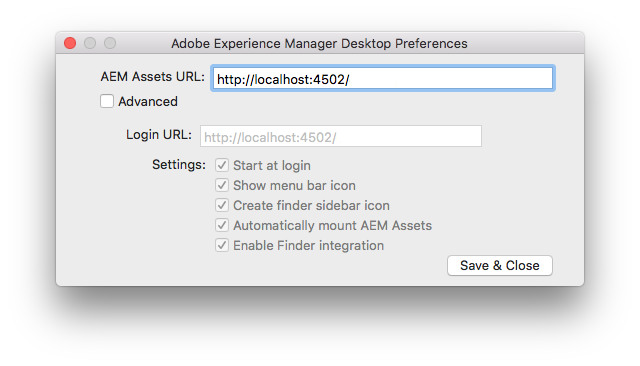
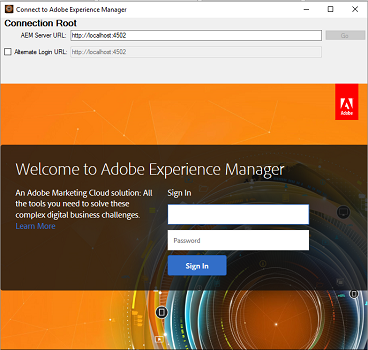
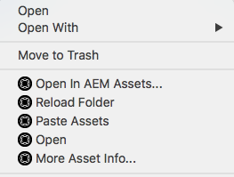

# Use AEM Desktop App{#use-aem-desktop-app}

Learn how to use Adobe Experience Manager Desktop App and optimize your work with assets on desktop.

Adobe offers connected workflows across its solutions to allow next-level productivity for your creative professionals. The AEM Desktop App connects AEM repositories and desktop applications, including Adobe and third-party ones, to provide faster access to resources and streamlined workflows. This saving of time and reduction in effort improves efficiency of users, who work with assets from AEM in their desktop workflows.

## About the AEM Desktop application {#about-the-aem-desktop-application}

Using the App, the assets within AEM are easily accessible on your local desktop and can be used in any desktop applications. Assets can be easily revealed in Mac Finder or Windows Explorer, opened in desktop applications, and changed locally - the changes are saved back to AEM with a new version created in the repository.

Such an integration allows various roles in the organization to manage the assets centrally in AEM Assets and to access them in the Creative Cloud and other applications, while making it easy to adhere to the various standards including branding.

The key capabilities supported by AEM Desktop App include:

* [Connect with an AEM server](#installandconnect)  

* [Open assets directly on desktop](#openondesktop)
* [Edit and check out assets from desktop](#workonassets)  

* [Upload assets and folders in bulk](/aem-desktop-app.html?cq_ck=1533108234281#bulkupload)

For the various recommended dos and don'ts, see the [best practices for using app](/content/help/en/experience-manager/6-4/assets/using/aem-desktop-app-best-practices). If you face issues using the App, see how to [troubleshoot AEM Desktop](troubleshooting-desktop-app.md).

>[!NOTE]
>
>AEM Desktop App was introduced in AEM 6.1 release and was called AEM Assets Companion App.

## AEM Desktop app touch-points in the creative workflow {#aem-desktop-app-touch-points-in-the-creative-workflow}

AEM Desktop app, along with AEM Assets, integrates in your creative workflow and offers the following touchpoints.

<!--
Comment Type: draft

<ol>
<li>Install and connect AEM Desktop app to AEM server
<ol>
<li>Install the application.</li>
<li>Understand the in-app options and preferences.</li>
<li>Connect to an AEM server.</li>
<li>Enable desktop actions in AEM web interface.</li>
</ol> </li>
<li>Access and open assets on your desktop
<ol>
<li>Reveal the location of mapped assets from AEM web interface.</li>
<li>Open AEM assets from the Finder or the Explorer.</li>
<li>Understand the asset statuses.</li>
</ol> </li>
<li>Work on your assets
<ol>
<li>Check out assets from the AEM web interface</li>
<li>Check out assets on Mac.</li>
<li>Check out assets on Windows.</li>
<li>Check in the asset using Finder or Explorer and using web interface.</li>
<li>Bulk upload assets and folders to AEM server.</li>
</ol> </li>
</ol>
-->

AEM Desktop app touch-points the creative workflow

## Install and connect AEM Desktop App to AEM server {#installandconnect}

Before you can begin creating or editing the creative assets, connect the desktop application with the AEM Assets server to download and upload assets in the repository. Perform the following tasks:

1. [Install the app](/aem-desktop-app.html?cq_ck=1535035698931#installapp).
1. [Set your preferences](/aem-desktop-app.html?cq_ck=1535035698931#inapppref) and connection details.
1. [Connect to an AEM server](/aem-desktop-app.html?cq_ck=1535035698931#connect) and mount assets repository as local drive.
1. [Enable desktop actions](/aem-desktop-app.html?cq_ck=1535035698931#desktopactions) on AEM server.

AEM Desktop App uses an HTTPS connection to connect to AEM server to robustly and securely transfer your assets.

>[!NOTE]
>
>For part of or all of the installation and configuration steps, you may need help from your AEM administrator or system administrator.

### Install the application {#installapp}

To use AEM Desktop App, ensure that your AEM server version is supported by AEM Desktop app. Download the appropriate installation file (binary) for your operating system (Mac or Windows) and install the app.

Detailed configuration may be required depending on your network and system preferences. See [Install and configure AEM Desktop app](install-configure-aem-desktop-app.md) for more details.

1. Go to the [AEM Desktop app download page](https://helpx.adobe.com/experience-manager/kb/download-companion-app.html) and download the appropriate binary for your operating system.
1. Launch the downloaded installation file and follow the on-screen instructions to install the app.

   >[!NOTE]
   >
   >Only one instance of the AEM Desktop App can be installed and be active at a time.

### Understand the in-app options and preferences {#inapppref}

The application allows for settings to connect and disconnect from AEM servers, view status of uploads, manage local cache, and so on. The default settings work for a typical user of the application. You can tweak the settings to get more out of the application and out of the integration with AEM server. The various settings are described below in details.

**Explore Assets** Open the local drive in which the AEM Assets repository is mounted. In other words, explore the assets that are now made available on your local machine.

**View asset status** When changed assets are uploaded or new assets are added to the AEM Assets repository, the application uploads the assets in the background. The background upload allows for smooth operations, without you having to wait for the upload to finish, especially for large-sized assets. You can save your changes locally and forget it. The application takes some time to send these assets to the server, depending on the available bandwidth. You can check the status of the upload, along with some more basic information.

**Options** Click/tap Options from the AEM Desktop app tray to access settings to launch the application when your system starts; to connect to the AEM server when the app is launched; and to change the local drive letter where AEM Assets is available after mounting.

**Advanced > Manage cache** You can control the amount of disk space made available for local caching purposes. The artifacts from the AEM Assets server are cached locally for a smoother experience. You can change the defaults to suit your requirements. Also, you can clear the cache to fetch all assets afresh. When you clear the cache, it preserves your unsaved changes. Any assets not checked into AEM server are retained and not deleted.

### Connect to an AEM server {#connect}

The app supports proxy configuration on Mac and Windows. The configuration is read when the app starts. If you modify proxy settings, restart the app for the changes to take effect.

1. Launch AEM Desktop app. To map your AEM instance with the app, specify your AEM server in this format: `https://[aem-server-url]:[port]`.

   

   Authenticate on Mac and provide AEM server URL

1. In the login screen, specify the user name and password for your instance. To specify an alternate AEM instance, select the **[!UICONTROL Alternate Login URL]** option.

   

   Provide AEM server credentials on the login screen on AEM Desktop

### Enable desktop actions in AEM web interface {#desktopactions}

From within the Assets UI in a browser, you can explore the asset locations or check-out and open the asset for editing in your desktop application. These options are called Desktop Actions and are not enabled by default. Follow these steps to enable it.

1. In the Assets console, click/tap the **User** icon from the toolbar. 
1. Click/tap the **[!UICONTROL My Preferences]** to display the **[!UICONTROL Preferences]**dialog.
1. In the User Preferences dialog, select **[!UICONTROL Show Desktop Actions For Assets]**. Click/tap **[!UICONTROL Accept]**.

   

   Check Show Desktop Actions For Assets to enable desktop actions

## Access and open assets on your desktop {#openondesktop}

>[!NOTE]
>
>On Windows, the [default Windows 7 setting](https://support.microsoft.com/en-us/kb/2668751) prevents AEM Desktop App from handling assets that are larger than 50 MB.

### Reveal the location of mapped assets from AEM web interface {#reveal-the-location-of-mapped-assets-from-aem-web-interface}

After you map the AEM Assets repository to your local drive, you can enable additional icons and the Folder Upload feature to appear for the mapped assets and folders.

<!--
Comment Type: annotation
Last Modified By: asgupta
Last Modified Date: 2018-06-14T07:38:14.877-0400
How to enable these additional icons? What are these icons?
-->

1. Open the AEM Assets interface and hover the pointer over a folder or an asset, to display the desktop actions as quick actions in the Card view.

   

   In Assets UI, open quick actions menu to see desktop actions

   These desktop actions are also available when you click/tap the **Desktop Actions** icon in the toolbar after selecting the asset or from the toolbar in the asset page. 

1. To open the asset in the desktop application that is associated with the specific file extension, click/tap the **Open on desktop** quick action .

   Alternatively, choose **Open** from the **Desktop Actions** menu in the toolbar.

1. Click/tap the **Reveal **quick action  to locate the particular asset on your local file system.

   Alternatively, choose **Reveal** from the **Desktop Actions** menu in the toolbar.

   <!--
   Comment Type: draft

   <li>
(AEM Desktop version 1.6 onwards) With AEM 6.3 Service Pack 1, you can open up to five assets from a folder or collection simultaneously on desktop for preview or editing. Select multiple assets from the UI (maximum 5) and then tap/click the <strong>Desktop Actions</strong> icon from the toolbar. 

   <draft-comment lastModifiedBy="asgupta" lastModifiedDate="2018-05-27T15:32:30.356-0400" type="annotation">
   Confirm if this is obsolete now. I've already drafted this step.
   </draft-comment>
   <note type="note">
   
If you attempt to open or edit more than five assets simultaneously, a dialog is displayed notifying that the maximum limit has been reached and your request is not processed.

   </note></li>
   -->

### Open AEM assets from the Finder or the Explorer {#open-aem-assets-from-the-finder-or-the-explorer}

On Mac, select Open from the context menu to open an asset through AEM Desktop.

For Adobe InDesign (INDD) files, select **[!UICONTROL Open]** from the context menu. When you click this option, the App downloads the linked assets to your local filesystem and then opens the INDD file in Adobe InDesign. This method ensures that the required assets are locally available when editing the INDD file.

On Windows, select Open on Web from the context menu to open the asset. From the Asset Status window, click/tap  to open the asset.

Context menu options to access and open assets using AEM Desktop app

### Understand the asset statuses {#understand-the-asset-statuses}

<table border="0" cellpadding="0" cellspacing="0" width="100%"> 
 <tbody> 
  <tr> 
   <td>  </td> 
   <td>App is connected to the server and all assets are synchronized.</td> 
  </tr> 
  <tr> 
   <td></td> 
   <td>App is launched but is not connected with the server. Some assets may be pending synchronization.</td> 
  </tr> 
  <tr> 
   <td style="text-align: left;" valign="middle" width="10%"></td> 
   <td>Assets are synchronizing. Files are either being uploaded or downloaded. You can see exact statuses and pause the transfers from the Asset Status window.  </td> 
  </tr> 
  <tr> 
   <td></td> 
   <td>App is trying to reconnect. Potentially the network issues are causing it to disconnect.  </td> 
  </tr> 
 </tbody> 
</table>

## Work on your assets {#workonassets}

### Check out assets from the AEM web interface {#check-out-assets-from-the-aem-web-interface}

AEM Assets lets you check out assets for editing and check them back in after you complete making the changes. After you check out an asset, only you can edit, annotate, publish, move, or delete the asset. Checking out an asset locks the asset and prevents other users from performing any of these operations. To be able to check out/in assets, you require Write access on them.

There are two ways of checking out assets from the AEM web interface. For detailed information on the first method, see [check in and checkout files from Assets UI](/content/help/en/experience-manager/6-4/assets/using/check-out-and-submit-assets). Follow these steps, for the second methods to check out and open the asset when AEM Desktop app is installed.

1. Open the AEM Assets interface and hover the pointer over a folder or an asset, to display the desktop actions as quick actions in the Card view.

   

   These desktop actions are also available when you click/tap the Desktop Actions icon in the toolbar after selecting the asset or from the toolbar in the asset page. 

1. To open the asset, click/tap the Open on desktop quick action .

   Alternatively, choose Open from the Desktop Actions menu in the toolbar.

   >[!NOTE]
   >
   >When you edit a file that is just opened and not checked-out, other users do not get to know that an asset is being updated by you.

1. To open an asset for editing in an Adobe Creative Cloud application, click/tap the Edit desktop quick action . This also checks out the asset for editing. After you finish editing, check in the asset, to update the changes in AEM Assets.

   Alternatively, choose Edit from the Desktop Actions menu in the toolbar.

   <!--
   Comment Type: draft

   <li>
(AEM Desktop version 1.6 onwards) With AEM 6.3 Service Pack 1, you can open up to five assets from a folder or collection simultaneously on desktop for preview or editing. Select multiple assets from the UI (maximum 5) and then tap/click the Desktop Actions icon from the toolbar. 

   <draft-comment lastModifiedBy="asgupta" lastModifiedDate="2018-05-27T15:32:30.356-0400" type="annotation">
   Confirm if this is obsolete now. I've already drafted this step.
   </draft-comment>
   <note type="note">
   
If you attempt to open or edit more than five assets simultaneously, a dialog is displayed notifying that the maximum limit has been reached and your request is not processed.

   </note></li>
   -->

1. Select the Open menu option. The selected assets are opened in preview mode. 
1. To edit the assets, select the Edit option. The assets are opened in edit mode.

### Check out assets on Mac {#check-out-assets-on-mac}

The app lets you check out asset files to prevent other users from modifying the files that you’re working on.

1. From the Mac context menu, select the Open AEM Assets Folder to open Finder.

   

   Context menu options to access and open assets using AEM Desktop app

1. Navigate to the asset you want to check out.

   

1. Right-click the asset, and select More Assets Info from the context menu.
1. In the Asset Info dialog, click/tap the Checkout icon to check out the asset. The Checkout icon toggles to the Checkin icon after you click/tap it.

   

1. To check in the asset so it is available to other users, click/tap the Checkin icon in the Asset Info dialog.

### Check out assets on Windows {#check-out-assets-on-windows}

The app lets you check out asset files to prevent other users from modifying the files that you’re working on.

1. From the Context menu, select the Explore Assets to open Explorer.
1. In Explorer, navigate to the location of the asset you want to check out. 

   

1. Right-click the asset and select Open on Web from the context menu.
1. In the Asset Info dialog, click/tap the Checkout icon. The Checkout icon toggles to Checkin icon.

   

1. Review the asset in Explorer. The lock icon on the asset  indicates that you have checked out the asset.

   >[!NOTE]
   >
   >The lock icon may appear after a few minutes of delay. AEM Desktop app caches the assets for quick access so it may take a few moments to update the locked status.

1. To check in the asset so it is available to other users, click/tap the Checkin icon in the **Asset Info** dialog.

### Check in an asset using Finder or Explorer and using web interface {#check-in-an-asset-using-finder-or-explorer-and-using-web-interface}

When you've finished editing the assets, save the assets in your desktop application. From the context menu, select More Assets Info and click/tap Checkin.

The assets are uploaded to AEM server. Optionally, you can check the status of the upload by selecting View Asset Status from the tray icon.

Alternatively, you can check in an asset from the AEM web interface. Click/tap the checked out assets or select it. From the toolbar, click/tap the check in icon .

### Bulk upload assets and folders to AEM server {#bulkupload}

Using AEM Desktop, you can upload an entire folder containing assets from your local file directory to AEM Assets. This way, all assets within the folder are uploaded in bulk instead of having to upload them one at a time.

1. From the Assets UI, click/tap **Create** from the toolbar, and the choose **Upload Folder** from the menu.
1. Browse to the folder you want to upload and select it.
1. Click/tap OK. The Assets Status dialog displays the status of the upload. 

   

   See status of the upload in the Asset Status window

   >[!NOTE]
   >
   >You can manually pause or cancel the upload by clicking/tapping the appropriate icon.

1. After the folder uploads, close the dialog and navigate to the Assets UI. The uploaded folder is displayed in the web interface.

Please note that it is *not recommended* to copy & paste or drag & drop larger number of files / nested folders from your local disk in Finder or Explorer into the network share area that is mapped by AEM Desktop App. It is much less reliable than the Upload Folder capability described above.

Another alternative if you prefer to work on the desktop is to select files/folders you want to upload to AEM in Finder or Explorer, copy them to system clipboard, then navigate to the target folder in the network share area, and from the AEM Desktop App context menu select "Paste Assets". This way, AEM Desktop App starts uploading the pasted assets similar to the Upload Folder described above.

## Additional resources {#additional-resources}

Help and knowledgebase articles related to Desktop App are:

* [Introduction to AEM Desktop App](https://helpx.adobe.com/experience-manager/kt/eseminars/ccoo-aem-desktop-app.html)
* [Understand Check-in/Check-out with AEM Desktop App](https://helpx.adobe.com/experience-manager/kt/assets/using/aem-desktop-app-checkin-checkout-technical-video-understand.html)
* [Troubleshoot AEM Desktop application](troubleshooting-desktop-app.md)

<!--
Comment Type: remark
Last Modified By: Ashish Gupta . (asgupta)
Last Modified Date: 2018-05-26T15:20:12.796-0400

<strong>Info for Cleanup Phase 2</strong>

How-to and Using instructions remain in this article.  

Install and configure instructions go to: <a href="install-configure-aem-desktop-app.md" target="_blank">https://chl-author.corp.adobe.com/content/help/en/experience-manager/6-4/assets/using/set-up-aem-desktop-app.html</a>

Troubleshooting info goes to: <a href="/content/help/en/experience-manager/kb/troubleshooting-companion-app" target="_blank">https://chl-author.corp.adobe.com/content/help/en/experience-manager/kb/troubleshooting-companion-app.html</a>

 Merge info from: <a href="/content/help/en/experience-manager/kt/assets/using/aem-desktop-app-tutorial-troubleshoot">https://chl-author.corp.adobe.com/content/help/en/experience-manager/kt/assets/using/aem-desktop-app-tutorial-troubleshoot.html</a>

-->

<!--
Comment Type: remark
Last Modified By: Ashish Gupta . (asgupta)
Last Modified Date: 2018-05-24T17:27:19.586-0400

Target audience persona:

<ul>
<li>Creatives who are end-users of Desktop App.</li>
<li>Low on technical skills.</li>
<li>Need high content velocity.</li>
<li>Shy away from doing convoluted configurations.</li>
<li>Need scenario-based troubleshooting in layman's terms.</li>
</ul>

 

-->

<!--
Comment Type: remark
Last Modified By: Ashish Gupta . (asgupta)
Last Modified Date: 2018-05-26T15:19:48.501-0400

<strong>More updates</strong>

[Optional for 1.9] Getting Started: This short <strong>video</strong> shows what AEM Desktop App can do.

AEM Desktop App <strong>capabilities</strong>:

<ul>
<li>Connect to AEM server</li>
<li>Use assets from AEM on your desktop - open in native desktop applications or reveal in Finder or Explorer. </li>
<li>Edit assets from AEM directly in desktop applications and have changes saved back to AEM</li>
<li>Upload hierarchical folders with files into AEM</li>
</ul>
-->

