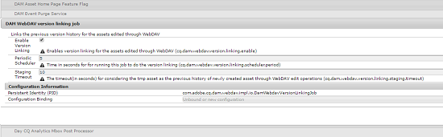

# Install and configure AEM Desktop App{#install-and-configure-aem-desktop-app}

Install and configure AEM Desktop App to work with AEM Assets servers and map the assets to mount as a drive on your desktop.

To use AEM Desktop App,

* Download and install the application.
* Ensure that your AEM server version is supported by AEM Desktop App. See the [compatibility matrix](release-notes.md#compatibilitymatrix).
* Test the connection using a few assets. See [Access and open assets on your desktop](aem-desktop-app.md#openondesktop).

## System requirements, prerequisites, and download links {#system-requirements-prerequisites-and-download-links}

For detailed information, see the [AEM Desktop App release notes](release-notes.md).

## Install and connect AEM Desktop App to AEM server {#install-and-connect-aem-desktop-app-to-aem-server}

For details, see [Install and connect AEM Desktop App to AEM server](aem-desktop-app.md#installandconnect).

>[!NOTE]
>
>Only one instance of the AEM Desktop App can be installed and be active at a time.

## Proxy support {#proxy-support}

AEM Desktop App uses system's pre-defined proxy to connect to the Internet over HTTPS. The app can only connect using a network proxy that does not require extra authentication.

If you configure or modify proxy server settings for Windows (Internet Options &gt; LAN Settings), restart the AEM Desktop App for the changes to take effect.

If your proxy requires authentication, the IT team can whitelist the AEM Assets URL in the proxy server settings to allow the application traffic to pass through.

## File handling {#file-handling}

When changing a file from a network share location mounted by the Desktop App, files are saved to that location in two phases. In the first phase, a file is saved locally. A user can save the file and continue working on the file, without waiting for the transfer to complete.

In the second phase, Desktop App uploads the updated file to AEM server after a predefined delay (for example, 30s). This operation occurs in the background. Use the View Asset Status option to view the status of the upload operation.

1. Upload an asset to AEM Assets.
1. Click/tap the AEM Desktop App icon from the toolbar.
1. From the menu, select the View Asset Status option.
1. From the dialog, review the status of the upload operation.

>[!NOTE]
>
>AEM Desktop App can handle assets up to 40 GB.

## Connect to an AEM instance behind a dispatcher {#connect-to-an-aem-instance-behind-a-dispatcher}

The Copy and Move methods in the Assets API require the following additional headers to be passed to AEM:

* X-Destination
* X-Depth
* X-Overwrite

AEM Desktop connects to AEM using a URL that includes the default port. Therefore, the *virtualhosts* setting in the dispatcher configuration should include the default port number. For more information around virtualhosts configuration, see [Identifying Virtual Hosts](/content/help/en/experience-manager/dispatcher/using/dispatcher-configuration#IdentifyingVirtualHostsvirtualhosts).

For additional information on configuring the dispatcher to pass through these additional headers, see [Specifying the HTTP Headers](/content/help/en/experience-manager/dispatcher/using/dispatcher-configuration#SpecifyingtheHTTPHeaderstoPassThroughclientheaders).

## Customize the Asset Info dialog {#customize-the-asset-info-dialog}

You can customize the Asset Info dialog by overlaying one or both of these components:

* The Granite user interface page at `/libs/dam/gui/content/assets/moreinfo`
* The HTL `/css/javascript` component at `/libs/dam/gui/components/admin/moreinfo`

Which component is overlaid, depends on the nature of the customization. To change which components are displayed as part of the Asset Info dialog, overlay the Granite user interface page. To change the HTML/CSS/Javascript content of the dialog, overlay the HTL component.

<!--
Comment Type: draft

<h2>Link the asset versions edited using WebDAV</h2>
-->

<!--
Comment Type: annotation
Last Modified By: asgupta
Last Modified Date: 2018-07-12T09:08:48.417-0400
WebDAV is not applicable anymore. The app uses HTTPS.
-->

<!--
Comment Type: draft

To link the version history for the assets edited through WebDAV, configure the DAM WebDAV version linking job from Configuration Manager.

-->

<!--
Comment Type: draft

<ol>
<li>
Visit https://[<em>AEM Server</em>]:[<em>Port</em>]/system/console/configMgr URL and open the Configuration Manager.
 </li>
<li>
Open the <strong>DAM WebDAV version linking job</strong> configuration.
 </li>
<li>
Select <strong>Enable Version Linking</strong>.
 </li>
<li>
Specify the time interval for the scheduler to run the job and the staging timeout time, and save the settings.
 </li>
</ol>
-->

## Manage cache {#manage-cache}

On Windows, the cache is at `%LOCALAPPDATA%\Adobe\AssetsCompanion\Cache\`, where is an encoded version of the AEM host configured in the Desktop App. For example, `http://localhost:4502` appears as `http%3A%2F%2Flocalhost%3A4502%2F`.

On Mac OS X, a similar directory is at `~/Library/Group Containers/group.com.adobe.aem.desktop/cache`.

### In-app option to manage cache {#in-app-option-to-manage-cache}

You can control the amount of disk space made available for local caching purposes. The artifacts from the AEM Assets server are cached locally for a smoother experience. You can change the defaults to suit your requirements. Also, you can clear the cache to fetch all assets afresh. To set the desired options, click the application's icon and click **[!UICONTROL Advanced]** > **[!UICONTROL Manage Cache]**. ****

>[!NOTE]
>
>When you clear the cache, it preserves your unsaved changes. Any assets not checked into AEM server are retained and not deleted.

### Change location of cache on Windows {#change-location-of-cache-on-windows}

The default location of the cache for the AEM Desktop App is:

* Windows: `%LocalAppData%\Adobe\AssetsCompanion\Cache\EncodedAEMEndpoint`
* Mac: `~/Library/Group/Containers/group.com.adobe.aem.desktop/cache/EncodedAEMEndpoint`

`EncodedAEMEndpoint` is AEM Desktop App's configured AEM endpoint URL. The value is an encoded version of the targeting URL of the AEM server. For example, if the application is targeting `http://localhost:4502`, the directory name is `http%3A%2F%2Flocalhost%3A4502`. The Windows path to the cache directory in this example is %LocalAppData%\Adobe\AssetsCompanion\Cache\http%3A%2F%2Flocalhost%3A4502.

To point the application to a different folder or a different drive, edit the application's configuration file.

1. Navigate to the app’s installation directory. The default location on Windows is `C:\Program Files (x86)\Adobe\Adobe Experience Manager Desktop`.
1. Edit Adobe Experience Manager Desktop.exe.config file with a text editor.

   Administrator privileges are required to save changes to this file.

1. Search for the string "ProxyCacheRoot". You see that its value is set to the cache location "%LocalAppData%\Adobe\AssetsCompanion\Cache". Simply change this value to any valid path.

   >[!NOTE]
   >
   >The app automatically creates an *&lt;Encoded AEM Endpoint&gt;* subdirectory; this behavior is not configurable.

## Additional resources {#additional-resources}

* [Introduction to AEM Desktop App](https://helpx.adobe.com/experience-manager/kt/eseminars/ccoo-aem-desktop-app.html)
* [Use AEM Desktop App](aem-desktop-app.md)  

* [Understand Check-in/Check-out with AEM Desktop App](https://helpx.adobe.com/experience-manager/kt/assets/using/aem-desktop-app-checkin-checkout-technical-video-understand.html)
* [Using Desktop App with AEM Assets](https://helpx.adobe.com/experience-manager/kt/assets/using/aem-desktop-app-sync-status-technical-video-use.html)
* [Troubleshooting AEM Desktop App](https://helpx.adobe.com/experience-manager/kb/troubleshooting-companion-app.html)

