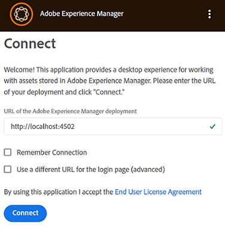

# Install [!DNL Adobe Experience Manager] desktop app {#install-app-v2}

Using the [!DNL Adobe Experience Manager] desktop app, the assets within [!DNL Experience Manager] are easily available on your local desktop and can be used in any native desktop applications. Assets can be previewed, opened in native desktop applications, revealed in Mac Finder or Windows Explorer for placing in other documents, and changed locally – the changes are saved back to [!DNL Experience Manager] when you upload and a new version is created in the repository.

Such an integration allows various roles in the organization to,

* Manage the assets centrally in [!DNL Experience Manager Assets].

* Access the assets in any native desktop applications, including third-party applications and in Adobe Creative Cloud. While doing so, users can easily adhere to the various standards including branding.

To use [!DNL Experience Manager] desktop app,

* Ensure that your [!DNL Experience Manager] version is supported by [!DNL Experience Manager] desktop app. See the [system requirements](release-notes.md).

* Download and install the application. See [install desktop app](#install-v2) below.

* Test the connection using a few assets. See [how to browse and search for assets](using.md#browse-search-preview-assets).

## System requirements, prerequisites, and download links {#tech-specs-v2}

For detailed information, see the [[!DNL Experience Manager] desktop app release notes](release-notes.md).

## Upgrade from a previous version {#upgrade-from-previous-version}

If you are a user of v1.x of desktop app, then understand the differences and similarities between the previous and the latest version of the app. See [what is new in desktop app](introduction.md#whats-new-v2) and [how the app works](release-notes.md#how-app-works)

>[!NOTE]
>
>Two versions of desktop app cannot co-exist on a machine. Before you install a version, uninstall the other version.

To upgrade from a previous version of the app, follow these instructions:

1. Before upgrading, sync all your assets and upload your changes to [!DNL Experience Manager]. This is to avoid losing any edits when uninstalling the app.

1. Uninstall the previous version of the app. When uninstalling, select the option to clear the cache.

1. Restart your machine.

1. [Download](release-notes.md) and [install](#install-v2) the latest app. Follow the instructions below.

## Install {#install-v2}

To install the desktop app, follow these steps. Uninstall any existing Adobe [!DNL Experience Manager] desktop app v1.x before installing the latest app. For more info, see above.

1. Download the latest installer from the [release notes](release-notes.md) page.

1. Keep the URL and credentials of your [!DNL Experience Manager] deployment handy.

1. If you are upgrading from another version of the app, see [upgrade desktop app](#upgrade-from-previous-version).

1. Skip this step if you are using [!DNL Experience Manager] as a [!DNL Cloud Service], [!DNL Experience Manager] 6.4.4 or later, or [!DNL Experience Manager] 6.5.0 or later. Ensure that your [!DNL Experience Manager] setup meets the compatibility requirements mentioned in the [release notes](release-notes.md). If necessary, download the applicable [compatibility package](https://experience.adobe.com/#/downloads/content/software-distribution/en/aem.html?package=/content/software-distribution/en/details.html/content/dam/aem/public/adobe/packages/cq640/featurepack/adobe-asset-link-support) and install it using the [!DNL Experience Manager] Package Manager as an [!DNL Experience Manager] administrator. To install a package, see [How to work with Packages](https://experienceleague.adobe.com/docs/experience-manager-65/administering/contentmanagement/package-manager.html).

1. Execute the installer binary and follow the onscreen instructions to install.

1. On Windows, the installer may prompt to install `Visual Studio C++ Redistributable 2015`. Follow on-screen instructions to install it. If the installation fails then install it manually. Download the installer from [here](https://www.microsoft.com/en-us/download/details.aspx?id=52685) and install both `vc_redist.x64.exe` and `vc_redist.x86.exe` files. Re-run the [!DNL Experience Manager] desktop app installer.

1. Restart the machine as prompted. Launch and configure the desktop app.

1. To connect the app with an [!DNL Experience Manager] repository, click the app icon in the tray and launch the app. Provide the address of the [!DNL Experience Manager] server in the format `https://[aem_server]:[port]/`.

   Click **[!UICONTROL Connect]** and provide the credentials.

   

   *Figure: Connection screen to input server address.*

   >[!CAUTION]
   >
   >Ensure there are no leading or trailing spaces before or after the address of the [!DNL Experience Manager] server. Otherwise the app cannot connect to the [!DNL Experience Manager] server.

1. Upon successful connection, you can view the list of folders and assets available in the root folder of the [!DNL Experience Manager] DAM. You can browse the folders from within the app.

   

   *Figure: Application displays the DAM contents after login*

1. ([!DNL Experience Manager] 6.5.1 or later) If you are using desktop app with [!DNL Experience Manager] 6.5.1 or later, upgrade S3 or Azure connector to version 1.10.4 or later. See [Azure connector](https://experienceleague.adobe.com/docs/experience-manager-65/deploying/deploying/data-store-config.html#azure-data-store) or [S3 connector](https://experienceleague.adobe.com/docs/experience-manager-65/deploying/deploying/data-store-config.html#amazon-s-data-store).

   If you are an Adobe Managed Services (AMS) customer, contact Adobe Customer Support.

## Set preferences {#set-preferences}

To change preferences, click  and **[!UICONTROL Preference]** . In the **[!UICONTROL Preferences]** window, adjust the values of the following:

* [!UICONTROL Launch application on login].

* [!UICONTROL Show window when application starts].

* **[!UICONTROL Cache Directory]**: Location of local cache of the app (it contains the locally downloaded assets).

* **[!UICONTROL Network Drive Letter]**: The drive letter used to map to the [!DNL Experience Manager] DAM. Do not change this if you are not sure. The app can map to any drive letter on Windows. If two users place assets from different drive letters, they cannot see the assets placed by each other. The path of the assets change. The assets remain placed in the binary file (say INDD) and are not removed. The app lists all the available drive letters and by default uses the last-available letter that is typically `Z`.

* **[!UICONTROL Maximum Cache Size]**: Allowed cache on hard disk in GB that is used toward storing locally downloaded assets.

* **[!UICONTROL Current cache size]**: Storage size of the locally downloaded assets. The information is displayed only after assets are downloaded using the app.

* **[!UICONTROL Automatically download linked assets]**: The assets that are placed in the supported native Creative Cloud apps are fetched automatically if you download the original file.

* **[!UICONTROL Maximum number of downloads]**:  Change with caution. When downloading assets for the first time (via Reveal, Open, Edit, Download, or similar option), the assets are downloaded only if the batch contains less than this number. Default value is 50. Do not change if you are unsure. Increasing the value can lead to longer wait times and decreasing the value may not allow you to download the necessary assets or folders in one go.

* **[!UICONTROL Use legacy conventions when creating nodes for assets and folders]**:  Change with caution. This setting lets the app emulate v1.10 app behavior when uploading folders. In v1.10, the node names created in the repository respect spaces and casing of the folder names provided by the user. However, in v2.1 of the app, the extra spaces in the folder names are converted to dashes. For example, uploading `New Folder` or `new   folder` creates the same node in the repository if the option is not selected and the default behavior in v2.1 is retained. If this option is selected, then different nodes are created in the repository for the above two folders and it matches the behavior of v1.10 app.

  The default behavior of v2.1 continues to remain same, that is, replace multiple spaces in folder names with dashes in the repository node name and convert to lowercase node names.

* **[!UICONTROL Upload Acceleration]**:  Change with caution. When uploading assets, the application can use concurrent uploads to improve upload speed. You can increase the concurrency of the upload by moving the slider to the right. The slider on the far left-hand side means no concurrency (single-threaded upload), the middle position corresponds to 10 concurrent threads, and the maximum limit on far right-hand side corresponds to 20 concurrent threads. A higher concurrency limit is more resource-intensive.

To update the unavailable preferences, log out of the [!DNL Experience Manager] server and then update. After updating the preferences, click .


*Figure: Desktop app preferences.*

### Proxy support {#proxy-support}

[!DNL Experience Manager] desktop app uses system's pre-defined proxy to connect to the Internet over HTTPS. The app can only connect using a network proxy that does not require extra authentication.

If you configure or modify proxy server settings for Windows (Internet Options &gt; LAN Settings), restart the [!DNL Experience Manager] desktop app for the changes to take effect. Proxy configuration applies when you start the desktop app. Close and re-launch the app for any changes to take effect.

If your proxy requires authentication, the IT team can allow the [!DNL Experience Manager Assets] URL in the proxy server settings to allow the application traffic to pass through.

## Uninstall the app {#uninstall-the-app}

To uninstall the application on Windows, follow these steps:

1. Upload all your changes to [!DNL Experience Manager] to avoid losing any edits. See [Edit assets and upload updated assets to [!DNL Experience Manager]](using.md#edit-assets-upload-updated-assets). Log off and [!UICONTROL Exit] the app.

1. Remove the app as you’d remove any other OS application. Uninstall it from Add and remove programs on Windows.

1. To remove the cache and logs, select the necessary check box.

   

1. Follow the onscreen instructions. When completed, restart the machine.

To uninstall the application on Mac, follow these steps:

1. Upload all your changes to [!DNL Experience Manager] to avoid losing any edits. See [Edit assets and upload updated assets to [!DNL Experience Manager]](using.md#edit-assets-upload-updated-assets). Log off and [!UICONTROL Exit] the app.

1. Remove the `Adobe Experience Manager Desktop.app` from `/Applications`.

Alternatively, to clean internal application caches on Mac and uninstall the app, you can execute the following command in the terminal:

```shell
/Applications/Adobe Experience Manager Desktop/Contents/Resources/uninstall-osx/uninstall.sh
```
