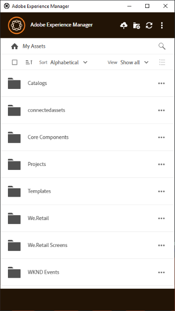

# Install AEM desktop app {#install-app-v2}

Using the AEM desktop app, the assets within AEM are easily accessible on your local desktop and can be used in any desktop applications. Assets can be easily revealed in Mac Finder or Windows Explorer, opened in desktop applications, and changed locally – the changes are saved back to AEM when you upload and a new version is created in the repository.

Such an integration allows various roles in the organization to manage the assets centrally in AEM Assets and to access them in the Creative Cloud and other applications, while making it easy to adhere to the various standards including branding.

To use AEM desktop app,

* Ensure that your AEM server version is supported by AEM desktop app. See the [compatibility matrix](release-notes-of-v1.md#compatibilitymatrix).
* Download and install the application.
* Test the connection using a few assets. See [Access and open assets on your desktop](use-app-v1.md#openondesktop).

## System requirements prerequisites, and download links {#tech-specs-v2}

For detailed information, see the [AEM desktop app release notes](release-notes.md).

## Upgrade from app v1.x to app v2 {#upgrade-from-previous-version}

If you are an existing user of the app, then understand the differences and similarities between the previous and the latest version of the app. Also, follow the below guidelines, to transition from v1.x to the latest version.

>[!NOTE]
>
>Desktop app v1.x and v2 cannot co-exist on a machine. Before you install a version, uninstall the other version.

To upgrade from v1.x to the latest version of the app, follow these instructions:

1. Before upgrading, sync all your assets. Upload all the changes using app v1.x. This is to avoid losing any changes when uninstalling the app v1.x.
1. Uninstall app v1.x. When uninstalling v1.x, clear the cache.
1. Restart your machine.
1. Download and install the latest app. Follow the instructions below.

## Install {#install-v2}

To install the desktop app, follow these steps. Uninstall any existing Adobe Experience Manager desktop app v1.x before installing the latest app. For more info, see above.

1. Keep the URL and credentials of your AEM deployment handy.
1. Skip this step if you are using AEM 6.4.4 and later or AEM 6.5.0 or later. Ensure that your AEM setup meets the compatibility requirements mentioned in the release notes. If necessary, download the applicable [compatibility package](https://www.adobeaemcloud.com/content/marketplace/marketplaceProxy.html?packagePath=/content/companies/public/adobe/packages/cq640/featurepack/adobe-asset-link-support) and install it using the AEM Package Manager as an AEM administrator. To install a package, see [How to work with Packages](https://helpx.adobe.com/experience-manager/6-5/sites/administering/using/package-manager.html).
1. Execute the installer binary and follow the onscreen instructions to install.
1. On Windows, the installer may prompt to install `Visual Studio C++ Redistributable 2015`. Follow on-screen instructions to install it. If the installation fails then install it manually. Download the installer from [here](https://www.microsoft.com/en-us/download/details.aspx?id=52685) and install both `vc_redist.x64.exe` and `vc_redist.x86.exe` files. Re-run the AEM desktop app installer.
1. Restart the machine as prompted. Launch the desktop app to configure it.
1. To connect the app with an AEM repository, click the app icon in the tray to launch the app. Provide the address of the AEM instance. Click **[!UICONTROL Connect]** and provide the credentials.

   

   >[!Caution]
   >
   >Ensure there are no leading or trailing spaces before or after the address of the AEM server. Otherwise the app cannot connect to the AEM server.

1. Upon successful connection, you can view the list of folders and assets available in the root folder of the AEM DAM. You can browse the folders from within the app.

   

1. (AEM 6.5.1 or above) If you are using desktop app with AEM 6.5.1 or later, upgrade S3 or Azure connector to version 1.10.4 or later. See [Azure connector](https://helpx.adobe.com/experience-manager/6-5/sites/deploying/using/data-store-config.html#AzureDataStore) or [S3 connector](https://helpx.adobe.com/experience-manager/6-5/sites/deploying/using/data-store-config.html#AmazonS3DataStore).

   If you are an Adobe Managed Services (AMS) customer, contact Adobe Customer Care.

## Set preferences {#set-preferences}

To change preferences, click  and **[!UICONTROL Preference]** . In the **[!UICONTROL Preferences]** window, adjust the values of the following:

* [!UICONTROL Launch application on login].
* [!UICONTROL Show window when application starts].
* **[!UICONTROL Cache Directory]**: Location of local cache of the app (it contains the locally downloaded assets).
* **[!UICONTROL Network Drive Letter]**: The drive letter used to map to the AEM DAM. Do not change this if you are not sure. The app can map to any drive letter on Windows. If two users place assets from different drive letters, they cannot see the assets placed by each other. The path of the assets change. The assets remain placed in the binary file (say INDD) and are not removed. The app lists all the available drive letters and by default uses the last-available letter that is typically `Z`.
* **[!UICONTROL Maximum Cache Size]**: Allowed cache on hard disk in GB that is used toward storing locally downloaded assets.
* **[!UICONTROL Current cache size]**: Storage size of the locally downloaded assets. The information is displayed only after assets are downloaded using the app.
* **[!UICONTROL Automatically download linked assets]**: The assets that are placed in the supported native Creative Cloud apps are fetched automatically if you download the original file.
* **[!UICONTROL Maximum number of downloads]**: When downloading assets for the first time (via Reveal, Open, Edit, Download, or similar option), the assets are downloaded only if the batch contains less than this number. Default value is 50. Do not change if you are unsure. Increasing the value can lead to longer wait times and decreasing the value may not allow you to download the necessary assets or folders in one go.

To update the unavailable preferences, log out of the AEM server. After updating the preferences, click  to save the changes.

## Uninstall the app {#uninstall-the-app}

To uninstall the application on Windows, follow these steps:

1. Upload all your changes to AEM to avoid losing any edits. See [Edit assets and upload updated assets to AEM](using.md#edit-assets-upload-updated-assets). Log off and [!UICONTROL Exit] the app.
1. Remove the app as you’d remove any other OS application. Uninstall it from Add and remove programs on Windows.
1. To remove the cache and logs, select the necessary check box.
   
1. Follow the onscreen instructions. When completed, restart the machine.

To uninstall the application on Mac, follow these steps:

1. Upload all your changes to AEM to avoid losing any edits. See [Edit assets and upload updated assets to AEM](using.md#edit-assets-upload-updated-assets). Log off and [!UICONTROL Exit] the app.
1. Remove the `Adobe Experience Manager Desktop.app` from `/Applications`.

Alternatively, to clean internal application caches on Mac and uninstall the app, you can execute the following command in the terminal:
`/Applications/Adobe Experience Manager Desktop/Contents/Resources/uninstall-osx/uninstall.sh`
