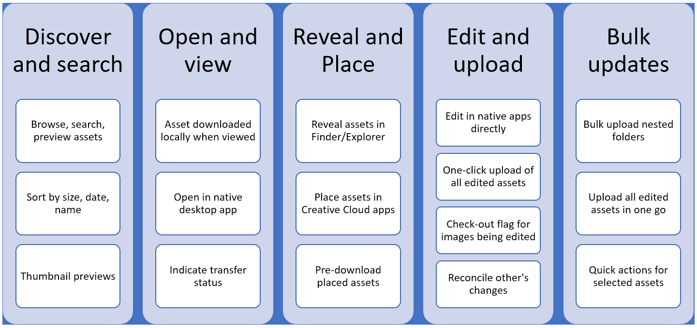

# Adobe Experience Manager desktop app overview {#overview-v2}

Adobe offers connected workflows across its solutions to allow next-level productivity for your line-of-business users and creative professionals. The Adobe Experience Manager desktop app connects repositories and desktop applications, including Adobe and third-party ones, to provide faster access to resources and streamlined workflows. This saving of time and reduction in effort improves efficiency of users, who work with assets from Adobe Experience Manager in their desktop workflows.

Using the app, the assets within Adobe Experience Manager Assets are easily accessible on your local desktop and can be used in any desktop applications. You can open and edit the assets in desktop applications of your choice. The local edits are made available in Adobe Experience Manager as a new version of the asset only when you choose to upload the changes, which allows for handling work-in-progress editing of assets in an efficient manner on desktop. The app supports upload of assets and nested folders to Experience Manager, simplifying adding new content to the repository.

Such an integration allows various roles in the organization to manage the assets centrally in Experience Manager Assets. Marketers and business users can ensure compliance to the various standards including branding and licensing. Creative users, who also have a dedicated [Adobe Asset Link](https://www.adobe.com/marketing/experience-manager-assets/adobe-asset-link.html) tool for working with assets in Adobe Photoshop, Illustrator and InDesign, can also access assets on the desktop in the Creative Cloud and other native applications.

>[!NOTE]
>
>Adobe Experience Manager desktop app was introduced in Adobe Experience Manager 6.1 release and was previously called Adobe Experience Manager Assets Companion App. For help of app version 1.x, see the TOC in the left sidebar. Adobe recommends upgrading to the latest version 2.

The desktop app documentation contains information for the following roles and use cases.

| Information required | Help content |
|--- |--- |
| Want a quick glimpse of new features and enhancements in the latest version? | [What's New in the App](#whats-new-v2) |
| Want to know the prerequisites and technical specifications? Want download links? | [Release Notes](release-notes.md) |
| Not new to desktop app? Upgrading and want to transition smoothly? | [Upgrade from previous version](install-upgrade.md#upgrade-from-previous-version) |
| Get up and running. Want to tweak default preferences? | [Install and configure the app](install-upgrade.md) |
| Learn how to use to browse, discover, edit, upload, resolve conflicts, do bulk operations, and so on. | [Use Experience Manager desktop app](using.md) |
| Ran into an issue? Need help to troubleshoot? | [Troubleshoot the Experience Manager desktop app](troubleshoot.md) |

## What's New in the App {#whats-new-v2}

Version 2.0 of the app is created from grounds-up to provide many improvements over the previous versions. The new app is more user-friendly and offers a dedicated desktop experience with a new application UI. Users can discover assets via search or browsing, open, edit, and upload changes, as well as upload new assets – without requiring the user to use the Experience Manager interface. This version also supports opening files from the Experience Manager interface.

The new app brings substantial improvements to the user experience, while catering to the same use cases as before. The following are the top-level improvements.

* Users discover assets by browsing and searching within the app in a built-in browser, instead of relying on Mac Finder or Windows Explorer to display a virtual network share.

* Clear guidance on the actions available to users.

* Performance is improved by reducing bandwidth usage. The original binary files are downloaded only when necessary. For browsing and searching assets, only small thumbnails are transferred.

* Optimized for bulk operations, such as bulk upload.

The primary use cases and enhancements of the new app are mapped with the customer journey in the following illustration.

The desktop app allows its users to accomplish all the above-mentioned use cases right from within the app. If necessary, you can also choose to do asset discovery in the web interface and then pass control to the app to open and edit the assets.
