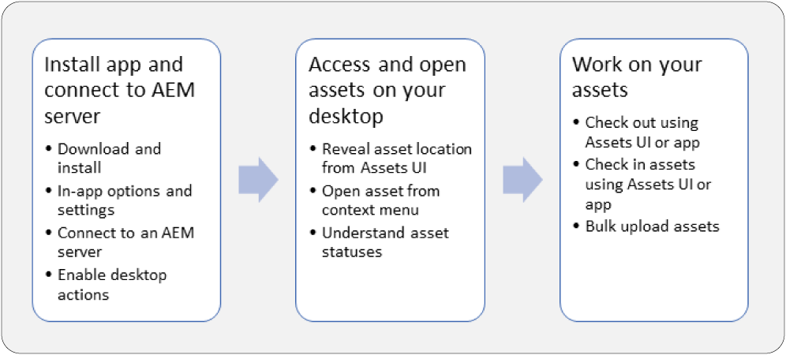

# AEM Desktop App Overview {#aem-desktop-app-overview}

Learn how to use Adobe Experience Manager Desktop App and optimize your work with assets on desktop.

Adobe offers connected workflows across its solutions to allow next-level productivity for your creative professionals. The AEM Desktop App connects AEM repositories and desktop applications, including Adobe and third-party ones, to provide faster access to resources and streamlined workflows. This saving of time and reduction in effort improves efficiency of users, who work with assets from AEM in their desktop workflows.

## About the AEM Desktop application {#about-the-aem-desktop-application}

Using the App, the assets within AEM are easily accessible on your local desktop and can be used in any desktop applications. Assets can be easily revealed in Mac Finder or Windows Explorer, opened in desktop applications, and changed locally - the changes are saved back to AEM with a new version created in the repository.

Such an integration allows various roles in the organization to manage the assets centrally in AEM Assets and to access them in the Creative Cloud and other applications, while making it easy to adhere to the various standards including branding.

>[!NOTE]
>
>AEM Desktop App was introduced in AEM 6.1 release and was previously called AEM Assets Companion App.

## AEM Desktop app touch-points in the creative workflow {#aem-desktop-app-touch-points-in-the-creative-workflow}

AEM Desktop app, along with AEM Assets, integrates in your creative workflow and offers the following touchpoints.

AEM Desktop app touch-points the creative workflow

## AEM Desktop App version 1.x documentation {#aem-desktop-app-version-1x-documentation}

If you are using v1.x of the app, refer the specific help articles in the TOC in the left sidebar. Adobe strongly recommends that you upgrade to v2.