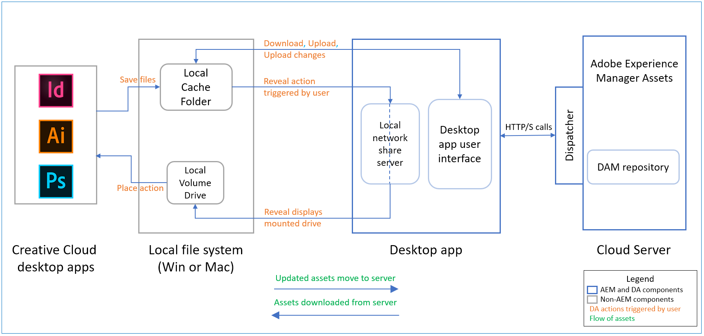

# Adobe Experience Manager desktop app release notes {#release-notes-v2}

| Products | Adobe Experience Manager desktop app |
|----|----|
| App version (Revision) | 2.0 (2.0.2.0) |
| Supported AEM versions | AEM as a Cloud Service; AEM 6.5; AEM 6.4; AEM 6.3 (with compatibility package) |
| Type | Minor release |
| Release date  | Apr 15, 2020 (Mac and Win) |
| Download URLs | [macOS 64-bit](https://download.macromedia.com/aem-assets-companion-app/aem-desktop-osx-2.0.2.0.dmg); [Windows 64-bit](https://download.macromedia.com/aem-assets-companion-app/aem-desktop-win64-2.0.2.0.exe); [Windows 32-bit](https://download.macromedia.com/aem-assets-companion-app/aem-desktop-win32-2.0.2.0.exe) |

## System requirements and prerequisites {#system-requirements-and-prerequisites-v2}

Adobe Experience Manager desktop app is compatible with the following operating systems:

* Mac OS X 10.14 or newer, with the latest bug fixes.
* Windows 7 and Windows 10 with the latest service packs and bug fixes.

The app works with the following Experience Manager versions, whether deployed as a Cloud Service, on Adobe Managed Services (AMS) or on-premise:

* [Experience Manager as a Cloud Service](https://docs.adobe.com/content/help/en/experience-manager-cloud-service/release-notes/home.html)
* [Experience Manager 6.5.0](https://docs.adobe.com/content/help/en/experience-manager-65/release-notes/release-notes.html) or newer
* [Experience Manager 6.4.4](https://docs.adobe.com/content/help/en/experience-manager-64/release-notes/release-notes.html) or newer
* Experience Manager 6.4.0 - 6.4.3 with [compatibility package](https://www.adobeaemcloud.com/content/marketplace/marketplaceProxy.html?packagePath=/content/companies/public/adobe/packages/cq640/featurepack/adobe-asset-link-support)

>[!NOTE]
>
>Desktop app support for Experience Manager 6.3 is deprecated. Adobe recommends upgrading to a newer and supported Adobe Experience Manager version.
>Experience Manager 6.3.3.1 or later works with desktop app after installing the [compatibility package](https://experience.adobe.com/#/downloads/content/software-distribution/en/aem.html?package=/content/software-distribution/en/details.html/content/dam/aem/public/adobe/packages/cq640/featurepack/adobe-asset-link-support). No such package is available for Experience Manager 6.3 as no [service packs are planned](https://helpx.adobe.com/experience-manager/maintenance-releases-roadmap.html).

The version of the app you plan to install on your local machine requires a specific Adobe Experience Manager server version/additional server-side components (service packs, hot fixes, or feature packs). Contact your Adobe Experience Manager administrator for help.

### Support for different assets and file types {#support-for-file-types}

The application supports assets stored in Adobe Experience Manager that represent binary file for its basic operations. Opening files in the native desktop application relies on the operating system association of the specific file types like PNG or JPG to specific applications like Mac Preview or Adobe Photoshop.

A few file types support placing linked assets in the binary. The application pre-downloads the linked assets if the asset is present in the Experience Manager repository when such binary files are opened using the desktop app. Currently supported file types are:

* Adobe InDesign files (INDD format)
* Adobe Illustrator files (AI format)
* Adobe Photoshop files (PS format)

The feature is supported with Adobe Creative Cloud 2018 and Adobe Creative Cloud 2019 versions of the above application. The app uses a heuristic, best-match approach to map the local desktop paths of linked assets to URLs on the Experience Manager server. It relies on a few assumptions:

* Paths to placed files in the native application use a global desktop path (placed from the local network share shown with [!UICONTROL Reveal] option).
* Paths are stored in the file’s XMP record by the native app.
* Experience Manager has extracted the XMP record with the paths to the asset’s metadata record.
* The paths can be matched to assets in Experience Manager, that is, the placed files are also in Experience Manager under a matching path.

## New features and enhancements {#whats-new-added}

To know the details, see [What's new in v2.0](introduction.md#whats-new-v2).

**Updates in app v2.0.2**

The bug fixes and updates are:

* To improve upload performance, increase the upload acceleration in [!UICONTROL Preferences]. When this setting turned on, the app uses more local CPU threads and is more resource-intensive.
* Fixed issue with asset uploads when filenames or paths contain certain GB18030 characters. <!-- CQ-4283494 -->
* Sort by relevance option is available after switching to another sort type in the search results. <!-- CQ-4286874 -->
* Desktop app now lists sub-folders without the need to explicitly refresh. <!-- CQ-4285711 -->
* (Windows) Fixed a rare issue of unusable app interface on some Windows machines. Users cannot click on the app interface as it  appears distorted with the click-area of interface elements 'shifted' sideway. <!-- CQ-4280785 -->

**Updates in app v2.0.1**

The bug fixes and updates are:

* Allow option to configure `%Temp%` directory to match `%APPDATA%` path. <!-- CQ-4282665 -->
* Allow users to log in on AEM Author via Okta SAML authentication. <!-- CQ-4278134 -->

## Installation instructions {#installation-instructions-v2}

To know how to install and configure the app, see [Install Experience Manager desktop app](install-upgrade.md).

If you are upgrading from a previous Experience Manager desktop app, you must follow these best practices for transitioning that are listed at [upgrade from previous version](install-upgrade.md#upgrade-from-previous-version).

## Important notes about how the app works {#how-app-works}

It is important to understand the following about the application and how it works.

* The application provides full control over operations that require full transfer of asset binaries from and to AEM (open, edit, upload changes, and upload assets).
  * If you want to work with the asset on desktop, you need to explicitly Open, Edit, or Download to your desktop, either individually, in a folder, or via multi-selection.
  * If you want to get local changes to assets uploaded to AEM, you need to select [!UICONTROL Upload Changes], either individually or via multi-selection.
  * The application is not a 'sync client' that synchronizes assets across the desktop and AEM.
  * The application does not provide a network share that maps the AEM repository as a virtual folder structure.
* The list of assets shown by the application is based on the status of the AEM Assets repository. Any files downloaded locally and then renamed in the local files or cache folder are not displayed or managed by the application.
* If the app does not display the expected results, click refresh icon in the top bar.
* The local network share, shown when you use [!UICONTROL Reveal File] action, only shows files (and folders) that are available locally. [!UICONTROL Reveal File] and [!UICONTROL Reveal Folder] pre-downloads assets to help get the right assets showing in the local network share.
* SMB (Mac) /WebDAV (Win) local network share is used when an Adobe Creative Cloud app reads the asset files linked/placed in a native file of the Creative Cloud app.

The following diagram illustrates the flow of assets and files from cloud to local file system and vice versa, as initiated by user actions.

## Known issues {#known-issues-v2}

**User interface issues:**

* At times, the interface of the desktop app might become blank. Right-click and click [!UICONTROL Refresh] to re-load the application. After such a refresh, you start at the root of the DAM repository. Updates to or statuses of your assets are retained. <!-- CQ-4270267 -->
* Difficult to navigate folders/search results without a track pad or mouse pointer. The scroll-bar might not appear with mouse devices without mouse wheel. <!-- CQ-4269947 -->
* Infrequently, the progress bar does not display correctly when the uploading asset changes.
* After applying and removing the filter to find all locally edited assets, the app does not take users to their search results or folder view that the users started with. The app displays the root folder of the DAM repository.
* At times, when you connect to a URL that doesn’t have AEM server running, the connect screen becomes unresponsive. Exit the application and start it again.

**CRUD (Create, Read, Update, and Delete) issues:**

* Application tries to upload files even with invalid characters, might cause server-side upload failure. <!-- CQ-4273652 -->
* When uploading changes to an asset with comments, the comments are stored with the asset in AEM but are not visible as versioning comments. This issue is resolved in AEM 6.4.5 and AEM 6.5.1. Adobe strongly recommends installing the latest service packs. <!-- CQ-4268990 -->
* Asset transfers cannot be canceled by the user. If you triggered an unintended large transfer, exit the application and start it again. <!-- CQ-4278940 -->

**Platform issues:**

* At times, on Windows, an asset's status may immediately change to [!UICONTROL Edited Locally] after opening it, even though you may not have edited it. Click [!UICONTROL Refresh] to update.

>[!MORELIKETHIS]
>
>* [AEM as a Cloud Service documentation](https://docs.adobe.com/content/help/en/experience-manager-cloud-service/landing/home.html)
>* [AEM as a Cloud Service Assets documentation](https://docs.adobe.com/content/help/en/experience-manager-cloud-service/assets/home.html)
>* [How to use Experience Manager desktop app](using.md)
>* [Install and upgrade desktop app](install-upgrade.md)
>* [Best practices and troubleshooting tips](troubleshoot.md)
