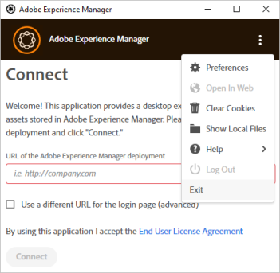

# Troubleshoot [!DNL Adobe Experience Manager] desktop app {#troubleshoot-v2}

[!DNL Adobe Experience Manager] desktop app connects to a [!DNL Experience Manager] deployment's Digital Asset Management (DAM) repository. The app fetches repository information and search results on your machine, downloads and uploads files and folders, and includes capabilities to manage conflicts with Assets user interface.

Read on to troubleshoot the app, learn the best practices, and find out the limitations.

## Best practices {#best-practices-to-prevent-troubles}

Adhere to the following best practices to prevent some common issues and troubleshooting.

* **Understand how the desktop app works**: Before starting to use the application, spend a few moments knowing how the app works. Know about linking between [!DNL Experience Manager] web interface and desktop, repository mapping, asset caching, saving locally and uploading in background. See [how it works](release-notes.md#how-app-works).

* **Avoid unsupported characters in folder names**: Do not use whitespaces and invalid characters when creating or uploading folders. See a list of characters at [Create folders in [!DNL Experience Manager Assets]](https://experienceleague.adobe.com/docs/experience-manager-65/assets/managing/manage-assets.html#creating-folders). Some [!DNL Experience Manager] use cases may be impacted by unsupported characters in the folder name.

* **Best practices to avoid conflicts**: To avoid potential conflicts when collaborating on multiple assets, see [avoid editing conflicts](using.md#adv-workflow-collaborate-avoid-conflicts).

* **Use folder upload for large, hierarchical folders**: Instead of using the Assets web interface or other methods, use [!DNL Experience Manager] desktop app to upload large folders. The app uploads the assets in background with logging and monitoring. See [bulk upload assets](using.md#bulk-upload-assets).

* **Use the latest version**: Use the latest app version and always check for compatibility before installing either a new app version or before upgrading to a newer [!DNL Experience Manager] version. See [release notes](release-notes.md).

* **Use the same drive letter**: Use the same drive letter across an organization to map to the [!DNL Experience Manager] DAM. To see assets placed by other users, the paths must be the same. Using the same drive letter ensures a constant path to DAM assets. The assets remain placed and are not removed even if different drive letters are used by different users.

* **Mind the network**: Network performance is critical to [!DNL Experience Manager] desktop app's performance. If you face slowed response to file transfers or bulk operations, turn off the features or apps that might cause lots of network traffic.

* **Unsupported use cases for desktop app**: Do not use the app for Assets' migration (it needs planning and other tools); for heavy-duty DAM operations (like moving large folders, large uploads, finding files using advanced metadata searches); and as a sync client (design principles and usage patterns are different from in-sync clients like Microsoft OneDrive or Adobe Creative Cloud desktop sync).

* **Timeout**: Currently, desktop app does not have a configurable timeout value that disconnects the connection between [!DNL Experience Manager] server and desktop app after a fixed time interval. When uploading large assets, if the connection gets timeout after a while, the app retries to upload the asset a few times by increasing the upload timeout. There is no recommended way to change the default timeout settings.

## How to troubleshoot {#troubleshooting-prep}

To troubleshoot desktop app issues, be aware of the following information. Also, it prepares you to better convey the issues to Adobe Customer Care if you choose to seek support.

### Location of log files {#check-log-files-v2}

[!DNL Experience Manager] desktop app stores its log files in the following locations depending on the operating system:

On Windows: `%LocalAppData%\Adobe\AssetsCompanion\Logs`

On Mac: `~/Library/Logs/Adobe\ Experience\ Manager\ Desktop`

When uploading many assets, if some files fail to upload, see `backend.log` file to identify the failed uploads.

>[!NOTE]
>
>When working with Adobe Customer Care on a support request or ticket, you can be asked to share the log files to help the Customer Care team understand the issue. Archive the entire `Logs` folder and share it with your Customer Care contact.

### Change level of details in log files {#level-of-details-in-log}

To change the level of details in log files:

1. Ensure the application is not running.

1. On Windows system:

    1. Open a command window.

    1. Launch [!DNL Adobe Experience Manager] desktop app by running the command:

    ```shell
    set AEM_DESKTOP_LOG_LEVEL=DEBUG&"C:\Program Files\Adobe\Adobe Experience Manager Desktop.exe
    ```

    On Mac system:

    1. Open a terminal window.

    1. Launch [!DNL Adobe Experience Manager] desktop app by running the command:

    ```shell
    AEM_DESKTOP_LOG_LEVEL=DEBUG open /Applications/Adobe\ Experience\ Manager\ Desktop.app
    ```

The valid log levels are DEBUG, INFO, WARN, or ERROR. The verbosity of the logs is highest in DEBUG and lowest in ERROR.

### Enable debug mode {#enable-debug-mode}

To troubleshoot, you can enable the debug mode and get more information in the logs.

>[!NOTE]
>
>Valid log levels are DEBUG, INFO, WARN, or ERROR. The verbosity of the logs is highest in DEBUG and lowest in ERROR.

To use the app in debug mode on Mac:

1. Open a terminal window or a command prompt.

1. Launch the [!DNL Experience Manager] desktop app by running the following command:

    `AEM_DESKTOP_LOG_LEVEL=DEBUG open /Applications/Adobe\ Experience\ Manager\ Desktop.app`.

To enable debug mode on Windows:

1. Open a command window.

1. Launch [!DNL Experience Manager] desktop app by running the following command:

`AEM_DESKTOP_LOG_LEVEL=DEBUG&"C:\Program Files\Adobe\Adobe Experience Manager Desktop.exe`.

### Know the [!DNL Adobe Experience Manager] desktop app version {#know-app-version-v2}

To see the version number:

1. Start the application.

1. Click the ellipses in the upper right corner, hover over [!UICONTROL Help], then click [!UICONTROL About].

    The version number is listed on this screen.

### Clear cache {#clear-cache-v2}

Perform the following steps:

1. Start the application and connect an the [!DNL Experience Manager] instance.

1. Open the application's preferences by clicking the ellipses in the upper right corner and selecting [!UICONTROL Preferences].

1. Locate the entry displaying the [!UICONTROL Current Cache Size]. Click the trash icon next to this element.

To manually clear the cache, proceed with the steps below. 

>[!CAUTION]
>
>This is a potentially destructive operation. If there are local file changes that are not uploaded to [!DNL Adobe Experience Manager], then those changes will be lost by proceeding.

The cache is cleared by deleting the application's cache directory, which is found in the application's preferences.

1. Start the application.

1. Open the application's preferences by selecting the ellipses in the upper right corner and selecting [!UICONTROL Preferences].

1. Note the [!UICONTROL Cache Directory] value.

    In this directory there are subdirectories named after the Encoded [!DNL Adobe Experience Manager] Endpoints. The names is an encoded version of the targeted [!DNL Adobe Experience Manager] URL. For example, if the application is targeting `localhost:4502` then the directory name will be `localhost_4502`.

To clear the cache, delete the desired Encoded [!DNL Adobe Experience Manager] Endpoint directory. Alternatively, deleting the entire directory specified in the preferences will clear the cache for all instances that have been used by the application.

Clearing [!DNL Adobe Experience Manager] desktop app's cache is a preliminary troubleshooting task that can resolve several issues. Clear the cache from the app preferences. See [set preferences](install-upgrade.md#set-preferences). The default location of the cache folder is:

## Cannot see placed assets {#placed-assets-missing}

If you cannot see the assets that you or other creative professionals placed in the support files (say, INDD files), check the following:

* Connection to the server. Flaky network connectivity can stall asset downloads.

* File size. Large assets take longer to download and display.

* Drive letter consistency. If you or another collaborator placed the assets while mapping the [!DNL Experience Manager] DAM to a different drive letter, the placed assets do not display.

* Permissions. To check if you have permissions to fetch the placed assets, contact your [!DNL Experience Manager] administrator.

### Edits to files on desktop app's user interface do not reflect in [!DNL Adobe Experience Manager] immediately {#changes-on-da-not-visible-on-aem}

[!DNL Adobe Experience Manager] desktop app leaves it up to the user to decide when all edits to a file are complete. Depending on the size and complexity of a file, it takes significant amount of time to transfer the new version of a file back to [!DNL Adobe Experience Manager]. The design of the application calls for minimizing the number of times a file is transferred back and forth, instead of guessing when the file edits are complete and are uploaded automatically. It is advised that the user initiate the transfer of the file back to [!DNL Adobe Experience Manager] by choosing to upload a file's changes.

### Issues when upgrading on macOS {#issues-when-upgrading-on-macos}

Occasionally issues may occur when upgrading [!DNL Experience Manager] desktop app on macOS. This is caused by legacy system folder for [!DNL Experience Manager] desktop app preventing new versions of [!DNL Experience Manager] desktop app to load correctly. To remedy this issue, the following folders and files can be manually removed.

Before executing the following steps, drag the `Adobe Experience Manager Desktop` application from the macOS Applications folder to the Trash. Then open terminal, execute the following command, and provide your password when prompted.

```shell
sudo rm -rf ~/Library/Application\ Support/com.adobe.aem.desktop
sudo rm -rf ~/Library/Preferences/com.adobe.aem.desktop.plist
sudo rm -rf ~/Library/Logs/Adobe\ Experience\ Manager\ Desktop

sudo find /var/folders -type d -name "com.adobe.aem.desktop" | xargs rm -rf
sudo find /var/folders -type d -name "com.adobe.aem.desktop.finderintegration-plugin" | xargs rm -rf
```

## Cannot upload files {#upload-fails}

If you are using desktop app with [!DNL Experience Manager] 6.5.1 or later, upgrade S3 or Azure connector to version 1.10.4 or later. It resolves file upload failure issue related to [OAK-8599](https://issues.apache.org/jira/browse/OAK-8599). See [install instructions](install-upgrade.md#install-v2).

## [!DNL Experience Manager] desktop app connection issues {#connection-issues}

If you are experiencing general connectivity issues, here are some ways to get more information about what [!DNL Experience Manager] desktop app is doing.

**Check the request log**

[!DNL Experience Manager] desktop app logs all requests that it sends, along with each request's response code, in a dedicated log file.

1. Open `request.log` in the application`s log directory to see these requests.

1. Each line in the log represents either a request or a response. Requests will have a `>` character followed by the URL that was requested. Responses will have a `<` character followed by the response code and the URL that was requested. Requests and Response can be matched using each line's GUID.

**Check requests loaded by the application's embedded browser**

A majority of the application's requests are found in the request log. However, if there is no helpful information there, then it can be useful to look into the requests sent by the application's embedded browser.
See the [SAML section](#da-connection-issue-with-saml-aem) for instructions on how to view those requests.

### SAML login authentication not working {#da-connection-issue-with-saml-aem}

[!DNL Experience Manager] desktop app may not connect to your SSO-enabled (SAML) [!DNL Adobe Experience Manager] deployment. The application's design attempts to accommodate the variations and complexities of SSO connections and processes. However, a setup may require additional troubleshooting.

Sometimes the SAML process does not redirect back to the originally requested path, or the final redirect is to a host that is different than what is configured in [!DNL Adobe Experience Manager] desktop app. To verify that this is not the case:

1. Open a web browser. Access `https://[aem_server]:[port]/content/dam.json` URL.

1. Log in to the [!DNL Adobe Experience Manager] deployment.

1. When the login is complete, look at the browser's current address in the address bar. It should exactly match the URL that was initially entered.

1. Also verify that everything before `/content/dam.json` matches the target [!DNL Adobe Experience Manager] value configured in [!DNL Adobe Experience Manager] desktop app's settings.

**Login SAML process works correctly according to the above steps, but users are still unable to login**

The window within [!DNL Adobe Experience Manager] desktop app that displays the login process is simply a web browser that is displaying the target [!DNL Adobe Experience Manager] instance's web user interface:

* The Mac version uses a [WebView](https://developer.apple.com/documentation/webkit/webview).

* The Windows version uses Chromium-based [CefSharp](https://cefsharp.github.io/).

Ensure that the SAML process supports those browsers.

To troubleshoot further, it is possible to view the exact URLs that the browser is attempting to load. To see this information:

1. Follow the directions for launching the application in [debug mode](#enable-debug-mode).

1. Reproduce the login attempt.

1. Navigate to [log directory](#check-log-files-v2) of the application

1. For Windows:

    1. Open "aemcompanionlog.txt".

    1. Search for messages that begin with "Login browser address changed to". These entries also contain the URL that the application loaded.

   For Mac:

    1. `com.adobe.aem.desktop-nnnnnnnn-nnnnnn.log`, where the **n** are replaced by whichever numbers are in the newest file name.

    1. Search for messages that begin with "loaded frame". These entries also contain the URL that the application loaded.

Looking at the URL sequence that is being loaded can help troubleshoot at the SAML's end to determine what is wrong.

### SSL configuration issue {#ssl-config-v2}

The libraries that [!DNL Experience Manager] desktop app uses for HTTP communication utilizes strict SSL enforcement. At times, a connection may succeed using a browser but fails using [!DNL Experience Manager] desktop app. To configure SSL appropriately, install the missing intermediate certificate in Apache. See [How to install an Intermediate CA cert in Apache](https://access.redhat.com/solutions/43575).

The libraries that [!DNL Experience Manager] desktop app uses for HTTP communication utilize strict SSL enforcement. So there can be instances where SSL connections that succeed through a browser fail with [!DNL Adobe Experience Manager] desktop app. This is good because it encourages correct configuration of SSL and increases security, but can be frustrating when the application is unable to connect.

The recommended approach in this case is to use a tool to analyze a server's SSL certificate and identify issues so they can be corrected. There are websites that inspect a server's certificate on providing its URL.

As a temporary measure, it is possible to disable strict SSL enforcement in [!DNL Adobe Experience Manager] desktop app. This is not a recommended long-term solution, as it reduces security by hiding the root cause of incorrectly configured SSL. To disable strict enforcement:

1. Use the editor of your choice to edit the application's JavaScript configuration file, which are found (by default) at the following locations (depending on the operating system):

    On Mac: `/Applications/Adobe Experience Manager Desktop.app/Contents/Resources/javascript/lib-smb/config.json`

    On Windows: `C:\Program Files (x86)\Adobe\Adobe Experience Manager Desktop\javascript\config.json`

1. Locate the following section in the file:

    ```shell
    ...
    "assetRepository": {
        "options": {
    ...
    ```

1. Modify the section by adding `"strictSSL": false` as follows:

    ```shell
    ...
    "assetRepository": {
        "options": {
            "strictSSL": false,
    ...
    ```

1. Save the file and restart [!DNL Adobe Experience Manager] desktop app.

### Login issues when switching to a different server {#cannot-login-cookies-issue}

After using an [!DNL Experience Manager] server, when you attempt to change the connection to a different server, you may encounter login issues. It is due to old cookies interfering with new authentication. An option in the main menu to [!UICONTROL Clear Cookies] helps. Logout of the current session in the app and select [!UICONTROL Clear Cookies] before proceeding to connect.



## App is unresponsive {#unresponsive}

Rarely the application may become unresponsive, display just a white screen, or display an error at the bottom of the interface without any options on the interface. Try the following in the order:

* Right click on the application interface and click **[!UICONTROL Refresh]**.
* Exit the application and open it again.

In both methods, the app starts at the root DAM folder.

<!--
### Need additional help with [!DNL Experience Manager] desktop app {#additional-help}

Create Jira ticket with the following information:

* Use `DAM - Companion App` as the [!UICONTROL Component].

* Detailed steps to reproduce the issue in [!UICONTROL Description].

* DEBUG level logs that were captured while reproducing the issue.

* Target Experience Manager version.

* Operating system version.

* [!DNL Adobe Experience Manager] desktop app version. To know your app version, see [finding the desktop app version](#know-app-version-v2).
-->

>[!MORELIKETHIS]
>
>* [Known issues](release-notes.md#known-issues-v2)
>* [Avoid editing conflicts](using.md#adv-workflow-collaborate-avoid-conflicts)
