# Use AEM desktop app {#use-aem-desktop-app-v2}

Use the Adobe Experience Manager (AEM) desktop app, to easily access the AEM assets on your local desktop and use these assets in any desktop applications. You can open the assets in desktop applications and edit the assets locally – upload the changes back to AEM with version control, to share the updates with other users. You can also upload new files and folder hierarchies to AEM, create folders, and delete assets or folders from AEM.

The integration allows various roles in the organization to manage the assets centrally in AEM Assets and to access the assets on local desktop in the native applications on Windows or Mac OS.

When you open the application after logging out or for the first time, provide the URL of your AEM server. Click Connect. Provide your credentials to connect the app with the server.

The key tasks you do using the AEM desktop app are:

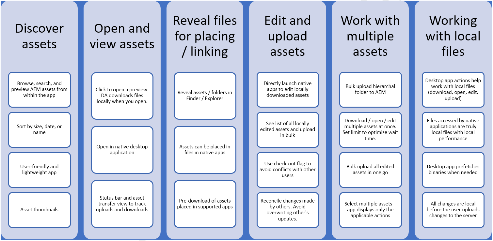
Download [this](assets/aem_desktop_app_usecases_print.pdf) print-ready PDF file.

## How desktop app works {#how-app-works2}

Before you start using the application, understand [How the app works](release-notes.md#how-app-works). Also, familiarize yourself with the following terms:

* **[!UICONTROL Desktop Actions]**: From the Assets web interface, from within in a browser, you can explore the asset locations or check-out and open the asset for editing in your native desktop application. These actions are available from the web interface and use desktop app functionality. See [how to enable Desktop Actions](using.md#desktopactions-v2).

* File status is **[!UICONTROL Cloud Only]**: Such assets are not downloaded on the local machine and are available on AEM server only.

* File status is **[!UICONTROL Available locally]**: The assets are downloaded and available on the local machine as is. The assets are not changed.

* File status is **[!UICONTROL Edited locally]**: Such assets are modified locally and the changes remain to the uploaded to AEM server. After you upload, the status changes to [!UICONTROL Available locally]. See [edit assets](using.md#edit-assets-upload-updated-assets).

* File status is **[!UICONTROL Editing conflict]**: If you and other users modify an asset simultaneously, the app indicates that an editing conflict has occurred. The app also provides options to retain or discard your changes. See [how to avoid editing conflicts](using.md#adv-workflow-collaborate-avoid-conflicts).

* File status is **[!UICONTROL Modified remotely]**: The app indicates if an asset that you have downloaded is changed on the AEM server. The app also provides the option to download the latest version and update your local copy. See [how to avoid editing conflicts](using.md#adv-workflow-collaborate-avoid-conflicts).

* **Check-out**: If you are editing a file or intend to edit a file, you toggle the status to check out. It adds a lock icon on the asset in the app and AEM web interface. The lock icon indicates to other users to avoid simultaneously editing the same asset as it leads to an editing conflict.

* **Check-in**: Mark the asset as safe for other users to edit without causing an editing conflict. When you upload your changes, the lock icon is automatically removed. Toggling the check-in status also removes the lock icon though it is recommended to not manually check in without uploading the changes. If you discard your changes, then manually toggle the check-in.

* **[!UICONTROL Open]** action: Just open the asset to preview it in the native application. It is not recommended to edit the asset by using this action, as it does not check out the asset and other users can make edits leading to editing conflicts.

* **[!UICONTROL Edit]** action: Use the action to modify the image. Clicking [!UICONTROL Edit] action automatically checks out the asset and adds a lock icon on the asset. After clicking Edit, if you do not want to edit the asset, then click [!UICONTROL Toggle check-in]. To delete, rename, or move assets in AEM DAM folder hierarchy, use the AEM web interface actions and not the edit action.

* **[!UICONTROL Download]** action: Download the asset to your local machine. You can download the assets now and edit later; work offline and upload the changes later. Assets are downloaded in a cache folder on your file system.

* **[!UICONTROL Reveal File]** or **[!UICONTROL Reveal Folder]** action: While the assets are downloaded to a local cache folder, the app mimics a local network drive and provides a local path for each asset. To know this path, use the appropriate reveal option in the app. Reveal action is required to place assets in the Creative Cloud application. See [place assets](using.md#place-assets-in-native-documents).

* **[!UICONTROL Open In Web]** action: To view the asset in AEM web interface, open it in web. You can initiate more workflows from AEM interface like updating metadata or asset discovery.

* **[!UICONTROL Delete]** action: Delete the asset from the AEM DAM repository. The action deletes the original copy of the asset on the AEM server. If you want to only discard modifications to the local asset, see [discard changes](using.md#edit-assets-upload-updated-assets).

* **[!UICONTROL Upload Changes]**: Desktop app uploads the updated asset only when you explicitly upload to AEM server. When you save your edits, the changes are saved on your local machine only. When you upload, the asset is automatically checked in and lock icon is removed. See [edit assets](using.md#edit-assets-upload-updated-assets).

## Enable desktop actions in AEM web interface {#desktopactions-v2}

From within the Assets user interface in a browser, you can explore the asset locations or check-out and open the asset for editing in your desktop application. These options are called [!UICONTROL Desktop Actions] and are not enabled by default. To enable it, follow these steps.

1. In the Assets console, click/tap the **[!UICONTROL User]** icon from the toolbar.
1. Click/tap the **[!UICONTROL My Preferences]** to display the **[!UICONTROL Preferences]** dialog.
1. In the User Preferences dialog, select **[!UICONTROL Show Desktop Actions For Assets]**. Click/tap **[!UICONTROL Accept]**.

   

   Check [!UICONTROL Show Desktop Actions For Assets] to enable desktop actions

## Browse, search, and preview assets {#browse-search-preview-assets}

You can browse to, search for, and preview the assets available in the AEM repository, all from within the desktop application. Try the following in the app:

1. Browse to a folder and see some basic info of the assets available in the folder, along with small thumbnails of all assets.

   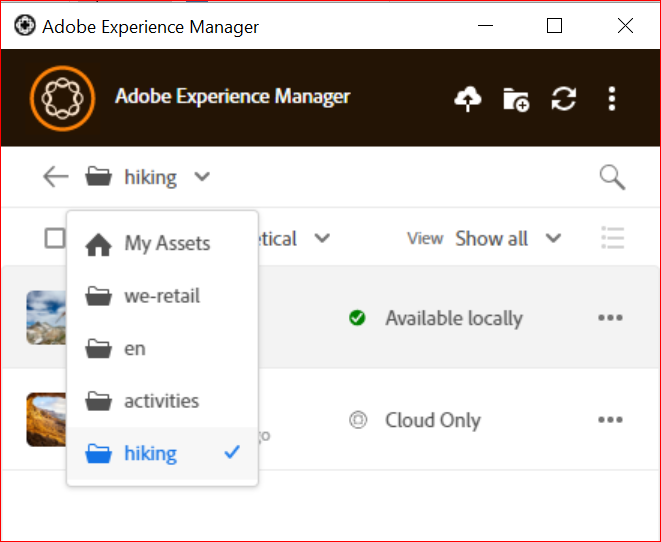

1. To view more information and a larger thumbnail of an individual asset, click the filename.

   

1. Click **[!UICONTROL Open]** or **[!UICONTROL Edit]** to download the file locally and just view it or edit it in the native application, respectively.
1. Search using keywords to find a related asset in the AEM repository. Use `?` and `*` as wildcards. These wildcards substitute for a single character or for multiple characters, respectively. Filter and sort the results as necessary.

   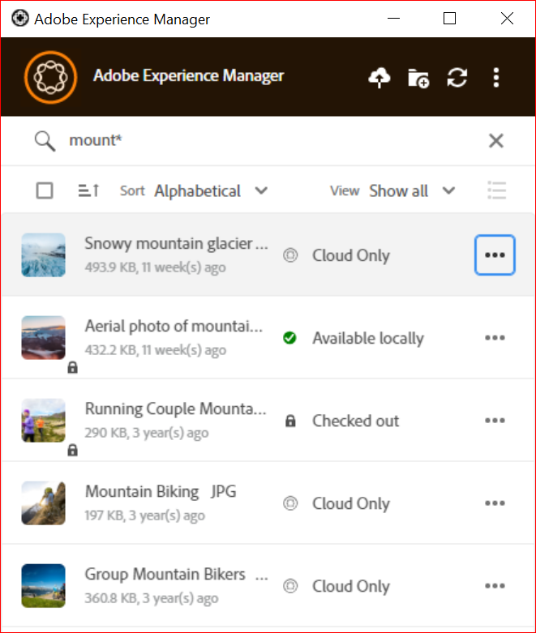

   

>[!NOTE]
>
>The app displays the assets by matching the search criteria across multiple metadata fields and not just the asset’s title or the filename.

## Download assets {#download-assets}

You can download the assets on your local file system. The app fetches the assets from AEM server and saves the same copy on your local file system.

Click  for options and click  to download.

>[!NOTE]
>
>When downloading or uploading a large file or many files, the application turns off the actions on assets and folders. The actions are available when the download or upload is complete.

Downloading multiple assets may lead to poor performance if queue size is large or if you face some network issue. Also, you may unknowingly queue many assets for download when you download a folder. To avoid long wait times, the app restricts the number of assets downloaded in one go. To know how to configure it, see [Set preferences](install-upgrade.md#set-preferences). Even below this limit, the app may at times seek a confirmation before downloading an apparently large folder.

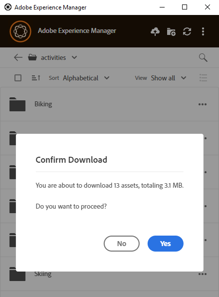

If folder(s) are selected and downloaded, the application only downloads assets stored directly in the folder(s) in AEM. It does not download assets from sub-folders automatically.

## Open assets on your desktop {#openondesktop-v2}

You can open the remote assets for viewing in the native application. The assets are downloaded to a local folder and launched in the native application associated with the file format. You can change the native application to open specific file types (extensions) in your Mac or Windows.

Click **[!UICONTROL Open]** from the asset menu. The asset is downloaded locally and opened in the native application. Check the download progress and transfer speed of large assets in the status bar.
<!-- 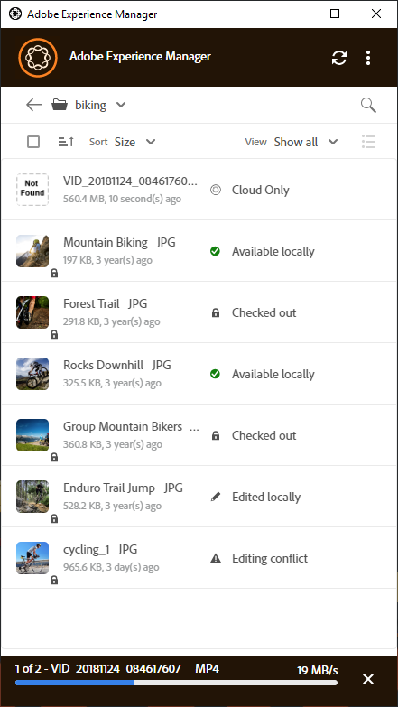

-->

>[!NOTE]
>
>If the expected changes are not reflected in the app, click refresh icon  or right click in the app interface and click **[!UICONTROL Refresh]**. The actions are not available while larger downloads or uploads are in progress.

To open the local download folder of an asset, click  and click  **[!UICONTROL Reveal File]** action.

## Use or place assets into native documents {#place-assets-in-native-documents}

In some cases, say when placing an asset into a native document, you access a file in Windows Explorer or Mac Finder. To get to the file system location of the locally downloaded file, use the  **[!UICONTROL Reveal File]** option.

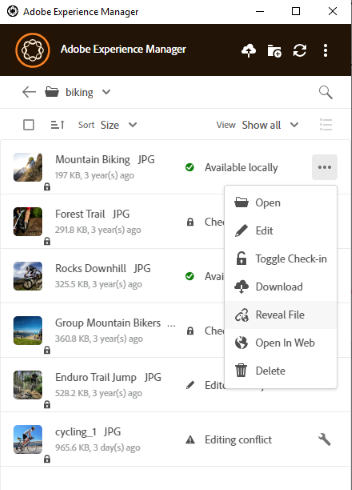

Click **[!UICONTROL Reveal File]**, or **[!UICONTROL Reveal Folder]** on a folder, to open Windows Explorer or Mac Finder with the file or folder preselected on your local machine. The option is useful to, say place the AEM files in the native applications that support placing or linking local files. To see how to place files in Adobe InDesign, see [Placing graphics](https://helpx.adobe.com/indesign/using/placing-graphics.html).

The **[!UICONTROL Reveal File]** action opens a local network share, that displays only the assets that are available locally – that is, it displays assets that were revealed, downloaded, or opened/edited using the app. The local network share does not upload any changes to AEM. To upload the changes, explicitly use **[!UICONTROL Upload Changes]** or **[!UICONTROL Upload]** actions in the app.

>[!NOTE]
>
>For backwards compatibility with AEM desktop app v1.x, the files revealed are served from a local network share, exposing locally available files only. The desktop paths of the revealed files are the same as the paths created by app v1.x.

>[!CAUTION]
>
>Do not use **[!UICONTROL Reveal File]** option to edit assets in native applications. Instead, use the **[!UICONTROL Edit]** actions. To know more, see [Advanced workflow: collaborate on same files and avoid editing conflicts](#adv-workflow-collaborate-avoid-conflicts).

## Edit assets and upload updated assets to AEM {#edit-assets-upload-updated-assets}

Open assets for editing when you want to make changes and upload the updated assets to AEM server. To avoid conflicts with edits of other users, use the app to initiate an editing session. Before you start editing, ensure that the asset does not have a lock icon on it, that is, another user is not editing the asset.

To edit an asset, search for the asset or browse to the asset’s location. Click  and click **[!UICONTROL Edit]**.

Use **[!UICONTROL Toggle Check-out]** to lock the asset to prevent conflicts with edits of other users in both the following situations:

* You've started editing an asset without checking it out first (say by just opening it).
* You intend to start editing an asset soon and do not want others to edit.

Once you’re done making the edits, the app displays the **[!UICONTROL Edited Locally]** status for the changed assets. All the changes saved to the assets are local-only until you upload the changes to AEM. To upload an individual or a few assets one-by-one, click **[!UICONTROL Upload Changes]** from the options for an asset. It creates a version of the asset in AEM. Using the web interface of AEM Assets, you can see asset history in the [Timeline view](https://helpx.adobe.com/experience-manager/6-5/assets/using/activity-stream.html).

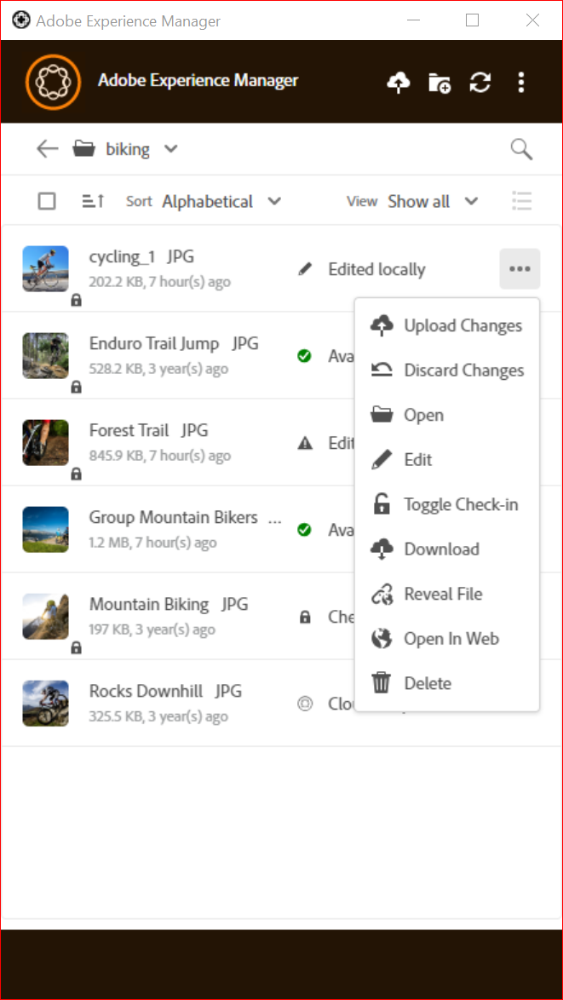

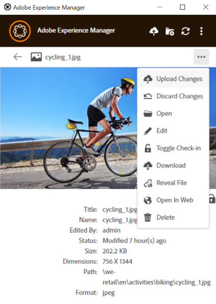

For best practices around collaborative editing, see [Advanced workflow: collaborate on same files and avoid editing conflicts](#adv-workflow-collaborate-avoid-conflicts).

In the following cases, you may want to discard your changes and edits to the local asset. Click **[!UICONTROL Discard Changes]**.

* If you do not want to save your local changes in AEM.
* Start making changes on the original asset after saving some changes.
* Stop editing the asset as it is no longer needed.

If necessary, toggle check-out. The updated asset is removed from the local cache folder and is downloaded again when you edit or open it.

## Upload and add new assets to AEM {#upload-and-add-new-assets-to-aem}

It may be necessary to add new assets to the repository. For example, you may be an agency photographer or contractor who must add a large number of photos from a photoshoot to the AEM repository. To add fresh content to AEM, click  in the top-bar of the app. Browse to the asset files in the local file system and click **[!UICONTROL Select]**. The app starts uploading the asset and displays a progress bar at the bottom if the asset takes longer to upload.

<!-- 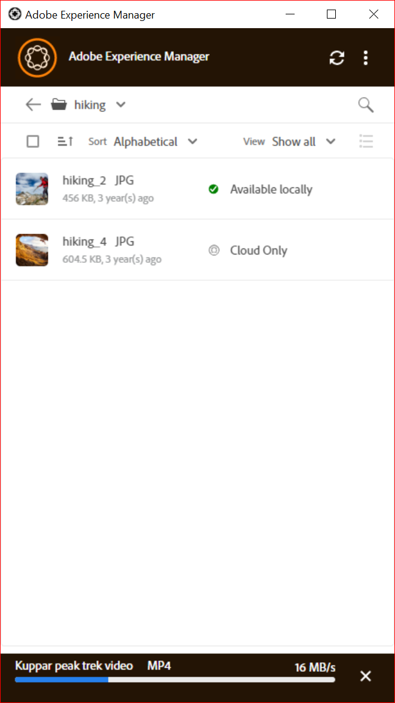
-->

You can upload folders or individual files from your local file system. A folder’s hierarchy is preserved when it is uploaded. Before uploading assets in bulk, see [Bulk uploads](#bulk-upload-assets).

To view the list of assets transferred in a given session, click **[!UICONTROL View]** > **[!UICONTROL Assets transfers]**. The list allows you to view and quickly verify the file transfers of the current session.

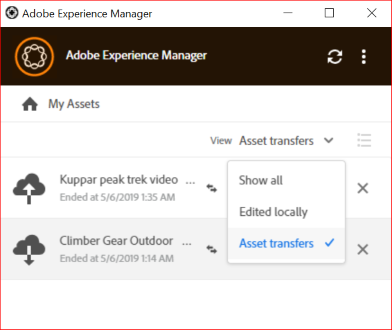

>[!NOTE]
>
>The transfer list is not persistent and is not available if you exit the app and reopen it.

## Work with multiple assets {#work-with-multiple-assets}

Users can easily work with and manage multiple assets using actions like uploading all edits in one go or uploading nested folders in a few clicks.

### Browse large folders {#browse-large-folders}

When working with folders containing many assets, scroll to view more assets. To scroll using the keyboard, press tab a few times to select the asset at the top. Notice the highlighted asset to know when it is selected. Now use the Down Arrow key to move through the list of assets.

### Quick actions for selected assets {#quick-actions-for-selected-assets}

Click the thumbnail of a few assets to select the assets. To select all assets, click the check box in the top-bar of the app. The set of actions that are applicable to all the selected assets collectively are displayed in a toolbar at the bottom of the app.

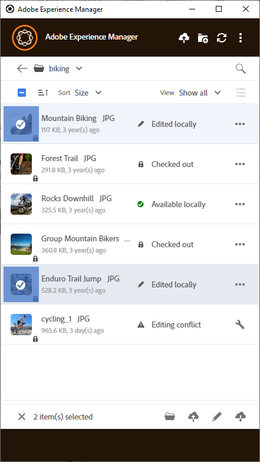

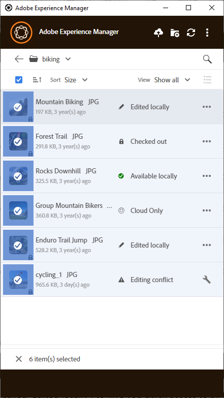

Actions available in the toolbar at the bottom depend on the status of selected files. For example, if you only select **[!UICONTROL Edited Locally]** files, you see **[!UICONTROL Upload Changes]** icon. If you select a mix of **[!UICONTROL Edited locally]** and **[!UICONTROL Cloud only]**, the **[!UICONTROL Upload Changes]** action is not available.

### Find all edited images {#find-all-edited-images}

The application provides a view, called **[!UICONTROL Edited locally]**, to give you quick access to all the files that you downloaded locally (via [!UICONTROL Open] or [!UICONTROL Edit] actions) and then modified. The app allows you to select all locally edited assets and upload the changes in a few clicks. This view also displays the locally edited assets that have an editing conflict.

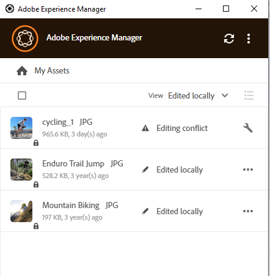

### Bulk upload assets {#bulk-upload-assets}

Users or organization, such as photographers or creative agencies, can create numerous local assets in scenarios, such as photoshoots, retouching, or selection from a larger set done outside AEM. They can upload these large local folders to AEM Assets directly from the desktop app. The folder hierarchies are preserved and all the nested subfolders and included assets are uploaded. The uploaded assets are immediately available to other users of the same server for consumption as well. Assets are uploaded in background, so the operation is not tied to a web browser session.

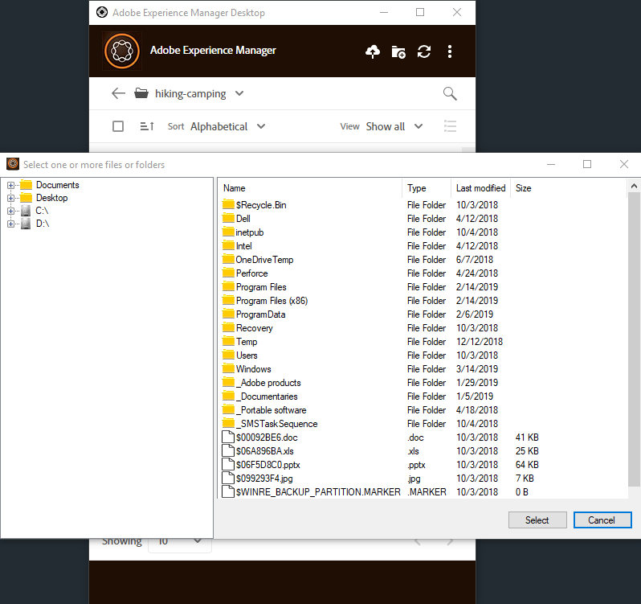

After uploading, if the expected changes are not reflected in the app, click the refresh icon .

>[!NOTE]
>
>Do not use upload functionality to migrate assets across two AEM deployments. Instead, see the [migration guide](https://helpx.adobe.com/experience-manager/6-5/assets/using/assets-migration-guide.html).

### List of transferred assets {#list-of-transferred-assets}

To view the list of assets transferred in a given session, see [Upload assets to AEM](#upload-and-add-new-assets-to-aem).

## Advanced workflow: start from the AEM Assets web interface {#adv-workflow-start-from-aem-ui}

If necessary, initiate your workflow from the AEM Assets web interface. The desktop app integrates with the AEM to take over when requested using Desktop Actions.

A special case of starting workflow from the web interface is asset discovery. The Omnisearch bar in Assets user interface offers a rich and advanced search experience. You may want to first locate a desired asset on the web and then initiate the workflow in the app, using [!UICONTROL Desktop Actions]. Some sample cases include filtering search results using facets, locating a specific asset licensed from Adobe Stock, or a customization implemented by your organization that allows you better discovery from the web interface.

Desktop app functionality is used when you attempt the following actions on the Assets web interface:

* The [!UICONTROL Desktop Actions] that allows [!UICONTROL Open], [!UICONTROL Edit], and [!UICONTROL Reveal]
* [!UICONTROL Upload folder]
* [!UICONTROL Check-out] or [!UICONTROL check-in]

For example, the actions on the web interface that are available for an asset that is checked out in the app are [!UICONTROL Open], [!UICONTROL Reveal], and [!UICONTROL Check-in].

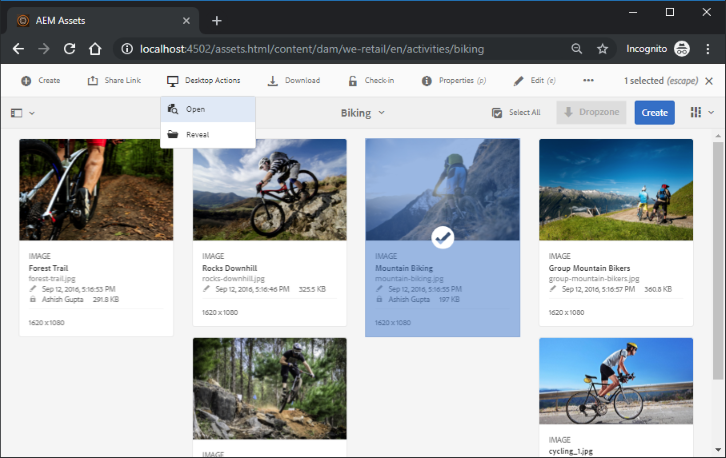

>[!NOTE]
>
>The browser may prompt you to permit the launch of Adobe Experience Manager Desktop. To enjoy uninterrupted transfer from the browser to the app, select the appropriate check box to always allow the app to take over.

You cannot find the following information or workflow using the web interface. Use the desktop app as the web interface does not track local changes and is not aware of the following:

* Files edited locally.
* Files that have an editing conflict and way to resolve it.
* Upload local changes to AEM.
* Various statuses of the locally available files.

On the contrary, you can open the asset in the web interface starting from the desktop app using the **[!UICONTROL Open In Web]** action.

## Advanced workflow: collaborate on same files and avoid editing conflicts {#adv-workflow-collaborate-avoid-conflicts}

In collaborative environments, multiple users may work on same set of assets that can lead to versioning conflicts. To prevent conflicts, follow these best practices:

* Do not edit any assets by clicking [!UICONTROL Open]. Do not edit the locally downloaded assets by opening from your file system folder. Other users do not know that the asset is being edited.
* To edit an asset, always click [!UICONTROL Edit]. It opens the asset in the native application and adds a lock icon on the asset, so the other users know that the asset is being edited.
* Click [!UICONTROL Toggle Check-in] if you accidentally start editing without clicking [!UICONTROL Edit]. This adds a lock icon to the asset. Even if you plan to edit an asset later but want to avoid others editing it, click [!UICONTROL Toggle Check-in] to lock the asset.
* Before editing an asset, ensure that other users are not editing it. Look for the lock icon on the asset.
* After completing the edits, upload all the changes, and then check-in the asset.

If a locally downloaded asset is updated on the AEM server, the app displays a **[!UICONTROL Modified remotely]** status. You can either remove your local copy or refresh your local copy, by clicking [!UICONTROL Remove] or [!UICONTROL Update] respectively. Links on the dialog allow you to view both versions of the asset.

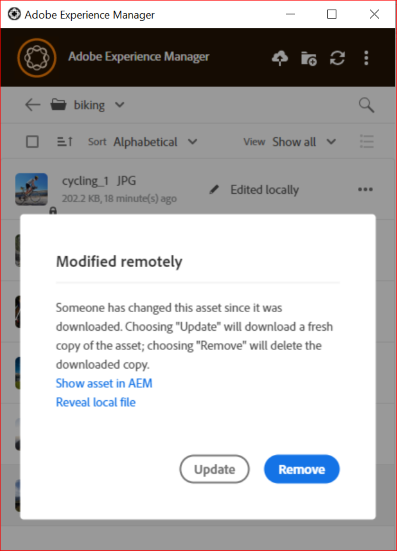

If an asset you are editing locally is also updated on the server without your knowledge, the app displays an **[!UICONTROL Editing Conflict]** status. You can retain one set of the changes – either retain your updates (click **[!UICONTROL Keep Mine]**) and delete the other user’s edit or respect the other user’s updates and delete yours (**[!UICONTROL Overwrite Mine]**).

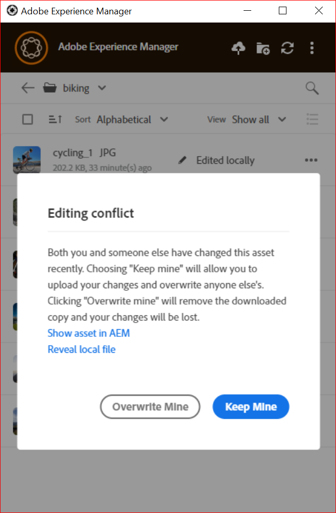

## Advanced workflow: place and link assets in InDesign file {#adv-workflow-place-assets-indesign}

When you use AEM desktop app to open files with linked assets, the assets are pre-downloaded and appear placed in the native applications. For this workflow to work, your native application must support placing links to local assets and AEM must support resolving these links in the binary files to server-side references.

AEM desktop app supports this workflow with a few select Adobe Creative Cloud desktop applications and file formats – Adobe InDesign, Adobe Illustrator, and Adobe Photoshop. The workflow allows you to work efficiently with the supported Creative Cloud files. So if user A places a few assets in an InDesign file and checks it into AEM, user B sees the assets in the InDesign file even though the assets are not part of the file. The assets are locally downloaded on the machine of user B.

>[!NOTE]
>
>The desktop app can map to any drive on Windows. However, for smooth operations, do not change the default drive letter. If users of the same organization use different drive letters, they cannot see the assets placed by others. The placed assets are not fetched as the path changes. The placed assets continue to remain placed in the binary file (say INDD) and are not removed.

To know the limitations of this workflow, see the [System requirements and supported versions](release-notes.md#system-requirements-and-prerequisites-v2).

To try this workflow with an image asset and InDesign, follow these steps:

1. Keep handy an INDD file with placed assets in AEM. To know how to create such an INDD file, see [Placing Graphics](https://helpx.adobe.com/indesign/using/placing-graphics.html).
1. From within desktop app, **[!UICONTROL Edit]** the INDD file with placed assets in AEM.
1. The app downloads both, the InDesign file and the linked assets. When InDesign opens the document, the links are resolved, assets are downloaded, and the assets are displayed in the InDesign document.
1. To place a new graphic in the InDesign file, use **[!UICONTROL Reveal File]** action on the asset. The action downloads the asset locally and opens the local network share location in Windows Explorer or Mac Finder.
1. Place the revealed asset in the InDesign document. This creates a link in the document.
1. Once you complete your edits in the InDesign document, save it and upload it to AEM using the desktop app.

## Advanced workflow: download the assets locally {#adv-workflow-download-assets-locally}

The app downloads the assets from AEM server locally on your file system in many scenarios. The downloads consume bandwidth and disk space. Knowing the scenarios help you optimize your wait time for the downloads to complete.

You download the assets from within the app on-demand. See [Download assets](#download-assets).

When you use the [!UICONTROL Open] action to open an asset in a native desktop application, the asset is downloaded locally if not already available locally. See [Open assets](#openondesktop-v2).

When you reveal the location of an asset or a folder from within the app, the asset or the folder is first downloaded locally and then opened on your machine in the local network share. See [Open assets](#openondesktop-v2).

When you use the [!UICONTROL Edit] action to edit an asset in a native desktop application, the asset is downloaded locally if not already available locally. See [Edit assets and upload updated assets to AEM](#edit-assets-upload-updated-assets).

If the app is installed and permitted to, it completes the actions when you use [!UICONTROL Desktop Actions] from AEM web interface. The app downloads the asset first and then completes the action.