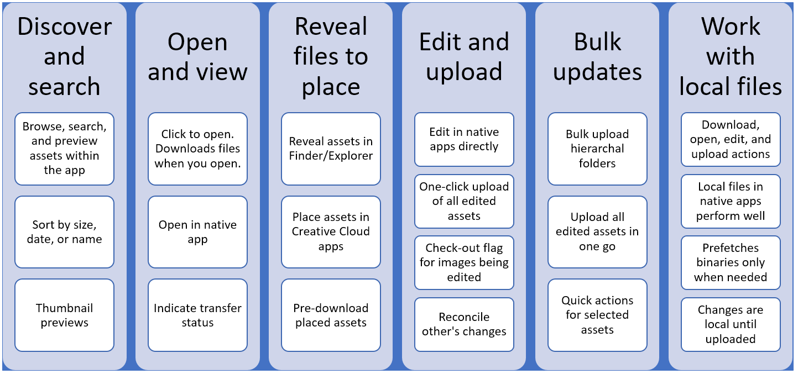

# Use AEM desktop app {#use-aem-desktop-app-v2}

Use the Adobe Experience Manager (AEM) desktop app, to easily access the AEM assets on your local desktop and use these assets in any desktop applications. You can open the assets in desktop applications and edit the assets locally – upload the changes back to AEM with version control, to share the updates with other users. You can also upload new files and folder hierarchies to AEM, create folders, and delete assets or folders from AEM.

The integration allows various roles in the organization to manage the assets centrally in AEM Assets and to access the assets on local desktop in the native applications on Windows or Mac OS.

When you open the application after logging out or for the first time, provide the URL of your AEM server. Click Connect. Provide your credentials to connect the app with the server.

The key tasks you do using the AEM desktop app are:

## How desktop app works {#how-app-works2}

Before you start using the application, understand [How the app works](release-notes.md#how-app-works).

## Enable desktop actions in AEM web interface {#desktopactions-v2}

From within the Assets UI in a browser, you can explore the asset locations or check-out and open the asset for editing in your desktop application. These options are called Desktop Actions and are not enabled by default. Follow these steps to enable it.

1. In the Assets console, click/tap the **User** icon from the toolbar.
1. Click/tap the **[!UICONTROL My Preferences]** to display the **[!UICONTROL Preferences]** dialog.
1. In the User Preferences dialog, select **[!UICONTROL Show Desktop Actions For Assets]**. Click/tap **[!UICONTROL Accept]**.

   

   Check Show Desktop Actions For Assets to enable desktop actions

## Browse, search, and preview assets {#browse-search-preview-assets}

You can browse to, search for, and preview the assets available in the AEM repository, all from within the desktop application. Try the following in the app:

1. Browse to a folder and see some basic info of the assets available in the folder, along with small thumbnails of all assets.

   

1. To view more information and a larger thumbnail of an individual asset, click the file name.

   

1. Click Open or Edit to download the file locally and just view it or edit it in the native application, respectively.
1. Search using keywords to find a related asset in the AEM repository. Use ‘?’ and ‘*’ with keyword as wildcards to substitute for a single character or for multiple characters. Filter and sort the results as required.

   

   

>[!NOTE]
>
>The app displays the assets by matching the search criteria across multiple metadata fields and not just the asset’s title or the file name.

## Download assets {#download-assets}

You can download the assets on your local filesystem. The app fetches the assets from AEM server and saves the same copy on your local filesystem.

Click  for options and click  to download.

>[!NOTE]
>
>When downloading or uploading a larger number of files, the application might turn off the actions on assets and folders. The actions are available when the download operation completes.

Downloading multiple assets may lead to poor performance if queue size is large or if you face some network issue. Also, you may unknowingly queue many assets for download when you download a folder. To avoid long wait times, the app restricts the number of assets downloaded in one go. To know how to configure it, see [Set preferences](install-upgrade.md#set-preferences). Even below this limit, the app may at times seek a confirmation before downloading an apparently large folder.

## Open assets on your desktop {#openondesktop-v2}

You can open the remote assets for viewing in the native application. The assets are downloaded to a local folder and launched in the native application associated with the file format.

Access the Open option in the more menu by clicking  . The asset is downloaded locally and opened in the native application. Check the download progress and transfer speed of large assets in the status bar.

>[!NOTE]
>
>Clicking  in the status bar does not stop or cancel the download. If the expected changes are not reflected in the app, click refresh icon  . Also note that the actions are not available while larger downloads or uploads are in progress.

To open the local download folder of an asset, click  and click  Reveal action.

## Use or place assets into native documents {#place-assets-in-native-documents}

To directly see the filesystem location of the locally downloaded files, use the  Reveal File option.

Click Reveal File, or Reveal on a folder, to open Windows Explorer or Mac Finder with the file or folder preselected on your local machine. The option is useful to, say place the AEM files in the native applications that support placing or linking local files. To see how to place files in Adobe InDesign, see [Placing graphics](https://helpx.adobe.com/indesign/using/placing-graphics.html).

The “Reveal” location shows a local network share, showing only the files that are available locally – that is, it will only show files that were revealed, downloaded, or opened/edited using the AEM desktop app actions. The network share will also not automatically upload any changes – you need to use “Upload Changes” or “Upload” actions in the AEM desktop app to do that.

>[!NOTE]
>
>For backwards compatibility with AEM desktop app v1.x, the files revealed are served from a local network share, exposing locally available files only. The desktop paths of the revealed files are the same as the paths created by app v1.x. If required, customize the drive letter, from the [app Preferences](install-upgrade.md#set-preferences).

>[!CAUTION]
>
>Do not use Reveal File option to edit assets in native applications. Instead, use the Edit actions. To know more, see Advanced workflow: collaborate on same files and avoid editing conflicts.

## Edit assets and upload updated assets to AEM {#edit-assets-upload-updated-assets}

Open assets for editing when you want to make changes and upload the updated assets to AEM server. To avoid conflicts with edits of other users, use the app to initiate an editing session. Click the Edit option that will open the asset in the native application associated with the asset. Ensure that the asset you start editing does not have a lock icon on it, that is, the asset is not being edited by another user.

To edit an asset, search for the asset or browse to the asset’s location. Click  and click Edit.

<!-- 
!-->

If you start editing an asset without checking it out (say by just opening it), use Toggle check-out option to lock the asset to prevent conflicts with edits of other users. You can use Toggle check-out option on an asset that you intend to start editing soon and do not want others to edit.

Once you’re done making the edits, the app displays the Edited Locally status for the changed assets. All the changes saved to the assets are local-only until you upload the changes to AEM. To upload an individual or a few assets one-by-one, click Upload Changes from the options for an asset. It creates a version of the asset in AEM. Using the web interface of AEM Assets, you can see asset history in the [Timeline view](https://helpx.adobe.com/experience-manager/6-4/assets/using/activity-stream.html).

For best practices around collaborative editing, see [Advanced workflow: collaborate on same files and avoid editing conflicts](#adv-workflow-collaborate-avoid-conflicts).

## Upload and add new assets to AEM {#upload-and-add-new-assets-to-aem}

## Work with multiple assets {#work-with-multiple-assets}

### Browse large folders {#browse-large-folders}

### Quick actions for selected assets {#quick-actions-for-selected-assets}

### Find all edited images {#find-all-edited-images}

### Bulk upload assets {#bulk-upload-assets}

### List of transferred assets {#list-of-transferred-assets}

## Advanced workflow: start from the AEM Assets web interface {#adv-workflow-start-from-aem-ui}

## Advanced workflow: collaborate on same files and avoid editing conflicts {#adv-workflow-collaborate-avoid-conflicts}

## Advanced workflow: place and link assets in InDesign file {#adv-workflow-place-assets-indesign}

## Advanced workflow: download the assets locally {#adv-workflow-download-assets-locally}