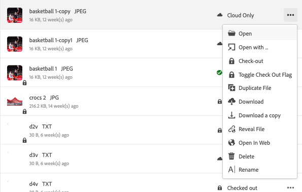
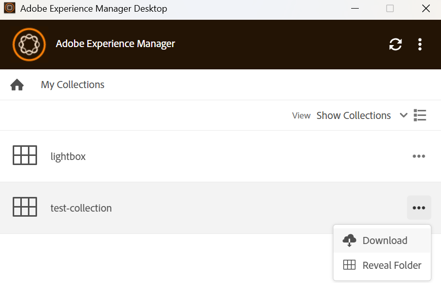
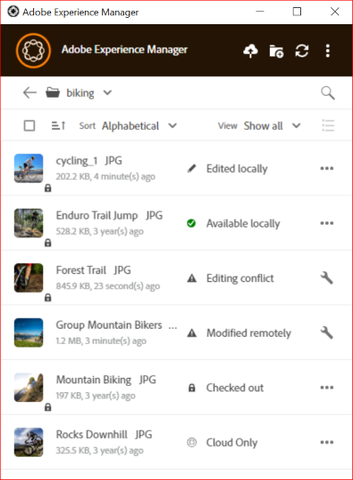
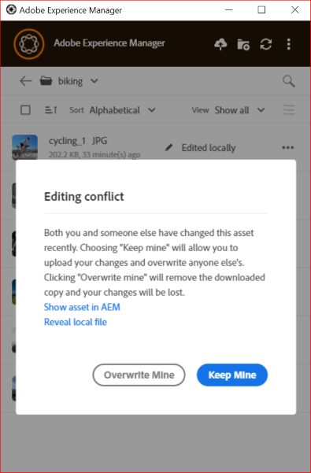

# Assets Management tasks in [!DNL AEM Desktop App] {#assets-management-tasks}

Asset management involves organizing, maintaining, and optimizing digital assets to streamline workflows. It includes tasks such as duplicating and renaming files, pinning or unpinning folders for quick access, and viewing assets in various layouts. This helps improve efficiency, simplify asset tracking, and ensure easy retrieval and organization of digital assets across platforms.

## View assets {#view-assets}

AEM Desktop App allows you to view assets in four different views:

* **[!UICONTROL Show Assets]:** Allows you to view all the assets.
* **[!UICONTROL Show Collections]:** Allows you to see all the collections created in the native AEM application. See more [collections](#collections-desktop-app).
* **[!UICONTROL Edited Locally]:** Allows you to show all the locally modified assets. In this view, you can add and upload multiple assets.
* **[!UICONTROL Asset transfers]:** Allows you to view all the assets that are transferred from native app to local or vice versa.
* **[!UICONTROL Pinned items]:** Allows you to view all the pinned items.

To choose among various views of assets in AEM Desktop app, execute the following steps:

1. Open AEM Desktop App.

1. Go to view drop-down on the top-right. Choose one among the available views.

     

## View newly added folders and files {#view-newly-added-files-folders}

You can upload newly created assets from your local machine to AEM, where the central repository is stored. To view these newly created assets locally, go to the **[!UICONTROL View]** drop-down menu and select **[!UICONTROL Show Assets]** to view all the updates with their timeline and titles, or select **[!UICONTROL Edited Locally]**. Both options explicitly show the locally edited assets.

## Duplicate files {#duplicate-files}

When you want to preserve an original file and make changes on the similar file, you can duplicate files at different locations (local and cloud) simultaneously. It can be accomplished through duplicate files operation across assets. 

To duplicate files in AEM Desktop App, follow the steps below:

1. Browse to a folder and select the asset that you want to duplicate.
   
   

1. Click **[!UICONTROL More actions]**  and select  **[!UICONTROL Duplicate File]** action.

1. The duplicate file gets created with an identical file name and content.

## Rename title of an asset or foler {#rename-asset-title}

To rename title of an asset or folder, execute the steps below:

1. Browse the asset which you want to rename. When naming a folder, special characters such as `\ / : * ?  | < > [ ] %`; are not allowed. If included, they are automatically replaced with a hyphen `-`.

1. Click **[!UICONTROL More actions]**  and select **[!UICONTROL Rename]** to add your desired title of an asset.

## Pin or Unpin folder {#pin-unpin-folder}

Pinned folders are automatically synchronized to reflect any changes made natively within the app. For the quick access, you can pin or unpin a folder by executing the steps below:

1. Browse the asset which you want to pin or unpin.

1. Click **[!UICONTROL More actions]**  and select [!UICONTROL pin] to pin the asset or folder. Alternatively, click [!UICONTROL unpin] to unpin it.

    

## Auto refresh {#auto-refresh}

The auto refresh feature automatically updates content in real time, ensuring you always see the latest information without manually reloading the page. Execute the steps below to refresh assets automatically to get the list of updated assets:

1. Open AEM Desktop App.

1. Click  on the menu bar to get the updates.

## Collections {#collections-desktop-app}

AEM Desktop App allows you to [view](#view-collections-desktop-app), [download](#download-collections-desktop-app) and browse collections that are created on [!DNL Adobe Experience Manager Assets] application.

### View Collections {#view-collections-desktop-app}

Execute the following steps to view collections in the Desktop App:

1. Open AEM Desktop App and go to [view assets](#view-assets).

1. Select **[!UICONTROL Show Collections]**. The collections available on the native application are shown.

   

### Download Collections {#download-collections-desktop-app}

Execute the following steps to download collections in the Desktop App:

1. Follow steps 1 and 2 as shown in [view Collections](#view-collections-desktop-app).

1. Go to more actions  on the collection that you want to download.

1. Click **[!UICONTROL Download]** to download the particular collection.

## Create folder with Metadata Schema {#create-folder-with-metadata-schema}

Using AEM Desktop App, you can assign metadata while creating a new folder. To do this, execute the following steps:

1. Go to create directory icon . **[!UICONTROL Create Directory]** screen appears.

1. Add the following details:
   * **[!UICONTROL Name]** of the folder.
   * **[!UICONTROL Folder Metadata Schema]** to choose metadata hierarchy of the folder or choose **[!UICONTROL none]** if you do not want to relate any metadata to it.

1. Click **[!UICONTROL OK]** to proceed further.

## List of transferred assets {#list-of-transferred-assets}

To view the list of assets transferred in a given session, see [Upload assets to [!DNL Experience Manager]](#upload-and-add-new-assets-to-aem).

## Advanced workflow: collaborate on the same files and avoid editing conflicts {#adv-workflow-collaborate-avoid-conflicts}

In collaborative environments, multiple users may work on the same set of assets that can lead to versioning conflicts. To prevent conflicts, follow these best practices:

* Do not edit any assets by clicking [!UICONTROL Open]. Do not edit the locally downloaded assets by opening from your file system folder. Other users do not know that the asset is being edited.
* To edit an asset, always click [!UICONTROL Edit]. It opens the asset in the native application and adds a lock icon on the asset, so the other users know that the asset is being edited.
* Click [!UICONTROL Toggle Check-in] if you accidentally start editing without clicking [!UICONTROL Edit]. This functionality adds a lock icon to the asset. Even if you plan to edit an asset later but want to avoid others editing it, click [!UICONTROL Toggle Check-in] to lock the asset.
* Before editing an asset, ensure that other users are not editing it. Look for the lock icon on the asset.
* After completing the edits, upload all the changes, and then check-in the asset.

If a locally downloaded asset is updated on the [!DNL Experience Manager] server, the app displays a **[!UICONTROL Modified remotely]** status. You can either remove your local copy or refresh your local copy, by clicking [!UICONTROL Remove] or [!UICONTROL Update] respectively. Links in the dialog box let you view both versions of the asset.

If an asset you are editing locally is also updated on the server without your knowledge, the app displays an **[!UICONTROL Editing Conflict]** status. You can retain one set of the changes – either retain your updates (click **[!UICONTROL Keep Mine]**) and delete the other user's edit or respect the other user's updates and delete yours (**[!UICONTROL Overwrite Mine]**).

## Advanced workflow: place and link assets in InDesign file {#adv-workflow-place-assets-indesign}

When you use the [!DNL Experience Manager] desktop app to open files with linked assets, the assets are pre-downloaded and appear placed in the native applications. For this workflow to work, your native application must support placing links to local assets and [!DNL Experience Manager] must support resolving these links in the binary files to server-side references.

[!DNL Experience Manager] desktop app supports this workflow with a few select Adobe Creative Cloud desktop applications and file formats – Adobe InDesign, Adobe Illustrator, and Adobe Photoshop. The workflow allows you to work efficiently with the supported Creative Cloud files. If user A adds assets to an InDesign file and checks it into [!DNL Experience Manager], user B can see the assets in the file even though they aren't part of it. The assets are locally downloaded on the machine of user B.

>[!NOTE]
>
>The desktop app can map to any drive on Windows. However, for smooth operations, do not change the default drive letter. If users of the same organization use different drive letters, they cannot see the assets placed by others. The placed assets are not fetched as the path changes. The placed assets continue to remain placed in the binary file (say INDD) and are not removed.

To know the limitations of this workflow, see the [system requirements and supported versions](release-notes.md).

To try this workflow with an image asset and InDesign, follow these steps:

1. Keep handy an INDD file with placed assets in [!DNL Experience Manager]. To know how to create such an INDD file, see [Placing Graphics](https://helpx.adobe.com/indesign/using/placing-graphics.html).
1. From within the desktop app, **[!UICONTROL Edit]** the INDD file with placed assets in [!DNL Experience Manager].
1. The app downloads the InDesign file and the linked assets. When InDesign opens the document, the links are resolved, assets are downloaded, and the assets are displayed in the InDesign document.
1. To place a new graphic in the InDesign file, use the **[!UICONTROL Reveal File]** action on the asset. The action downloads the asset locally and opens the local network share location in Windows Explorer or Mac Finder.
1. Place the revealed asset in the InDesign document. Doing so creates a link in the document.
1. Once you complete your edits in the InDesign document, save it and upload it to [!DNL Experience Manager] using the desktop app.

## Next Steps {#next-steps}

* [Watch a video to get started with Adobe Experience Manager Desktop App](https://experienceleague.adobe.com/en/docs/experience-manager-learn/assets/creative-workflows/aem-desktop-app)

* Provide documentation feedback using [!UICONTROL Edit this page]  or [!UICONTROL Log an issue]  available on the right sidebar

* Contact [Customer Care](https://experienceleague.adobe.com/?support-solution=General#support)

<!--* Provide product feedback using the [!UICONTROL Feedback] option available on the AEM Desktop App user interface>-->

>[!MORELIKETHIS]
>
>* [Understand the user interface](/help/using/user-interface.md).
>* [Get started guide](/help/using/get-started.md).
