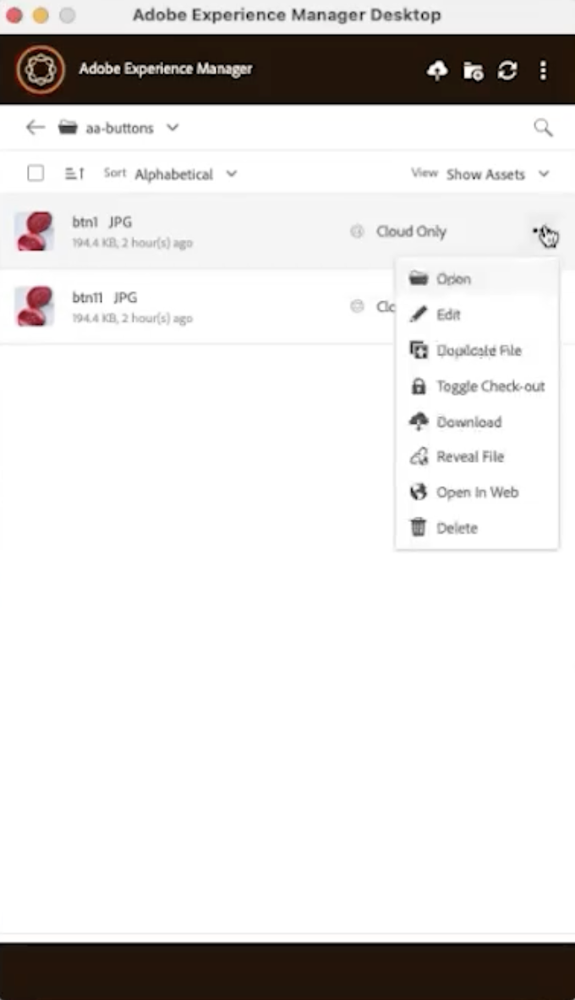
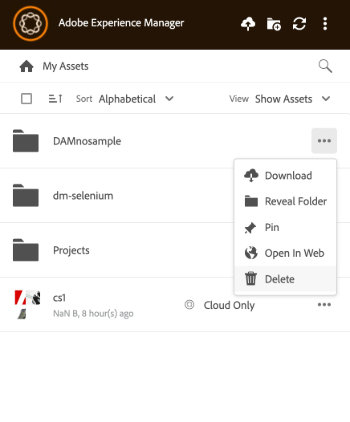
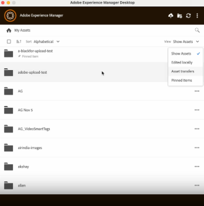

# Get started using [!DNL Adobe Experience Manager] Desktop App {#getting-started-desktop-app}

Asset management involves organizing, maintaining, and optimizing digital assets to streamline workflows. It includes tasks such as duplicating and renaming files, pinning or unpinning folders for quick access, and viewing assets in various layouts. This helps improve efficiency, simplify asset tracking, and ensure easy retrieval and organization of digital assets across platforms.

## Duplicate files {#duplicate-files}

When you want to preserve an original file and make changes on the similar file, you can duplicate files at different locations (local and cloud) simultaneously. It can be accomplished through duplicate files operation across assets. 

To duplicate files in AEM Desktop App, follow the steps below:

1. Browse to a folder and select the asset that you want to duplicate.
   
    

1. Click  and select  **[!UICONTROL Duplicate File]** action.

1. The duplicate file gets created with an identical file name and content.

## Rename title of an asset {#rename-asset-title}

To rename title of an asset, execute the steps below:

1. Browse the asset which you want to rename.

1. Click **[!UICONTROL More actions]**  and select **[!UICONTROL open in web]** to open the asset in its native application.

1. Go to asset details. Under [!UICONTROL Basic] tab, go to title and enter the text.

## Pin or Unpin folder {#pin-unpin-folder}

For the quick access, you can pin or unpin a folder by executing the steps below:

1. Browse the asset which you want to pin or unpin.

1. Click **[!UICONTROL More actions]**  and select [!UICONTROL pin] to pin the asset or folder. Alternatively, click [!UICONTROL unpin] to unpin it.

    

<!--
## Auto refresh {#auto-refresh}

Execute the steps below to refresh assets automatically to get the list of updated assets:

1. Browse the asset which you want to pin or unpin.

1. Click  and select [!UICONTROL pin] to pin the asset or folder. Alternatively, click [!UICONTROL unpin] to unpin it.

    
-->

## View assets {#view-assets}

AEM Desktop App allows you to filter view of assets. To do this, execute the steps below:

1. Open AEM Desktop App.

1. Go to view on the top-right. Drop down menu appears. Choose one of the following views:

 *  **[!UICONTROL Show Assets]:** To view all the assets.
 *  **[!UICONTROL Edited Locally]:** To show all the locally modified assets.
 *  **[!UICONTROL Asset transfers]:** To view all the assets that are transferred from native app to local or vice versa.
 *  **[!UICONTROL Pinned items]:** To view all the pinned items.

  

<!--
## Check-in and checkout assets {#chechin-checkout-assets}
 
To check-in or check-out an asset, execute the steps below:

1. Browse the asset which you want to rename.
-->

## Next Steps {#next-steps}

* [Watch a video to get started with Adobe Experience Manager Desktop App](https://experienceleague.adobe.com/en/docs/experience-manager-learn/assets/creative-workflows/aem-desktop-app)

* Provide documentation feedback using [!UICONTROL Edit this page]  or [!UICONTROL Log an issue]  available on the right sidebar

* Contact [Customer Care](https://experienceleague.adobe.com/?support-solution=General#support)

<!--* Provide product feedback using the [!UICONTROL Feedback] option available on the AEM Desktop App user interface>

>[!MORELIKETHIS]
>
>* [Understand the user interface](/help/using/navigate-view.md).
>* [Release notes and known issues](/help/using/release-notes.md).

