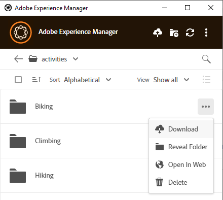
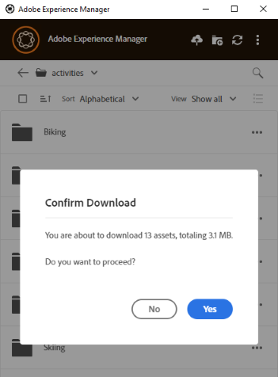

# Download assets locally {#download-assets-locally}

The app frequently downloads assets from the [!DNL Experience Manager] server to your local file system. The downloads consume bandwidth and disk space. Knowing the scenarios can help you optimize your wait time for the downloads to complete. You can download the assets on your local file system. The app fetches the assets from the [!DNL Experience Manager] server and saves the same copy on your local file system.

Click **[!UICONTROL More actions]**  for options and click  to download.

>[!NOTE]
>
>When downloading or uploading a large file or many files, the application turns off the actions on assets and folders. The actions are available when the download or upload is complete.

When you use the [!UICONTROL Open] action to open an asset in a native desktop application, the asset is downloaded locally if not already available locally. See [Open assets](#openondesktop-v2).

When you reveal the location of an asset or a folder from within the app, the asset or the folder is first downloaded locally and then opened on your machine in the local network share. See [Open assets](#openondesktop-v2).

When you use the [!UICONTROL Edit] action to edit an asset in a native desktop application, the asset is downloaded locally if not already available locally. See [Edit assets and upload updated assets to [!DNL Experience Manager]](#edit-assets-upload-updated-assets).

If the app is installed and permitted to, it completes the actions when you use [!UICONTROL Desktop Actions] from [!DNL Experience Manager] Web interface. The app downloads the asset first and then completes the action.

## Download multiple assets {#download-multiple-assets}

Downloading multiple assets may lead to poor performance if the queue size is large or if you face some network issue. Also, you may unknowingly queue many assets for download when you download a folder. To avoid lengthy wait times, the app restricts the number of assets downloaded in one go. To know how to configure it, see [Set preferences](install-upgrade.md#set-preferences). Even below this limit, the app may at times seek a confirmation before downloading an apparently large folder.

If folders are selected and downloaded, the application only downloads assets stored directly in the folders in [!DNL Experience Manager]. It does not download assets from sub-folders automatically.

## Next Steps {#next-steps}

* [Watch a video to get started with Adobe Experience Manager Desktop App](https://experienceleague.adobe.com/en/docs/experience-manager-learn/assets/creative-workflows/aem-desktop-app)

* Provide documentation feedback using [!UICONTROL Edit this page]  or [!UICONTROL Log an issue]  available on the right sidebar

* Contact [Customer Care](https://experienceleague.adobe.com/?support-solution=General#support)

>[!MORELIKETHIS]
>
>* [Upload assets](/help/using/upload-assets.md)
>* [Understand the user interface](/help/using/user-interface.md)
>* [Search](/help/using/search.md)

