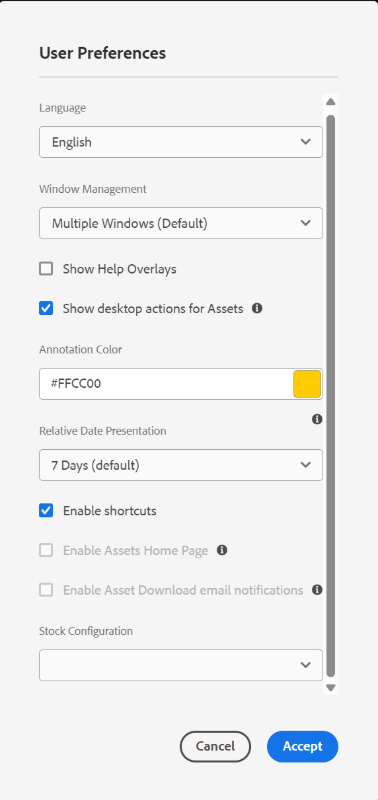

# Get started using [!DNL Adobe Experience Manager] Desktop App {#getting-started-desktop-app}

Use the [!DNL Adobe Experience Manager] desktop app to access digital assets stored in an [!DNL Adobe Experience Manager] DAM repository on your local desktop. You can then use these assets in any desktop applications. You can open and edit the assets locally in desktop applications. After making changes, upload them back to [!DNL Experience Manager] with version control to share updates with other users. You can also upload new files and folder hierarchies to [!DNL Experience Manager], create folders, and delete assets or folders from [!DNL Experience Manager] DAM.

The integration allows various roles in the organization to manage the assets centrally in [!DNL Experience Manager Assets] and to access the assets on local desktop in the native applications on Windows or macOS.

When you open the application after logging out or for the first time, provide the URL of your [!DNL Experience Manager] server in the format `https://[aem-server-url]:[port]/`. Then select the [!UICONTROL Connect] option. Provide credentials to connect the app with the server.

The key tasks that you perform using the [!DNL Adobe Experience Manager] desktop app are:

![Workflows and tasks you can accomplish using [!DNL Experience Manager] desktop app](assets/aem_desktop_app_usecases_v2.png)

## How desktop app works {#how-app-works2}

Before you start using the application, understand [how the app works](release-notes.md#how-app-works). Also, familiarize yourself with the following terms:

* **[!UICONTROL Desktop Actions]**: From the Assets Web interface, from within in a browser, you can explore the asset locations or check-out and open the asset for editing in your native desktop application. These actions are available from the Web interface and use desktop app functionality. See [how to enable Desktop Actions](using.md#desktopactions-v2).

* File status is **[!UICONTROL Cloud Only]**: Such assets are not downloaded on the local machine and are available on [!DNL Experience Manager] server only.

* File status is **[!UICONTROL Available locally]**: The assets are downloaded and available on the local machine as is. The assets are not changed.

* File status is **[!UICONTROL Edited locally]**: Such assets are modified locally and the changes remain to the uploaded to [!DNL Experience Manager] server. After you upload, the status changes to [!UICONTROL Available locally]. See [edit assets](using.md#edit-assets-upload-updated-assets).

* File status is **[!UICONTROL Editing conflict]**: If you and others edit an asset simultaneously, the app indicates that an editing conflict has occurred. The app also provides options to retain or discard your changes. See [how to avoid editing conflicts](using.md#adv-workflow-collaborate-avoid-conflicts).

* File status is **[!UICONTROL Modified remotely]**: The app indicates if an asset that you have downloaded is changed on the [!DNL Experience Manager] server. The app also provides the option to download the latest version and update your local copy. See [how to avoid editing conflicts](using.md#adv-workflow-collaborate-avoid-conflicts).

* **[!UICONTROL Check-out]**: If you are editing a file or intend to edit a file, you toggle the status to check out. It adds a lock icon on the asset in the app and [!DNL Experience Manager] Web interface. The lock icon indicates to other users to avoid simultaneously editing the same asset as it leads to an editing conflict.

* **[!UICONTROL Check-in]**: Mark the asset as safe for other users to edit without causing an editing conflict. When you upload your changes, the lock icon is automatically removed. Toggling the check-in status also removes the lock icon, though Adobe recommends that you avoid manually checking in without uploading the changes. If you discard your changes, then manually toggle the check-in.

* **[!UICONTROL Open]** action: Just open the asset to preview it in the native application. Adobe recommends that you avoid editing the asset by using this action. The reason is because it does not check out the asset. Meanwhile, other users can make edits leading to editing conflicts.

* **[!UICONTROL Edit]** action: Use the action to modify the image. Clicking [!UICONTROL Edit] checks out the asset and adds a lock icon on the asset. After clicking Edit, if you do not want to edit the asset, then click [!UICONTROL Toggle check-in]. To delete, rename, or move assets in the [!DNL Experience Manager] DAM folder hierarchy, use the [!DNL Experience Manager] Web interface actions and not the edit action.

* **[!UICONTROL Download]** action: Download the asset to your local machine. You can download the assets now and edit later; work offline and upload the changes later. Assets are downloaded in a cache folder on your file system.

* **[!UICONTROL Reveal File]** or **[!UICONTROL Reveal Folder]** action: While the assets are downloaded to a local cache folder, the app mimics a local network drive. It provides a local path for each asset. To know this path, use the appropriate reveal option in the app. Reveal action is required to place assets in the Creative Cloud application. See [place assets](using.md#place-assets-in-native-documents).

* **[!UICONTROL Open In Web]** action: To view the asset in the [!DNL Experience Manager] Web interface, open it in the Web. You can initiate more workflows from the [!DNL Experience Manager] interface like updating metadata or asset discovery.

* **[!UICONTROL Delete]** action: Delete the asset from the [!DNL Experience Manager] DAM repository. The action deletes the original copy of the asset on the Experience Manager server. If you only want to discard modifications to the local asset, see [discard changes](using.md#edit-assets-upload-updated-assets).

* **[!UICONTROL Upload Changes]**: Desktop app uploads the updated asset only when you explicitly upload to the [!DNL Experience Manager] server. When you save your edits, the changes are saved on your local machine only. When you upload, the asset is automatically checked in and the lock icon is removed. See [edit assets](using.md#edit-assets-upload-updated-assets).

## Enable desktop actions in [!DNL Experience Manager] Web interface {#desktopactions-v2}

From within the [!DNL Assets] user interface in a browser, you can explore the asset locations or check-out and open the asset for editing in your desktop application. These options are called [!UICONTROL Desktop Actions] and are not enabled by default. To enable it, follow these steps.

1. In the [!DNL Assets] console, click the **[!UICONTROL User]** icon from the toolbar.
1. Click **[!UICONTROL My Preferences]** to display the **[!UICONTROL Preferences]** dialog.

1. In the [!UICONTROL User Preferences] dialog, select **[!UICONTROL Show Desktop Actions For Assets]**, then click **[!UICONTROL Accept]**.

   

## Start from the [!DNL Assets] Web interface {#adv-workflow-start-from-aem-ui}

If necessary, initiate your workflow from the Assets Web interface. The desktop app integrates with the [!DNL Experience Manager] to take over when requested using Desktop Actions.

A special case of starting a workflow from the Web interface is asset discovery. The Omnisearch bar in the Assets user interface offers a rich and advanced search experience. You may want to first locate a desired asset on the Web and then initiate the workflow in the app, using [!UICONTROL Desktop Actions]. Some sample cases include filtering search results using facets, locating a specific asset licensed from Adobe Stock, or a customization implemented by your organization that allows you better discovery from the Web interface.

Desktop app functionality is used when you attempt the following actions on the Assets Web interface:

* The [!UICONTROL Desktop Actions] that allow [!UICONTROL Open], [!UICONTROL Edit], and [!UICONTROL Reveal]
* [!UICONTROL Upload folder]
* [!UICONTROL Check-out] or [!UICONTROL check-in]

For example, the actions on the Web interface that are available for an asset that is checked out in the app are [!UICONTROL Open], [!UICONTROL Reveal], and [!UICONTROL Check in].

![Desktop Actions in the [!DNL Experience Manager] Web interface](assets/assets_web_actions_da2.png "Desktop Actions in the Experience Manager Web interface")

>[!NOTE]
>
>The browser may prompt you to permit the launch of [!DNL Adobe Experience Manager] Desktop. To have uninterrupted transfer from the browser to the app every time, select the appropriate check box to allow the app to take over.

You cannot find the following information or workflow using the Web interface. Use the desktop app as the Web interface does not track local changes and is not aware of the following:

* Files are edited locally.
* Files that have an editing conflict and a way to resolve it.
* Upload local changes to [!DNL Experience Manager].
* Various statuses of the locally available files.

On the contrary, you can open the asset in the Web interface starting from the desktop app using the **[!UICONTROL Open In Web]** action.

## Next Steps {#next-steps}

* [Watch a video to get started with Adobe Experience Manager Desktop App](https://experienceleague.adobe.com/en/docs/experience-manager-learn/assets/creative-workflows/aem-desktop-app)

* Provide documentation feedback using [!UICONTROL Edit this page]  or [!UICONTROL Log an issue]  available on the right sidebar

* Contact [Customer Care](https://experienceleague.adobe.com/?support-solution=General#support)

>[!MORELIKETHIS]
>
>* [Understand the user interface](/help/using/navigate-view.md)
>* [Release notes and known issues](/help/using/release-notes.md)
>* [Install or Upgrade Desktop App](/help/using/install-upgrade.md)
