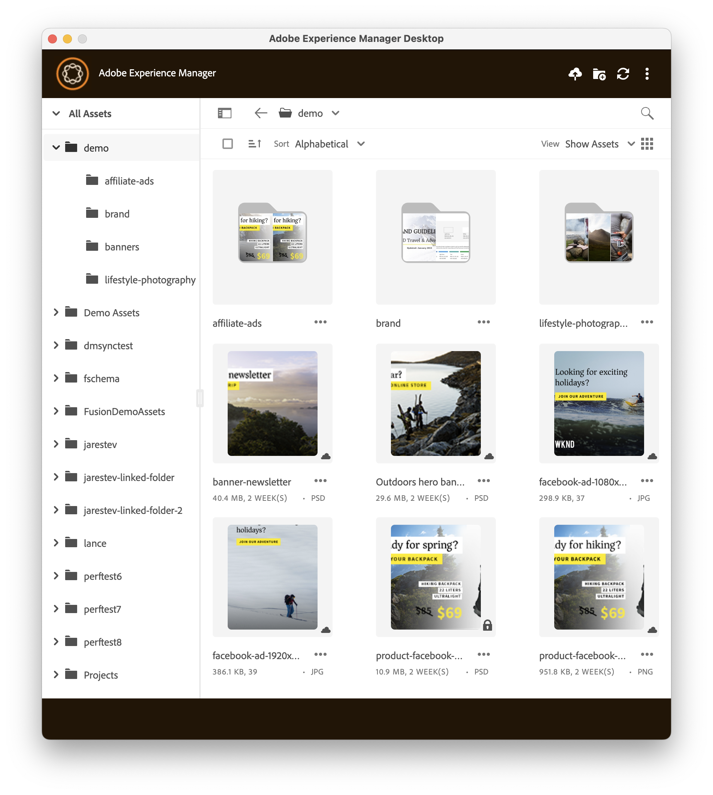

# [!DNL Adobe Experience Manager] Desktop App release notes {#release-notes-v2}

The release date of desktop app version 3.0.1 is December 18, 2025.  The release includes the following enhancements:

Smoother and more reliable workflows

* Ensured consistent folder naming by fixing sync issues between the AEM Desktop App and AEM Author.
* Enabled uninterrupted workflows by allowing full application functionality during active transfer operations.

Faster and more responsive user experience

* Enhanced UI responsiveness by replacing blocking I/O with asynchronous processing, delivering a smoother experience during high-load operations.
* Enhanced large file transfers by introducing pagination in upload and download flows, enabling efficient handling of large datasets.

Stronger stability and reliability

* Resolved Author server restarts triggered by Desktop App interactions, significantly improving system stability.
* Addressed application crashes during large folder (thousands of files) download or upload.

The **supported [!DNL Experience Manager] versions** are:

* [!DNL Experience Manager] as a [!DNL Cloud Service]. See [release notes](https://experienceleague.adobe.com/en/docs/experience-manager-cloud-service/content/release-notes/home).
* [!DNL Experience Manager] 6.5.0 or newer, on Adobe Managed Services (AMS) or On-Premise. See [service pack release notes](https://experienceleague.adobe.com/en/docs/experience-manager-65/content/release-notes/release-notes).

[!DNL Adobe Experience Manager] desktop app is available for the following **operating systems**:

* macOS X 10.14 or newer, with the latest bug fixes.
* Windows 10 with the latest service packs and bug fixes.

Two versions of the Windows installer are available for AEM Desktop App version 2.3.1 and later versions. The base installer installs the AEM Desktop App under the user's local App Data directory. Adobe recommends this installation process for most of its users. An Enterprise Windows installer is also available, which installs the AEM Desktop App under the shared Program Files directory. These two installers install the same version of the AEM Desktop App, with no differences in functionality.

The **download URLs** for supported OS are:

| Operating system | [!DNL Experience Manager] as a [!DNL Cloud Service] | [!DNL Experience Manager] 6.x |
|---|---|---|
| macOS (v3.0.0) | [Download link](https://experience.adobe.com/#/downloads/content/software-distribution/en/aemcloud.html?package=/content/software-distribution/en/details.html/content/dam/aemcloud/public/aem-desktop-app/aem-desktop-osx-x64-3.0.0.dmg) | [Download link](https://experience.adobe.com/#/downloads/content/software-distribution/en/aem.html?package=/content/software-distribution/en/details.html/content/dam/aem/public/adobe/packages/adobe/aem-desktop-app/aem-desktop-osx-x64-3.0.0.dmg)|
| macOS Apple Silicon (M1) (v3.0.0) | [Download link](https://experience.adobe.com/#/downloads/content/software-distribution/en/aemcloud.html?package=/content/software-distribution/en/details.html/content/dam/aemcloud/public/aem-desktop-app/aem-desktop-osx-arm64-3.0.0.dmg) | [Download link](https://experience.adobe.com/#/downloads/content/software-distribution/en/aem.html?package=/content/software-distribution/en/details.html/content/dam/aem/public/adobe/packages/adobe/aem-desktop-app/aem-desktop-osx-arm64-3.0.0.dmg) |
| Windows 64-bit (v3.0.0) | [Download link](https://experience.adobe.com/#/downloads/content/software-distribution/en/aemcloud.html?package=/content/software-distribution/en/details.html/content/dam/aemcloud/public/aem-desktop-app/aem-desktop-win-x64-3.0.0.exe) | [Download link](https://experience.adobe.com/#/downloads/content/software-distribution/en/aem.html?package=/content/software-distribution/en/details.html/content/dam/aem/public/adobe/packages/adobe/aem-desktop-app/aem-desktop-win-x64-3.0.0.exe)|
| Windows 64-bit Enterprise (v3.0.0) | [Download link](https://experience.adobe.com/#/downloads/content/software-distribution/en/aemcloud.html?package=/content/software-distribution/en/details.html/content/dam/aemcloud/public/aem-desktop-app/aem-desktop-win-x64-ent-3.0.0.msi) | [Download link](https://experience.adobe.com/#/downloads/content/software-distribution/en/aem.html?package=/content/software-distribution/en/details.html/content/dam/aem/public/adobe/packages/adobe/aem-desktop-app/aem-desktop-win-x64-ent-3.0.0.msi)|
| macOS (v2.3.3) | [Download link](https://experience.adobe.com/#/downloads/content/software-distribution/en/aemcloud.html?package=/content/software-distribution/en/details.html/content/dam/aemcloud/public/aem-desktop-app/aem-desktop-osx-x64-2.3.3.dmg) | [Download link](https://experience.adobe.com/#/downloads/content/software-distribution/en/aem.html?package=/content/software-distribution/en/details.html/content/dam/aem/public/adobe/packages/adobe/aem-desktop-app/aem-desktop-osx-x64-2.3.3.dmg)|
| macOS Apple Silicon (M1) (v2.3.3) | [Download link](https://experience.adobe.com/#/downloads/content/software-distribution/en/aemcloud.html?package=/content/software-distribution/en/details.html/content/dam/aemcloud/public/aem-desktop-app/aem-desktop-osx-arm64-2.3.3.dmg) | [Download link](https://experience.adobe.com/#/downloads/content/software-distribution/en/aem.html?package=/content/software-distribution/en/details.html/content/dam/aem/public/adobe/packages/adobe/aem-desktop-app/aem-desktop-osx-arm64-2.3.3.dmg) |
| Windows 64-bit (v2.3.3) | [Download link](https://experience.adobe.com/#/downloads/content/software-distribution/en/aemcloud.html?package=/content/software-distribution/en/details.html/content/dam/aemcloud/public/aem-desktop-app/aem-desktop-win-x64-2.3.3.exe) | [Download link](https://experience.adobe.com/#/downloads/content/software-distribution/en/aem.html?package=/content/software-distribution/en/details.html/content/dam/aem/public/adobe/packages/adobe/aem-desktop-app/aem-desktop-win-x64-2.3.3.exe)|
| Windows 64-bit Enterprise (v2.3.3) | [Download link](https://experience.adobe.com/#/downloads/content/software-distribution/en/aemcloud.html?package=/content/software-distribution/en/details.html/content/dam/aemcloud/public/aem-desktop-app/aem-desktop-win-x64-2.3.3.msi) | [Download link](https://experience.adobe.com/#/downloads/content/software-distribution/en/aem.html?package=/content/software-distribution/en/details.html/content/dam/aem/public/adobe/packages/adobe/aem-desktop-app/aem-desktop-win-x64-2.3.3.msi)|
| macOS (v2.3.1) | [Download link](https://nam04.safelinks.protection.outlook.com/?url=https%3A%2F%2Fexperience.adobe.com%2F%23%2Fdownloads%2Fcontent%2Fsoftware-distribution%2Fen%2Faemcloud.html%3Fpackage%3D%2Fcontent%2Fsoftware-distribution%2Fen%2Fdetails.html%2Fcontent%2Fdam%2Faemcloud%2Fpublic%2Faem-desktop-app%2Faem-desktop-osx-x64-2.3.1.dmg&data=05%7C02%7Canujm%40adobe.com%7Cfcf599743bd649c5cd7308dcab9ea5cd%7Cfa7b1b5a7b34438794aed2c178decee1%7C0%7C0%7C638573945081954149%7CUnknown%7CTWFpbGZsb3d8eyJWIjoiMC4wLjAwMDAiLCJQIjoiV2luMzIiLCJBTiI6Ik1haWwiLCJXVCI6Mn0%3D%7C0%7C%7C%7C&sdata=mwSX5ilZL0he2raIx8t5ecQ%2FWuizky4MpcCXX3mEN38%3D&reserved=0) | [Download link](https://nam04.safelinks.protection.outlook.com/?url=https%3A%2F%2Fexperience.adobe.com%2F%23%2Fdownloads%2Fcontent%2Fsoftware-distribution%2Fen%2Faem.html%3Fpackage%3D%2Fcontent%2Fsoftware-distribution%2Fen%2Fdetails.html%2Fcontent%2Fdam%2Faem%2Fpublic%2Fadobe%2Fpackages%2Fadobe%2Faem-desktop-app%2Faem-desktop-osx-x64-2.3.1.dmg&data=05%7C02%7Canujm%40adobe.com%7Cfcf599743bd649c5cd7308dcab9ea5cd%7Cfa7b1b5a7b34438794aed2c178decee1%7C0%7C0%7C638573945081981239%7CUnknown%7CTWFpbGZsb3d8eyJWIjoiMC4wLjAwMDAiLCJQIjoiV2luMzIiLCJBTiI6Ik1haWwiLCJXVCI6Mn0%3D%7C0%7C%7C%7C&sdata=LJH3OCFq7yRykN4wU8HN9%2FBXC%2BjfXLJH4QizeFZfRHE%3D&reserved=0) |
| macOS Apple Silicon (M1) (v2.3.1) | [Download link](https://nam04.safelinks.protection.outlook.com/?url=https%3A%2F%2Fexperience.adobe.com%2F%23%2Fdownloads%2Fcontent%2Fsoftware-distribution%2Fen%2Faemcloud.html%3Fpackage%3D%2Fcontent%2Fsoftware-distribution%2Fen%2Fdetails.html%2Fcontent%2Fdam%2Faemcloud%2Fpublic%2Faem-desktop-app%2Faem-desktop-osx-arm64-2.3.1.dmg&data=05%7C02%7Canujm%40adobe.com%7Cfcf599743bd649c5cd7308dcab9ea5cd%7Cfa7b1b5a7b34438794aed2c178decee1%7C0%7C0%7C638573945081965822%7CUnknown%7CTWFpbGZsb3d8eyJWIjoiMC4wLjAwMDAiLCJQIjoiV2luMzIiLCJBTiI6Ik1haWwiLCJXVCI6Mn0%3D%7C0%7C%7C%7C&sdata=2YENn0tDduiucogClt6aBZHDOE6dbzBdigq8VQawIO0%3D&reserved=0) | [Download link](https://nam04.safelinks.protection.outlook.com/?url=https%3A%2F%2Fexperience.adobe.com%2F%23%2Fdownloads%2Fcontent%2Fsoftware-distribution%2Fen%2Faem.html%3Fpackage%3D%2Fcontent%2Fsoftware-distribution%2Fen%2Fdetails.html%2Fcontent%2Fdam%2Faem%2Fpublic%2Fadobe%2Fpackages%2Fadobe%2Faem-desktop-app%2Faem-desktop-osx-arm64-2.3.1.dmg&data=05%7C02%7Canujm%40adobe.com%7Cfcf599743bd649c5cd7308dcab9ea5cd%7Cfa7b1b5a7b34438794aed2c178decee1%7C0%7C0%7C638573945081986151%7CUnknown%7CTWFpbGZsb3d8eyJWIjoiMC4wLjAwMDAiLCJQIjoiV2luMzIiLCJBTiI6Ik1haWwiLCJXVCI6Mn0%3D%7C0%7C%7C%7C&sdata=jCepldg4dMej0%2BrK2mUonXwqsWL8ksE8%2BLMSgsH9qTA%3D&reserved=0) |
| Windows 64-bit (v2.3.1) | [Download link](https://nam04.safelinks.protection.outlook.com/?url=https%3A%2F%2Fexperience.adobe.com%2F%23%2Fdownloads%2Fcontent%2Fsoftware-distribution%2Fen%2Faemcloud.html%3Fpackage%3D%2Fcontent%2Fsoftware-distribution%2Fen%2Fdetails.html%2Fcontent%2Fdam%2Faemcloud%2Fpublic%2Faem-desktop-app%2Faem-desktop-win-x64-2.3.1.exe&data=05%7C02%7Canujm%40adobe.com%7Cfcf599743bd649c5cd7308dcab9ea5cd%7Cfa7b1b5a7b34438794aed2c178decee1%7C0%7C0%7C638573945081970892%7CUnknown%7CTWFpbGZsb3d8eyJWIjoiMC4wLjAwMDAiLCJQIjoiV2luMzIiLCJBTiI6Ik1haWwiLCJXVCI6Mn0%3D%7C0%7C%7C%7C&sdata=sRn2UWW%2Bi7SMEvSO74ZGGvJ40vHh1KhLc7zAfKc37Es%3D&reserved=0) | [Download link](https://nam04.safelinks.protection.outlook.com/?url=https%3A%2F%2Fexperience.adobe.com%2F%23%2Fdownloads%2Fcontent%2Fsoftware-distribution%2Fen%2Faem.html%3Fpackage%3D%2Fcontent%2Fsoftware-distribution%2Fen%2Fdetails.html%2Fcontent%2Fdam%2Faem%2Fpublic%2Fadobe%2Fpackages%2Fadobe%2Faem-desktop-app%2Faem-desktop-win-x64-2.3.1.exe&data=05%7C02%7Canujm%40adobe.com%7Cfcf599743bd649c5cd7308dcab9ea5cd%7Cfa7b1b5a7b34438794aed2c178decee1%7C0%7C0%7C638573945081991004%7CUnknown%7CTWFpbGZsb3d8eyJWIjoiMC4wLjAwMDAiLCJQIjoiV2luMzIiLCJBTiI6Ik1haWwiLCJXVCI6Mn0%3D%7C0%7C%7C%7C&sdata=aQWZtEK%2F3cWX8n8Au%2FwZ5Zd9xPVo5phvk%2FuF%2Be0HRrE%3D&reserved=0)|
| Windows 64-bit Enterprise (v2.3.1) | [Download link](https://nam04.safelinks.protection.outlook.com/?url=https%3A%2F%2Fexperience.adobe.com%2F%23%2Fdownloads%2Fcontent%2Fsoftware-distribution%2Fen%2Faemcloud.html%3Fpackage%3D%2Fcontent%2Fsoftware-distribution%2Fen%2Fdetails.html%2Fcontent%2Fdam%2Faemcloud%2Fpublic%2Faem-desktop-app%2Faem-desktop-win-x64-2.3.1.msi&data=05%7C02%7Canujm%40adobe.com%7Cfcf599743bd649c5cd7308dcab9ea5cd%7Cfa7b1b5a7b34438794aed2c178decee1%7C0%7C0%7C638573945081976350%7CUnknown%7CTWFpbGZsb3d8eyJWIjoiMC4wLjAwMDAiLCJQIjoiV2luMzIiLCJBTiI6Ik1haWwiLCJXVCI6Mn0%3D%7C0%7C%7C%7C&sdata=v9C0sLDSkuL%2FMIyae2WkbitJPVgSlAw2BqcaH5Im0uw%3D&reserved=0) | [Download link](https://nam04.safelinks.protection.outlook.com/?url=https%3A%2F%2Fexperience.adobe.com%2F%23%2Fdownloads%2Fcontent%2Fsoftware-distribution%2Fen%2Faem.html%3Fpackage%3D%2Fcontent%2Fsoftware-distribution%2Fen%2Fdetails.html%2Fcontent%2Fdam%2Faem%2Fpublic%2Fadobe%2Fpackages%2Fadobe%2Faem-desktop-app%2Faem-desktop-win-x64-2.3.1.msi&data=05%7C02%7Canujm%40adobe.com%7Cfcf599743bd649c5cd7308dcab9ea5cd%7Cfa7b1b5a7b34438794aed2c178decee1%7C0%7C0%7C638573945081995827%7CUnknown%7CTWFpbGZsb3d8eyJWIjoiMC4wLjAwMDAiLCJQIjoiV2luMzIiLCJBTiI6Ik1haWwiLCJXVCI6Mn0%3D%7C0%7C%7C%7C&sdata=2btCh0aIrUBiyeG37K9YorvzTeIJOggbq%2FRauUMn4LY%3D&reserved=0)|
| macOS (v2.3.0) | [Download link](https://experience.adobe.com/#/downloads/content/software-distribution/en/aemcloud.html?package=/content/software-distribution/en/details.html/content/dam/aemcloud/public/aem-desktop-app/aem-desktop-osx-x64-2.3.0.dmg) | [Download link](https://experience.adobe.com/#/downloads/content/software-distribution/en/aem.html?package=/content/software-distribution/en/details.html/content/dam/aem/public/adobe/packages/adobe/aem-desktop-app/aem-desktop-osx-x64-2.3.0.dmg) |
| macOS Apple Silicon (M1) (v2.3.0) | [Download link](https://experience.adobe.com/#/downloads/content/software-distribution/en/aemcloud.html?package=/content/software-distribution/en/details.html/content/dam/aemcloud/public/aem-desktop-app/aem-desktop-osx-arm64-2.3.0.dmg) | [Download link](https://experience.adobe.com/#/downloads/content/software-distribution/en/aem.html?package=/content/software-distribution/en/details.html/content/dam/aem/public/adobe/packages/adobe/aem-desktop-app/aem-desktop-osx-arm64-2.3.0.dmg) |
| Windows 64-bit (v2.3.0) | [Download link](https://experience.adobe.com/#/downloads/content/software-distribution/en/aemcloud.html?package=/content/software-distribution/en/details.html/content/dam/aemcloud/public/aem-desktop-app/aem-desktop-win-x64-2.3.0.exe) | [Download link](https://experience.adobe.com/#/downloads/content/software-distribution/en/aem.html?package=/content/software-distribution/en/details.html/content/dam/aem/public/adobe/packages/adobe/aem-desktop-app/aem-desktop-win-x64-2.3.0.exe)|
| macOS (v2.2.2) | [Download link](https://experience.adobe.com/#/downloads/content/software-distribution/en/aemcloud.html?package=/content/software-distribution/en/details.html/content/dam/aemcloud/public/aem-desktop-app/aem-desktop-osx-x64-2.2.2.dmg) | [Download link](https://experience.adobe.com/#/downloads/content/software-distribution/en/aem.html?package=/content/software-distribution/en/details.html/content/dam/aem/public/adobe/packages/adobe/aem-desktop-app/aem-desktop-osx-x64-2.2.2.dmg) |
| macOS Apple Silicon (M1) (v2.2.2) | [Download link](https://experience.adobe.com/#/downloads/content/software-distribution/en/aemcloud.html?package=/content/software-distribution/en/details.html/content/dam/aemcloud/public/aem-desktop-app/aem-desktop-osx-arm64-2.2.2.dmg) | [Download link](https://experience.adobe.com/#/downloads/content/software-distribution/en/aem.html?package=/content/software-distribution/en/details.html/content/dam/aem/public/adobe/packages/adobe/aem-desktop-app/aem-desktop-osx-arm64-2.2.2.dmg) |
| Windows 64-bit (v2.2.2) | [Download link](https://experience.adobe.com/#/downloads/content/software-distribution/en/aemcloud.html?package=/content/software-distribution/en/details.html/content/dam/aemcloud/public/aem-desktop-app/aem-desktop-win-x64-2.2.2.exe) | [Download link](https://experience.adobe.com/#/downloads/content/software-distribution/en/aem.html?package=/content/software-distribution/en/details.html/content/dam/aem/public/adobe/packages/adobe/aem-desktop-app/aem-desktop-win-x64-2.2.2.exe)|
| macOS (v2.2.1) | [Download link](https://experience.adobe.com/#/downloads/content/software-distribution/en/aemcloud.html?package=/content/software-distribution/en/details.html/content/dam/aemcloud/public/aem-desktop-app/aem-desktop-osx-x64-2.2.1.dmg) | [Download link](https://experience.adobe.com/#/downloads/content/software-distribution/en/aem.html?package=/content/software-distribution/en/details.html/content/dam/aem/public/adobe/packages/adobe/aem-desktop-app/aem-desktop-osx-x64-2.2.1.dmg) |
| macOS Apple Silicon (M1) (v2.2.1) | [Download link](https://experience.adobe.com/#/downloads/content/software-distribution/en/aemcloud.html?package=/content/software-distribution/en/details.html/content/dam/aemcloud/public/aem-desktop-app/aem-desktop-osx-arm64-2.2.1.dmg) | [Download link](https://experience.adobe.com/#/downloads/content/software-distribution/en/aem.html?package=/content/software-distribution/en/details.html/content/dam/aem/public/adobe/packages/adobe/aem-desktop-app/aem-desktop-osx-arm64-2.2.1.dmg) |
| Windows 64-bit (v2.2.1) | [Download link](https://experience.adobe.com/#/downloads/content/software-distribution/en/aemcloud.html?package=/content/software-distribution/en/details.html/content/dam/aemcloud/public/aem-desktop-app/aem-desktop-win-x64-2.2.1.exe) | [Download link](https://experience.adobe.com/#/downloads/content/software-distribution/en/aem.html?package=/content/software-distribution/en/details.html/content/dam/aem/public/adobe/packages/adobe/aem-desktop-app/aem-desktop-win-x64-2.2.1.exe)|
| macOS (v2.2.0) | [Download link](https://experience.adobe.com/#/downloads/content/software-distribution/en/aemcloud.html?package=/content/software-distribution/en/details.html/content/dam/aemcloud/public/aem-desktop-app/aem-desktop-osx-x64-2.2.0.dmg) | [Download link](https://experience.adobe.com/#/downloads/content/software-distribution/en/aem.html?package=/content/software-distribution/en/details.html/content/dam/aem/public/adobe/packages/adobe/aem-desktop-app/aem-desktop-osx-x64-2.2.0.dmg) |
| macOS Apple Silicon (M1) (v2.2.0) | [Download link](https://experience.adobe.com/#/downloads/content/software-distribution/en/aemcloud.html?package=/content/software-distribution/en/details.html/content/dam/aemcloud/public/aem-desktop-app/aem-desktop-osx-arm64-2.2.0.dmg) | [Download link](https://experience.adobe.com/#/downloads/content/software-distribution/en/aem.html?package=/content/software-distribution/en/details.html/content/dam/aem/public/adobe/packages/adobe/aem-desktop-app/aem-desktop-osx-arm64-2.2.0.dmg) |
| Windows 64-bit (v2.2.0) | [Download link](https://experience.adobe.com/#/downloads/content/software-distribution/en/aemcloud.html?package=/content/software-distribution/en/details.html/content/dam/aemcloud/public/aem-desktop-app/aem-desktop-win-x64-2.2.0.exe) | [Download link](https://experience.adobe.com/#/downloads/content/software-distribution/en/aem.html?package=/content/software-distribution/en/details.html/content/dam/aem/public/adobe/packages/adobe/aem-desktop-app/aem-desktop-win-x64-2.2.0.exe)|
| macOS (v2.1.5.0) | [Download link](https://experience.adobe.com/#/downloads/content/software-distribution/en/aemcloud.html?package=/content/software-distribution/en/details.html/content/dam/aemcloud/public/aem-desktop-app/aem-desktop-osx-2.1.5.0.dmg) | [Download link](https://experience.adobe.com/#/downloads/content/software-distribution/en/aem.html?package=/content/software-distribution/en/details.html/content/dam/aem/public/adobe/packages/adobe/aem-desktop-app/aem-desktop-osx-2.1.5.0.dmg) |
| Windows 64-bit (v2.1.5.0) | [Download link](https://experience.adobe.com/#/downloads/content/software-distribution/en/aemcloud.html?package=/content/software-distribution/en/details.html/content/dam/aemcloud/public/aem-desktop-app/aem-desktop-win64-2.1.5.0.exe) | [Download link](https://experience.adobe.com/#/downloads/content/software-distribution/en/aem.html?package=/content/software-distribution/en/details.html/content/dam/aem/public/adobe/packages/adobe/aem-desktop-app/aem-desktop-win64-2.1.5.0.exe)|
| Windows 32-bit (v2.1.5.0) | [Download link](https://experience.adobe.com/#/downloads/content/software-distribution/en/aemcloud.html?package=/content/software-distribution/en/details.html/content/dam/aemcloud/public/aem-desktop-app/aem-desktop-win32-2.1.5.0.exe) | [Download link](https://experience.adobe.com/#/downloads/content/software-distribution/en/aem.html?package=/content/software-distribution/en/details.html/content/dam/aem/public/adobe/packages/adobe/aem-desktop-app/aem-desktop-win32-2.1.5.0.exe) |
| macOS (v2.1.4.0) | [Download link](https://experience.adobe.com/#/downloads/content/software-distribution/en/aemcloud.html?package=/content/software-distribution/en/details.html/content/dam/aemcloud/public/aem-desktop-app/aem-desktop-osx-2.1.4.0.dmg) | [Download link](https://experience.adobe.com/#/downloads/content/software-distribution/en/aem.html?package=/content/software-distribution/en/details.html/content/dam/aem/public/adobe/packages/adobe/aem-desktop-app/aem-desktop-osx-2.1.4.0.dmg) |
| Windows 64-bit (v2.1.4.0) | [Download link](https://experience.adobe.com/#/downloads/content/software-distribution/en/aemcloud.html?package=/content/software-distribution/en/details.html/content/dam/aemcloud/public/aem-desktop-app/aem-desktop-win64-2.1.4.0.exe) | [Download link](https://experience.adobe.com/#/downloads/content/software-distribution/en/aem.html?package=/content/software-distribution/en/details.html/content/dam/aem/public/adobe/packages/adobe/aem-desktop-app/aem-desktop-win64-2.1.4.0.exe)|
| Windows 32-bit (v2.1.4.0) | [Download link](https://experience.adobe.com/#/downloads/content/software-distribution/en/aemcloud.html?package=/content/software-distribution/en/details.html/content/dam/aemcloud/public/aem-desktop-app/aem-desktop-win32-2.1.4.0.exe) | [Download link](https://experience.adobe.com/#/downloads/content/software-distribution/en/aem.html?package=/content/software-distribution/en/details.html/content/dam/aem/public/adobe/packages/adobe/aem-desktop-app/aem-desktop-win32-2.1.4.0.exe) |
| macOS (v2.1.3.4) | [Download link](https://experience.adobe.com/#/downloads/content/software-distribution/en/aemcloud.html?package=/content/software-distribution/en/details.html/content/dam/aemcloud/public/aem-desktop-app/aem-desktop-osx-2.1.3.4.dmg) | [Download link](https://experience.adobe.com/#/downloads/content/software-distribution/en/aem.html?package=/content/software-distribution/en/details.html/content/dam/aem/public/adobe/packages/adobe/aem-desktop-app/aem-desktop-osx-2.1.3.4.dmg) |
| Windows 64-bit (v2.1.3.4) | [Download link](https://experience.adobe.com/#/downloads/content/software-distribution/en/aemcloud.html?package=/content/software-distribution/en/details.html/content/dam/aemcloud/public/aem-desktop-app/aem-desktop-win64-2.1.3.4.exe) | [Download link](https://experience.adobe.com/#/downloads/content/software-distribution/en/aem.html?package=/content/software-distribution/en/details.html/content/dam/aem/public/adobe/packages/adobe/aem-desktop-app/aem-desktop-win64-2.1.3.4.exe)|
| Windows 32-bit (v2.1.3.1) | [Download link](https://experience.adobe.com/#/downloads/content/software-distribution/en/aemcloud.html?package=/content/software-distribution/en/details.html/content/dam/aemcloud/public/aem-desktop-app/aem-desktop-win32-2.1.3.1.exe) | [Download link](https://experience.adobe.com/#/downloads/content/software-distribution/en/aem.html?package=/content/software-distribution/en/details.html/content/dam/aem/public/adobe/packages/adobe/aem-desktop-app/aem-desktop-win32-2.1.3.1.exe) |

## Support for different assets and file types {#support-for-file-types}

The application supports assets stored in [!DNL Experience Manager] that represent binary file for its basic operations. Opening files in the native desktop application relies on the operating system association of the specific file types like PNG or JPG to specific applications like Mac Preview or Adobe Photoshop.

A few file types support placing linked assets in the binary. The application pre-downloads the linked assets if the asset is present in the [!DNL Experience Manager] repository when such binary files are opened using the desktop app. Currently supported file types are:

* [!DNL Adobe InDesign] files (INDD format)
* [!DNL Adobe Illustrator] files (AI format)
* [!DNL Adobe Photoshop] files (PS format)

The feature is supported with [!DNL Adobe Creative Cloud] 2018 and [!DNL Adobe Creative Cloud] 2019 versions of the above application. The app uses a heuristic, best-match approach to map the local desktop paths of linked assets to URLs on the [!DNL Experience Manager] server. It relies on a few assumptions:

* Paths to placed files in the native application use a global desktop path (placed from the local network share shown with the [!UICONTROL Reveal] option).

* Paths are stored in the file's XMP record by the native app.

* [!DNL Experience Manager] has extracted the XMP record with the paths to the asset's metadata record.

* The paths can be matched to assets in [!DNL Experience Manager], that is, the placed files are also in [!DNL Experience Manager] under a matching path.

## New features, enhancements, and bug fixes {#what-is-new}

To know the details, see [What's new in v3.0.1](introduction.md#whats-new-v2).

### Updates in app v3.0.0 {#app-version-3.0.0}

This release delivers multiple enhancements to Collections, Uploads, Check-in / Check-out, Metadata management, and overall usability. These updates improve efficiency, streamline asset handling, and provide a more intuitive, real-time experience in AEM Desktop App.

**Collections**

* You can now view, download, and browse collections.

*  Added support to download folders available within collections.

* Auto sync feature now enables downloaded assets within collections to periodically synchronize AEM Asset management with the local file system.

* When you update an asset that is part of a collection, the system automatically updates it in the temporary cache folder and in the Desktop App UI.

**Uploads**

* You can upload newly created assets from your local machine to AEM, where the central repository is stored, and view them in your Desktop App.

* Desktop App now automatically identifies new files created under an already downloaded folder on your local file system and uploads them to AEM. Desktop App must be kept open to identify the new files on your local file system.

**Check-in and check-out**

* The check-in and check-out feature enables you to manage file access by locking a file for editing (check-out) and saving your changes while making it available for others (check-in).

* Ability to drag an asset from Desktop App to the target Creative Cloud application. Desktop App automatically checks out the assets and downloads it onto the local file system.

**Metadata**

* You can assign metadata when creating a new folder.

* Experience Manager Desktop App now allows you to move assets or folders to a new location while preserving their metadata, helping to organize and streamline your file system.

* AEM Desktop App now allows you to view folder properties, such as the folder thumbnail, size, path, date created, tags, metadata, and so on.

**Usability Improvements**

* The auto-refresh feature automatically updates content in real time, ensuring you always see the latest information without manually reloading the page and getting the list of updated assets.

* The pin or unpin folder feature allows you to keep important folders easily accessible by pinning them or declutter your view by unpinning them when they are no longer needed.

* The rename title feature allows you to easily update or modify the title of an asset, helping you keep names accurate and organized as your content evolves.

* You can preserve the original file and make changes to a similar one by duplicating files across local and cloud locations using the duplicate files operation.

* The export option now allows downloading selected files and folders from Desktop App to their specific target location in a flat structure.

* You can now access assets in Card view, Grid view, or a Tree view for a clean, organized, and visually appealing layout of assets.

* Various labels for various options are updated on the UI to make the application more intuitive.

### Updates in app v2.3.1 {#app-version-2.3.1}

* The new Enterprise Windows installer installs the application under Program Files. 
* Support for **Basic Authentication** during AEM and SSO logins.
* Configurable number of assets allowed during upload operation

### Updates in app v2.3.0 {#app-version-2.3.0}

* Added Support for IMS login. IMS integration allows the desktop app to perform access token refresh automatically, allowing the user to stay logged in for up to 14 days.

* Improved support for corporate proxies and web filtering.

### Updates in app v2.2.2 {#app-version-2.2.2}

* (Windows Only) The desktop app displays a blank screen after installing 2.2.0 and 2.2.1 release versions.

### Updates in app v2.2.1 {#app-version-2.2.1}

* The desktop app displays a session timeout error message when you click **[!UICONTROL Sign In]**.

* Issues while accessing desktop app v2.2.0 on macOS.

* The desktop app displays an error message when you sort assets by clicking **[!UICONTROL Edited Locally]**.

### Updates in app v2.2.0 {#app-version-2.2.0}

* Support for Apple Silicon (M1).

* Ability to remember the connection string while logging on to the desktop app.

### Updates in app v2.1.5.0 {#app-version-2.1.5.0}

* The Desktop App stops responding when you upload files in a folder that contains Chinese characters (ASSETS-9237).

* Desktop App replaces dots with dashes in file names (ASSETS-10955).

### Updates in app v2.1.4.0 {#app-version-2.1.4.0}

The new version of the application offers bug fixes.

### Updates in app v2.1.3.4 {#app-version-2.1.3.4}

The new version of the application offers a bug fix.

### Updates in app v2.1.3.3 {#app-version-2.1.3.3}

The new version of the application offers a bug fix.

### Updates in app v2.1.3.2 {#app-version-2.1.3.2}

This version of the application offers a bug fix.

### Updates in app v2.1.3.1 {#app-version-2.1.3.1}

The bug fixed in this version is:

* Asset upload and download speeds have improved, even with large assets. This release fixed an issue where asset uploads with the [!DNL desktop app] failed sometimes when very large files were uploaded.

### Updates in app v2.1.2.0 {#app-version-2.1.2.0}

* A new option to [!UICONTROL Clear Cookies] is added to the main menu of the application. It helps with potential logon issues, for example when changing a connection from a server to another. See [clear cookies before connecting](/help/using/troubleshoot.md#cannot-login-cookies-issue).

* A new option has been added that, if selected, allows the app to upload folders and files with node names in [!DNL Adobe Experience Manager] matching the local file and folder names. This process ensures consistency between local and uploaded names.

  This behavior is similar to the default behavior in version 1 of the desktop app. Whereas in the current version, if the option is not enabled then whitespaces and the characters `% ; # , + ? ^ { } "` in folder names are replaced with dashes in folder paths. Also, the upper-case characters are converted to lower case in folder paths. However, in file names, the characters `# % { } ? &` are replaced with dash; but whitespaces and casing are retained. For more information see, [app Preferences](/help/using/install-upgrade.md#set-preferences) and [Upload and add new assets](/help/using/upload-assets.md#upload-and-add-new-assets-to-aem).

### Updates in app v2.1.1.0 {#app-version-2.1.1.0}

* An advanced setting lets the app emulate v1.10 app behavior when uploading folders. In v1.10, the node names created in the repository respect the spaces and casing of the folder names provided by the user. In version 2.1, the default behavior is unchanged: multiple spaces in folder names are replaced with hyphens in the repository node name, and node names are converted to lowercase. See [the app preferences](/help/using/install-upgrade.md#set-preferences).

### Updates in app v2.1.0.0 {#app-version-2.1.0.0}

* To upload assets, users can now drag the files or folders on the application's interface, directly from Windows Explorer or Mac Finder. This process works in addition to the upload option available in the application. See [upload assets](/help/using/upload-assets.md#upload-and-add-new-assets-to-aem) <!-- CQ-4309527 -->

### Updates in app v2.0.3 {#app-version-2.0.3}

The bug fixed in this version is:

* Fixed the login issue for app users on Windows who try to access the DAM repository on [!DNL Adobe Experience Manager] 6.5.5.0.

### Updates in app v2.0.2 {#app-version-2.0.2}

The bug fixes and updates are:

* Upload acceleration setting is now made available to boost the upload performance. When this setting is turned on, the app uploads faster by using more local CPU threads and is more resource-intensive.

* Asset uploads when filenames or paths containing certain GB18030 characters is fixed. <!-- CQ-4283494 -->

* Sort by relevance option is available after switching to another sort type in the search results. <!-- CQ-4286874 -->

* The desktop app now lists sub-folders without the need for explicit refresh. <!-- CQ-4285711 -->

* (Windows) Fixed a rare issue of unusable app interface on some Windows machines. Users cannot click on the app interface as it appears distorted with the click-area of interface elements 'shifted' sideway. <!-- CQ-4280785 -->

### Updates in app v2.0.1 {#app-version-2.0.1}

The bug fixes and updates are:

* Allow option to configure `%Temp%` directory to match `%APPDATA%` path. <!-- CQ-4282665 -->

* Allow users to log in on [!DNL Experience Manager] Author via Okta SAML authentication. <!-- CQ-4278134 -->

## Installation instructions {#installation-instructions-v2}

To know how to install and configure the app, see [Install [!DNL Experience Manager] desktop app](install-upgrade.md).

If you are upgrading from a previous [!DNL Experience Manager] desktop app, you must follow these best practices for transitioning that are listed at [upgrade from the previous version](install-upgrade.md#upgrade-from-previous-version).

## Important notes about how the app works {#how-app-works}

It is important to understand the following about the application and how it works.

* The application provides full control over operations that require full transfer of asset binaries from and to [!DNL Experience Manager] (**Open**, **Edit**, **Upload Changes**, and **Upload Assets**).

  * If you want to work with the asset on desktop, you must explicitly Open, Edit, or Download to your desktop, either individually, in a folder, or via multi-selection.

  * If you want to get local changes to assets uploaded to [!DNL Experience Manager], you need to select [!UICONTROL Upload Changes], either individually or via multi-selection.

  * The application is not a 'sync client' that synchronizes assets across the desktop and [!DNL Experience Manager].

  * The application does not provide a network share that maps the [!DNL Experience Manager] repository as a virtual folder structure.

* The list of assets shown by the application is based on the status of the Assets repository. Files downloaded locally and subsequently renamed in the local files or cache folder are not displayed or managed with the application.

* If the app does not display the expected results, click the refresh icon in the top bar.

* The local network share, shown when you use [!UICONTROL Reveal File] action, only shows files (and folders) that are available locally. [!UICONTROL Reveal File] and [!UICONTROL Reveal Folder] pre-downloads assets to help get the right assets showing in the local network share.

* SMB (Mac) / WebDAV (Win) local network share is used when an Adobe Creative Cloud app reads the asset files linked / placed in a native file of the Creative Cloud app.

The following diagram illustrates the flow of assets and files from cloud to local file system and the opposite way, as initiated by user actions.

![Flow of assets from [!DNL Experience Manager] server to native desktop apps via desktop app](assets/da20_flow_diagram.png)

## Known issues {#known-issues-v2}

**User interface issues:**

* At times, the interface of the desktop app might become blank. Right-click and click [!UICONTROL Refresh] to reload the application. After such a refresh, you start at the root of the DAM repository. Updates to or statuses of your assets are retained. <!-- CQ-4270267 -->

* Difficult to navigate folders / search results without a track pad or mouse pointer. The scroll-bar does not appear with wheel-less mouse devices. <!-- CQ-4269947 -->

* Infrequently, the progress bar does not display correctly when the uploading asset changes.

* After applying and removing the filter to find all locally edited assets, the app does not take users to their search results or folder view that the users started with. The app displays the root folder of the DAM repository.

* At times, when you connect to a URL that does not have an [!DNL Experience Manager] server running, the connect screen becomes unresponsive. Exit the application and start it again.

**CRUD (Create, Read, Update, and Delete) issues:**

* When uploading changes to an asset with comments, the comments are stored with the asset in [!DNL Experience Manager] but are not visible as versioning comments. This issue is resolved in [!DNL Experience Manager] 6.4.5 and [!DNL Experience Manager] 6.5.1. Adobe recommends installing the latest service packs. <!-- CQ-4268990 -->

* A user cannot cancel asset transfers. If you triggered an unintended large transfer, exit the application and start it again. <!-- CQ-4278940 -->

**Platform issues:**

* At times, on Windows, an asset's status may immediately change to [!UICONTROL Edited Locally] after opening it, even though you may not have edited it. Click [!UICONTROL Refresh] to update.

>[!MORELIKETHIS]
>
>* [[!DNL Experience Manager] as a [!DNL Cloud Service] documentation](https://experienceleague.adobe.com/en/docs/experience-manager-cloud-service)
>* [[!DNL Experience Manager] as a [!DNL Cloud Service] [!DNL Assets] documentation](https://experienceleague.adobe.com/en/docs/experience-manager-cloud-service/content/assets/overview)
>* [How to use [!DNL Experience Manager] desktop app](using-desktop-app.md)
>* [Install and upgrade desktop app](install-upgrade.md)
>* [Best practices and troubleshooting tips](troubleshoot.md)
