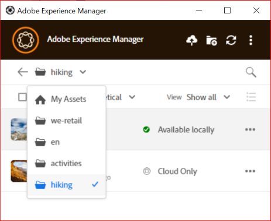
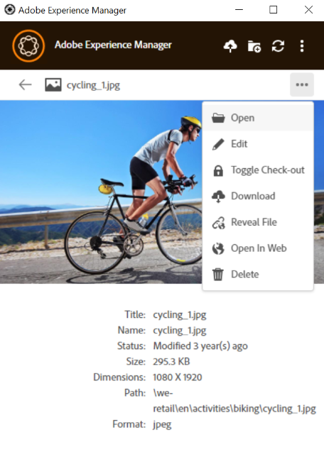
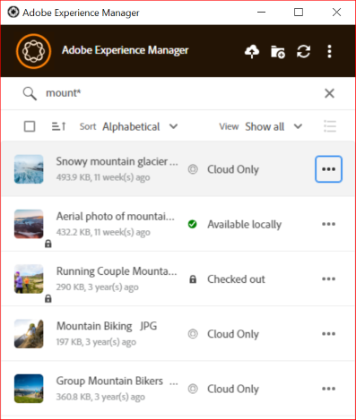
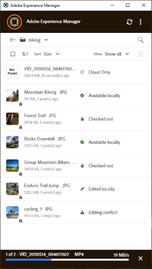
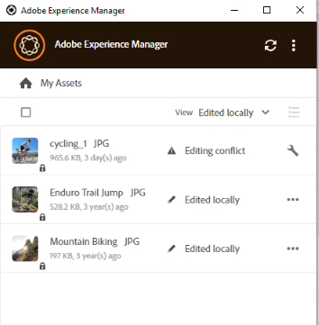

# Browse, search, and preview assets {#browse-search-preview-assets}

You can browse to, search for, and preview the assets available in the [!DNL Experience Manager] repository, all from within the desktop application. Try the following in the app:

1. Browse to a folder and see some basic info of the assets available in the folder, along with small thumbnails of all assets.

   

1. To view more information and a larger thumbnail of an individual asset, click the filename.

   

1. Click **[!UICONTROL Open]** or **[!UICONTROL Edit]** to download the file locally and just view it or edit it in the native application, respectively.
1. Search using keywords to find a related asset in the [!DNL Experience Manager] repository. Use `?` and `*` as wildcards. These wildcards substitute for a single character or for multiple characters, respectively. Filter and sort the results as necessary.

   

   

>[!NOTE]
>
>The app displays the assets by matching the search criteria across multiple metadata fields and not just the asset's title or the filename.

## Open assets on your desktop {#openondesktop-v2}

You can open the remote assets for viewing in the native application. The assets are downloaded to a local folder. Then they are launched in the native application associated with the file format. You can change the native application to open specific file types (extensions) in your Mac or Windows.

Click **[!UICONTROL Open]** from the asset menu. The asset is downloaded locally and opened in the native application. Check the download progress and transfer speed of large assets in the status bar.

<!-- 
-->

>[!NOTE]
>
>If the expected changes are not reflected in the app, click refresh icon  or right click in the app interface and click **[!UICONTROL Refresh]**. The actions are not available while larger downloads or uploads are in progress.

To open the local download folder of an asset, click  and click  **[!UICONTROL Reveal File]** action.

## Use or place assets into native documents {#place-assets-in-native-documents}

In some cases, say when placing an asset into a native document, you access a file in Windows Explorer or Mac Finder. To get to the file system location of the locally downloaded file, use the  **[!UICONTROL Reveal File]** option.

Click **[!UICONTROL Reveal File]**, or **[!UICONTROL Reveal Folder]** on a folder, to open Windows Explorer or Mac Finder with the file or folder preselected on your local computer. As an example, the option is useful to place the [!DNL Experience Manager] files in the native applications that support placing or linking local files. To see how to place files in Adobe InDesign, see [Placing graphics](https://helpx.adobe.com/indesign/using/placing-graphics.html).

The **[!UICONTROL Reveal File]** action opens a local network share. It displays only the assets that are available locally. That is, it displays assets that were revealed, downloaded, or opened/edited using the app. The local network share does not upload any changes to [!DNL Experience Manager]. To upload the changes, explicitly use the **[!UICONTROL Upload Changes]** or **[!UICONTROL Upload]** actions in the app.

>[!NOTE]
>
>For backwards compatibility with [!DNL Experience Manager] desktop app v1.x, the files revealed are served from a local network share, exposing locally available files only. The desktop paths of the revealed files are the same as the paths created by app v1.x.

>[!CAUTION]
>
>Do not use the **[!UICONTROL Reveal File]** option to edit assets in native applications. Instead, use the **[!UICONTROL Edit]** actions. To know more, see [Advanced workflow: collaborate on the same files and avoid editing conflicts](#adv-workflow-collaborate-avoid-conflicts).

### Manage special characters in asset names {#special-characters-in-filename}

In the legacy app, the node names created in the repository retained the spaces and casing of the folder names provided by the user. For the current application to emulate the node naming rules of v1.10 app, enable [!UICONTROL Use legacy conventions when creating nodes for assets and folders] in the [!UICONTROL Preferences]. See [app preferences](/help/using/install-upgrade.md#set-preferences). This legacy preference is disabled by default.

>[!NOTE]
>
>The app changes only the node names in the repository using the following naming conventions. The app retains the `Title` of the asset as is.

| Characters &Dagger; | Legacy preference in app | When occurring in file names | When occurring in folder names | Example |
|---|---|---|---|---|
| `. / : [ ] \| *` | Enabled or Disabled | Replaced with `-` (hyphen). A `.` (dot) in the filename extension is retained as is. | Replaced with `-` (hyphen). | `myimage.jpg` remains as is and `my.image.jpg` changes into `my-image.jpg`. |
| `% ; # , + ? ^ { } "` and whitespaces |  Disabled | Whitespaces are retained | Replaced with `-` (hyphen). | `My Folder.` changes to `my-folder-`. |
| `# % { } ? & .` |  Disabled | Replaced with `-` (hyphen). | NA. | `#My New File.` changes to `-My New File-`. |
| Uppercase characters |  Disabled | Casing is retained as is. | Changed to lowercase characters. | `My New Folder` changes to `my-new-folder`. |
| Uppercase characters |  Enabled | Casing is retained as is. | Casing is retained as is. | NA. |

&Dagger; The list of characters is a whitespace-separated list. 

## Find all edited images {#find-all-edited-images}

The application provides a view, called **[!UICONTROL Edited locally]**, to give you quick access to all the files that you downloaded locally (via [!UICONTROL Open] or [!UICONTROL Edit] actions) and then modified. The app allows you to select all locally edited assets and upload the changes in a few clicks. This view also displays the locally edited assets that have an editing conflict.

## Next Steps {#next-steps}

* [Watch a video to get started with Adobe Experience Manager Desktop App](https://experienceleague.adobe.com/en/docs/experience-manager-learn/assets/creative-workflows/aem-desktop-app)

* Provide documentation feedback using [!UICONTROL Edit this page]  or [!UICONTROL Log an issue]  available on the right sidebar

* Contact [Customer Care](https://experienceleague.adobe.com/?support-solution=General#support)

>[!MORELIKETHIS]
>
>* [Understand the user interface](/help/using/navigate-view.md)
>* [Using Desktop App](/help/using/using-desktop-app.md)
>* [Managing Assets in Desktop App](/help/using/asset-management.md)
