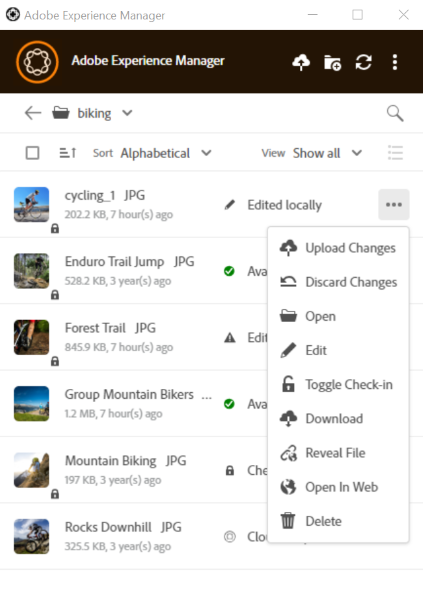
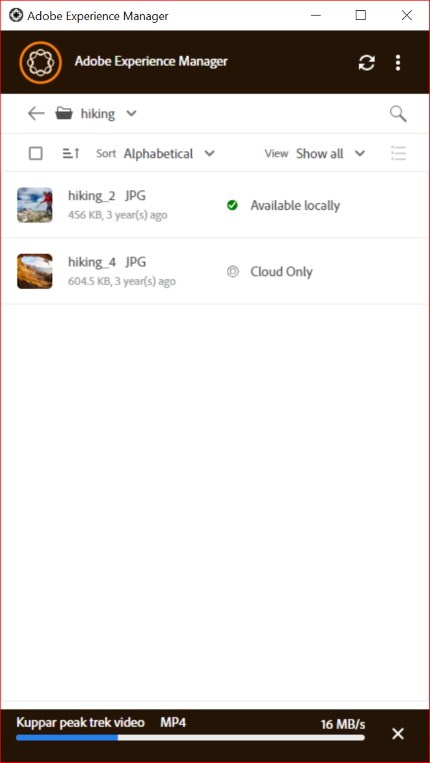

# Upload assets {#upload-assets}

AEM Desktop App users with rights to add assets can add assets (such as images, documents, videos, or other media).

## Edit assets and upload updated assets to [!DNL Experience Manager] {#edit-assets-upload-updated-assets}

Open assets for editing when you want to make changes and upload the updated assets to the [!DNL Experience Manager] server. To avoid conflicts with edits of other users, use the app to initiate an editing session. Before you start editing, ensure that the asset does not have a lock icon on it indicating that another user is editing the asset.

To edit an asset, search for the asset or browse to the asset's location. Click  and click **[!UICONTROL Edit]**.

Use **[!UICONTROL Toggle Check-out]** to lock the asset to prevent conflicts with edits of other users in both the following situations:

* You've started editing an asset without checking it out first (say by just opening it).
* You intend to start editing an asset soon and do not want others to edit.

Once you're done making the edits, the app displays the **[!UICONTROL Edited Locally]** status for the changed assets. All the changes saved to the assets are local-only until you upload the changes to [!DNL Experience Manager]. To upload an individual or a few assets one-by-one, click **[!UICONTROL Upload Changes]** from the options for an asset. It creates a version of the asset in [!DNL Experience Manager]. Using the Web interface of [!DNL Assets], you can see asset history in the [Timeline view](https://experienceleague.adobe.com/en/docs/experience-manager-65/content/assets/using/activity-stream).

For best practices around collaborative editing, see [Advanced workflow: collaborate on the same files and avoid editing conflicts](#adv-workflow-collaborate-avoid-conflicts).

In the following cases, you may want to discard your changes and edits to the local asset. Click **[!UICONTROL Discard Changes]**.

* If you do not want to save your changes locally in [!DNL Experience Manager].
* Start making changes on the original asset after saving some changes.
* Stop editing the asset as it is no longer needed.

If necessary, toggle check-out. The updated asset is removed from the local cache folder and is downloaded again when you edit or open it.

## Upload and add new assets to [!DNL Experience Manager] {#upload-and-add-new-assets-to-aem}

Users can add new assets to the DAM repository. For example, you may be an agency photographer or contractor who wants to add a large number of photos from a photoshoot to the [!DNL Experience Manager] repository. To add new content to [!DNL Experience Manager], select  in the top-bar of the app. Browse to the asset files in the local file system and click **[!UICONTROL Select]**. Alternatively, to upload assets, drag the files or folders on the application interface. On Windows, if you drag assets on a folder inside the app, the assets are uploaded into the folder. If it takes longer to upload, the app displays a progress bar.

<!-- 
-->

You can upload folders or individual files from your local file system. A folder's hierarchy is preserved when it is uploaded. Before uploading assets in bulk, see [Bulk uploads](#bulk-upload-assets).

To view the list of assets transferred in a given session, click **[!UICONTROL View]** > **[!UICONTROL Assets transfers]**. The list allows you to view and quickly verify the file transfers of the current session.

You can control the upload concurrency (acceleration) in **[!UICONTROL Preferences]** > **[!UICONTROL Upload acceleration]** setting. More concurrency typically gives faster uploads, but can be resource-intensive, consuming more processing power of the local machine. If you experience a slow system, re-attempt uploads using a lower value of concurrency.

>[!NOTE]
>
>The transfer list is not persistent and is not available if you exit the app and reopen it.

## Bulk upload assets {#bulk-upload-assets}

Users or organizations, such as photographers or creative agencies, can create numerous local assets during activities like photoshoots, retouching, or selecting from a larger set. These tasks are often done outside of [!DNL Experience Manager]. They can upload these large local folders to [!DNL Assets] directly from the desktop app. The folder hierarchies are preserved and all the nested sub-folders and included assets are uploaded. The uploaded assets are immediately available to other users of the same server for consumption as well. Assets are uploaded in the background, so the operation is not tied to a Web browser session.

![Bulk upload multiple local folders from your desktop into [!DNL Experience Manager]](assets/upload_local_folders_da2.png "Bulk upload multiple local folders from your desktop into Experience Manager")

After uploading, if the expected changes are not reflected in the app, click the refresh icon .

>[!NOTE]
>
>Do not use upload functionality to migrate assets across two [!DNL Experience Manager] deployments. Instead, see the [migration guide](https://experienceleague.adobe.com/en/docs/experience-manager-65/content/assets/administer/assets-migration-guide).

## Next Steps {#next-steps}

* [Watch a video to get started with Adobe Experience Manager Desktop App](https://experienceleague.adobe.com/en/docs/experience-manager-learn/assets/creative-workflows/aem-desktop-app)

* Provide documentation feedback using [!UICONTROL Edit this page]  or [!UICONTROL Log an issue]  available on the right sidebar

* Contact [Customer Care](https://experienceleague.adobe.com/?support-solution=General#support)

>[!MORELIKETHIS]
>
>* [Download assets](/help/using/download-assets.md)
>* [Understand the user interface](/help/using/user-interface.md)
>* [Search](/help/using/search.md)
