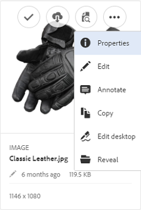

# Use [!DNL Experience Manager] desktop app v1.10 {#use-aem-desktop-app-v1x}

Using the App, the assets within [!DNL Experience Manager] are easily accessible on your local desktop and can be used in any desktop applications. Assets can be easily revealed in Mac Finder or Windows Explorer, opened in desktop applications, and changed locally - the changes are saved back to [!DNL Experience Manager] with a new version created in the repository.

This integration enables centralized asset management and access across Creative Cloud and other applications, ensuring compliance with branding and other standards.

The key tasks that you do using the [!DNL Experience Manager] desktop app v1 include:

1. [Connect with an [!DNL Experience Manager] server](#installandconnect)
1. [Open assets directly on the desktop app](#openondesktop)
1. [Edit and check out assets from the desktop app](#workonassets)
1. [Upload assets and folders in bulk](#bulkupload)

For the various recommended dos and don'ts, see the [best practices for using the desktop app](best-practices-for-v1.md). If you face issues using the App, see how to [troubleshoot [!DNL Experience Manager] desktop app](troubleshoot-app-v1.md).

>[!NOTE]
>
>The desktop app was introduced in [!DNL Experience Manager] 6.1 release and was called [!DNL Experience Manager Assets Companion App].

## [!DNL Experience Manager] desktop app touch-points in the creative workflow {#aem-desktop-app-touch-points-in-the-creative-workflow}

[!DNL Experience Manager] desktop app, along with [!DNL Assets], integrates in your creative workflow and offers the following touch-points.

![[!DNL Experience Manager] desktop app touch-points the creative workflow](assets/aem_desktopapp_workflow.png)

[!DNL Experience Manager] desktop app touch-points the creative workflow

## Install and connect the app to the [!DNL Experience Manager] server {#installandconnect}

Before you can begin creating or editing the creative assets, connect the desktop application with the [!DNL Assets] server to download and upload assets in the repository. Perform the following tasks:

1. [Install the app](#installapp).
1. [Set your preferences](#inapppref) and connection details.
1. [Connect to an [!DNL Experience Manager] server](#connect) and mount assets repository as local drive.
1. [Enable desktop actions](#desktopactions) on the [!DNL Experience Manager] server.

The [!DNL Experience Manager] desktop app uses an HTTPS connection to connect to the [!DNL Experience Manager] server to transfer your assets robustly and securely.

>[!NOTE]
>
>For all or part of the installation and configuration steps, you may need help from your [!DNL Experience Manager] administrator or system administrator.

### Install the application {#installapp}

Ensure that the app supports your version of the Experience Manager server to use the Experience Manager desktop app. Download the appropriate installation file (binary) for your operating system (Mac or Windows) and install the app.

Detailed configuration can be necessary depending on your network and system preferences. See [Install and configure [!DNL Experience Manager] desktop app](install-configure-app-v1.md) for more details.

1. Go to the [[!DNL Experience Manager] desktop app v1.10 download page](/help/using/release-notes-of-v1.md) and download the appropriate binary for your operating system.
1. Launch the downloaded installation file and follow the on-screen instructions to install the app.

   >[!NOTE]
   >
   >Only one instance of the [!DNL Experience Manager] desktop app can be installed and be active at a time.

### Understand the in-app options and preferences {#inapppref}

The application allows for settings to connect and disconnect from [!DNL Experience Manager] servers, view the status of uploads, manage local cache, and so on. The default settings work for a typical user of the application. You can tweak the settings to get more out of the application. And, get more out of the integration with the [!DNL Experience Manager] server. The following are the various settings:

**Explore Assets** Open the local drive in which the [!DNL Assets] repository is mounted. In other words, explore the assets that are now made available on your local machine.

**View asset status** When changed assets are uploaded or new assets are added to the [!DNL Assets] repository, the application uploads the assets in the background. The background upload allows for smooth operations, without you having to wait for the upload to finish, especially for large-sized assets. You can save your changes locally and forget it. The application takes some time to send these assets to the server, depending on the available bandwidth. You can check the status of the upload, along with some more basic information.

**Options** Click options in the desktop app tray to set the app to launch at startup, connect to the [!DNL Experience Manager] server on launch, and change the local drive letter for [!DNL Assets] after mounting.

**Advanced > Manage cache** You can control the amount of disk space made available for local caching purposes. The artifacts from the [!DNL Assets] server are cached locally for a smoother experience. You can change the defaults to suit your requirements. Also, you can clear the cache to fetch all assets afresh. When you clear the cache, it preserves your unsaved changes. Any assets not checked into the [!DNL Experience Manager] server are retained and not deleted.

### Connect to an [!DNL Experience Manager] server {#connect}

The app supports proxy configuration on Mac and Windows. The configuration is read when the app starts. If you modify proxy settings, restart the app for the changes to take effect.

>[!NOTE]
>
>If you modify the proxy settings, restart the app for the changes to take effect. Otherwise, the app continues to use the previously configured proxy server.

1. Launch the [!DNL Experience Manager] desktop app. To map your [!DNL Experience Manager] instance with the app, specify your [!DNL Experience Manager] server in the format `https://[aem-server-url]:[port]`.

   ![Authenticate on Mac and provide [!DNL Experience Manager] server URL](assets/aem_desktop_app_server_url.png)

1. In the login screen, specify the user name and password for your instance. To specify an alternate [!DNL Experience Manager] instance, select the **[!UICONTROL Alternate Login URL]** option.

   ![Provide [!DNL Experience Manager] server credentials on the login screen on [!DNL Experience Manager] desktop app](assets/login_screen_v1.png)

### Enable desktop actions in [!DNL Experience Manager] web interface {#desktopactions}

From within the Assets user interface, you can explore the asset locations or check-out and open the asset for editing in your desktop application. These options are called desktop actions and are not enabled by default. Follow these steps to enable it.

1. In the Assets interface, click/tap the User icon in the upper right corner of the toolbar.
1. Click **[!UICONTROL My Preferences]** to display the **[!UICONTROL Preferences]** dialog.

   ![[!DNL Experience Manager] interface with user preferences](assets/aem_ui_user_preferences.png)

1. In the [!UICONTROL User Preferences] dialog, select **[!UICONTROL Show Desktop Actions For Assets]**, then click **[!UICONTROL Accept]**.

   ![Check [!UICONTROL Show Desktop Actions For Assets] to enable desktop actions](assets/enable_desktop_actions.png)

   *Figure: Check [!UICONTROL Show Desktop Actions For Assets] to enable the desktop actions.*

## Access and open assets on your desktop {#openondesktop}

When you click **Open** to open an asset on your local computer, the app downloads the asset to its internal cache. The app launches the native desktop application that is associated with the file type of the downloaded asset.

On Mac, select **Open** from the context menu to open an asset through the [!DNL Experience Manager] desktop app. On Windows, select Open on Web from the context menu to open the asset. From the Asset Status window, click/tap  to open the asset.

For Adobe InDesign (INDD) files, select **[!UICONTROL Open]** from the context menu. When you click this option, the App downloads the linked assets to your local file system and then opens the INDD file in Adobe InDesign. This method ensures that the necessary assets are locally available when editing the INDD file.

![Context menu options to access and open assets using [!DNL Experience Manager] desktop app](assets/aem_desktopapp_mac_context_menu.png)

*Figure: Context menu options to access and open assets using the [!DNL Experience Manager] desktop app.*

>[!NOTE]
>
>Adobe recommends that you go to Finder View Options on Mac and deactivate the options **Show item info**, **Show item preview**, and **Show preview column** for the mounted [!DNL Assets] folder. It improves the performance.

### Additional options in [!DNL Experience Manager] interface {#additional-options-in-aem-assets}

After you map the [!DNL Assets] repository to your local drive, you can enable additional icons and the Folder Upload feature to appear for the mapped assets and folders.

1. Open the [!DNL Assets] interface and hover the pointer over a folder or an asset, to display the desktop actions as quick actions in the Card view.

   

   *Figure: In Assets UI, open the quick actions menu to see desktop actions.*

   These desktop actions are also available when you click the **Desktop Actions** option in the toolbar after selecting the asset or from the toolbar in the asset page.

1. To open the asset in the desktop application that is associated with the specific file extension, click the **Open on desktop** quick action .

   Alternatively, choose **Open** from the **Desktop Actions** menu in the toolbar.

To locate the particular asset on your local file system, click **Reveal** quick action . Alternatively, choose **Reveal** from the **Desktop Actions** menu in the toolbar.

## Understand the asset statuses {#understand-the-asset-statuses}

|  | The app is connected to the server and all assets are synchronized. |
--- |--- |
|  | The app is launched but is not connected with the server. Some assets may be pending synchronization. |
|  | Assets are synchronizing. Files are either being uploaded or downloaded. You can see exact statuses and pause the transfers from the Asset Status window. |
|  | App is trying to reconnect. Potentially, the network issues are causing it to disconnect. |

## Work on your assets {#workonassets}

### Check out assets from the [!DNL Experience Manager] web interface {#check-out-assets-from-the-aem-web-interface}

[!DNL Experience Manager Assets] lets you check out assets for editing and check them back in after you complete making the changes. After you check out an asset, only you can edit, annotate, publish, move, or delete the asset. Checking out an asset locks the asset and prevents other users from performing any of these operations. To be able to check out/in assets, you require Write access on them.

There are two ways of checking out assets from the [!DNL Experience Manager] web interface. For detailed information on the first method, see the [check-in and checkout files from Assets UI](https://experienceleague.adobe.com/en/docs/experience-manager-65/content/assets/managing/check-out-and-submit-assets). Follow these steps for the second methods to check out and open the asset when the [!DNL Experience Manager] desktop app is installed.

1. Open the [!DNL Assets] interface and hover the pointer over a folder or an asset, to display the desktop actions as quick actions in the Card view.

   

   These desktop actions are also available when you click/tap the Desktop Actions icon in the toolbar after selecting the asset or from the toolbar in the asset page.

1. To open the asset, click/tap the Open on desktop quick action .

   Alternatively, choose Open from the Desktop Actions menu in the toolbar.

   >[!NOTE]
   >
   >When you edit an opened but unchecked-out file, other users do not know that you are updating the asset.

1. To open an asset for editing in an Adobe Creative Cloud application, click . This option also checks out the asset for editing. After you finish editing, check in the asset, to update the changes in [!DNL Assets].

   Alternatively, choose Edit from the Desktop Actions menu in the toolbar.

1. Select the Open menu option. The selected assets are opened in preview mode.
1. To edit the assets, select the Edit option. The assets are opened in edit mode.

### Check out assets from Finder on macOS {#check-out-assets-on-mac}

The app lets you check out asset files to prevent other users from modifying the files that you're working on.

1. From the Mac context menu, select the Open AEM Assets Folder option to open the Finder.

   ![Context menu options to access and open assets using [!DNL Experience Manager] desktop app](assets/aem_desktopapp_mac_context_menu.png)

   *Figure: Context menu options to access and open assets using the [!DNL Experience Manager] desktop app.*

1. Navigate to the asset that you want to check out.
1. Right-click the asset, and select More Assets Info from the context menu.
1. In the Asset Info dialog, click/tap the Checkout icon to check out the asset. The Checkout icon toggles to the check-in icon after you click/tap it.

   

1. To check in the asset so it is available to other users, click/tap the check-in icon in the Asset Info dialog.

### Check out assets on Windows {#check-out-assets-on-windows}

The app lets you check out asset files to prevent other users from modifying the files that you're working on.

1. From the Context menu, select the Explore Assets to open Explorer.
1. In Explorer, navigate to the location of the asset you want to check out.
1. Right-click the asset and select Open on Web from the context menu.
1. In the Asset Info dialog, click the Checkout icon. The Checkout icon toggles to the check-in icon.

   

1. Review the asset in Explorer. The lock icon on the asset  indicates that you have checked out the asset.

   >[!NOTE]
   >
   >The lock icon may appear after some delay. The [!DNL Experience Manager] desktop app caches the assets for quick access so it may take a few moments to update the locked status.

1. To check in the asset so it is available to other users, click/tap the check-in icon in the **Asset Info** dialog.

### Check in an asset using Finder or Explorer and using web interface {#check-in-an-asset-using-finder-or-explorer-and-using-web-interface}

When you've finished editing the assets, save the assets in your desktop application. From the context menu, select **More Assets Info** and click check-in.

The assets are uploaded to the [!DNL Experience Manager] server. Optionally, you can check the status of the upload by selecting **View Asset Status** from the system tray icon. Alternatively, you can check in an asset from the [!DNL Experience Manager] web interface. Click the checked out assets or select it. From the toolbar, click the check-in icon .

An asset is uploaded to [!DNL Experience Manager] automatically after any changes are saved locally. The check-in makes the asset available to other [!DNL Experience Manager] users for editing.

### Bulk upload assets and folders to [!DNL Experience Manager] server {#bulkupload}

Using the [!DNL Experience Manager] desktop app, you can upload an entire folder containing assets from your local file directory to [!DNL Assets]. This way, all assets within the folder are uploaded in bulk instead of having to upload them one at a time.

1. From the Assets UI, click/tap **Create** from the toolbar, and then from the menu, select **Upload Folder**.
1. Browse to the folder that you want to upload and select it.
1. Click/tap OK. The Assets Status dialog displays the status of the upload.

   

   See the status of the upload in the Asset Status window

   >[!NOTE]
   >
   >You can manually pause or cancel the upload by clicking/tapping the appropriate icon.

1. After the folder uploads, close the dialog and navigate to the Assets UI. The uploaded folder is displayed in the web interface.

Adobe does not recommend copy-pasting or dragging a larger number of files or nested folders, from the local file system, into the network share area. The app cannot control the upload process due to technical limitations and the performance is poor.

Alternatively, select files/folders in Finder or Explorer, copy them, navigate to the target folder in the network share area, and choose **Paste Assets** from the [!DNL Experience Manager] desktop app context menu. This way, the [!DNL Experience Manager] desktop app starts uploading the pasted assets similar to the **Upload Folder** option available in the [!DNL Experience Manager] web interface.

>[!MORELIKETHIS]
>
>* [Troubleshoot [!DNL Experience Manager] desktop app application](troubleshoot-app-v1.md)
