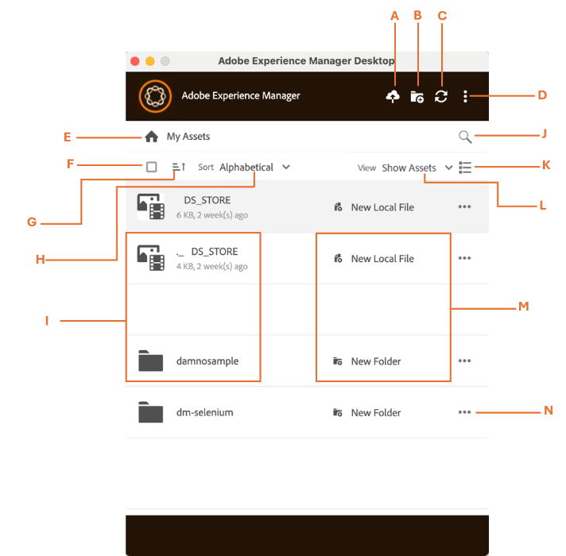

# User Interface of [!DNL Adobe Experience Manager] Desktop App {#user-interface-desktop-app}

[!DNL Adobe Experience Manager] Desktop App offers an intuitive and user-friendly user interface. The clean interface makes assets and related information easy to find and remember.

When you log into [!DNL Adobe Experience Manager] Desktop App, you see the following interface:

<table border="0">
    <tr>
        <td> A </td>
        <td> Add Assets </td>
    </tr>
    <tr>
        <td> B </td>
        <td> Create directory or folder </td>
    </tr>
    <tr>
        <td> C </td>
        <td> Refresh or Reconnect assets </td>
    </tr>
    <tr>
        <td> D </td>
        <td> More Options such as:
            <ul>
                <li>Preferences</li>
                <li>Open in Web</li>
                <li>Clear Cookies</li>
                <li>Show Work Folder</li>
                <li>Help</li>
                <li>Log Out</li>
                <li>Exit</li>
            </ul>
        </td>
    </tr>
    <tr>
        <td> E </td>
        <td> My Assets (indicates app homepage) </td>
    </tr>
    <tr>
        <td> F </td>
        <td> Select all checkbox </td>
    </tr>
    <tr>
        <td> G </td>
        <td> Sort by ascending or descending order </td>
    </tr>
    <tr>
        <td> H </td>
        <td> Sort by Alphabetical, Size, or Last modified </td>
    </tr>
    <tr>
        <td> I </td>
        <td> 
        <ul>
            <li> <b>File options:</b> Open File or Upload File </li> 
            <li> <b>Folder options:</b> Reveal Folder </li>
        </ul>
        </td>
    </tr>
    <tr>
        <td> J </td>
        <td> Search assets </td>
    </tr>
    <tr>
        <td> K </td>
        <td> 
            <ul>
                <li> <b> Tree View: </b> The tree view displays scrollable files and folders in a single column. </li> 
                <li> <b> Grid view: </b> The grid view displays scrollable files and folders in a grid of rows and columns. </li>
                <li> <b> Card View: </b> A card view is a compact, bordered layout that organizes content into a clean and clickable block. </li> 
            </ul>
        </td>
    </tr>
    <tr>
        <td> L </td>
        <td> View Options such as: 
            <ul>
                <li><b> Show Assets:</b> Allows you to view all the assets. </li>
                <li><b> Show Collections:</b> Allows you to see all the collections created in the native AEM application. See more collections. </li>
                <li><b> Edit Locally:</b> Allows you to show all the locally modified assets. In this view, you can add and upload multiple assets.</li>
                <li><b> Asset Transfers:</b> Allows you to view all the assets that are transferred from native app to local or vice versa. </li>
                <li><b> Pinned items:</b> Allows you to view all the pinned items.</li>
            </ul>
        </td>
    </tr>
    <tr>
        <td> M </td>
        <td> File or folder (local or web) indicator. </td>
    </tr>
    <tr>
        <td> N </td>
        <td> More options: 
            <ul>
                <li><b> Download:</b> Allows you to download a selected asset or a folder. </li>
                <li><b> Download a copy:</b> Allows you to download a copy of a selected asset or folder which is saved as a duplicate for offline use. </li>
                <li><b> Reveal Folder:</b> Use this to open the folder in your system's file explorer.</li>
                <li><b> Pin:</b> Allows you to pin or unpin the selected asset. </li>
                <li><b> Apply Folder Metadata Schema:</b> Use this option to apply a structured metadata schema to enable consistent organization, searchability, and management to assets.</li>
                <li><b> View Folder Properties: </b> It displays detailed metadata and attributes associated with a folder. </li>
                <li><b> Open in Web: </b> Access and view the folder directly through a web browser interface. </li>
                <li><b> Delete: </b> Removes the selected asset and its contents. </li>
                <li><b> Rename: </b> Changes the name of the selected asset to a new user-defined name </li>
            </ul>
        </td>
    </tr>
</table>

## View folder structure [!DNL Adobe Experience Manager] Desktop App {#folder-structure-desktop-app}

Navigate to a folder then click  adjacent to folder name. Select **[!UICONTROL Reveal Folder]** to instantly open the folder in your system's file explorer, giving you quick and direct access to its contents for easy navigation and management.

## Next Steps {#next-steps}

* [Watch a video to get started with Adobe Experience Manager Desktop App](https://experienceleague.adobe.com/en/docs/experience-manager-learn/assets/creative-workflows/aem-desktop-app)

* Provide documentation feedback using [!UICONTROL Edit this page]  or [!UICONTROL Log an issue]  available on the right sidebar

* Contact [Customer Care](https://experienceleague.adobe.com/?support-solution=General#support)

>[!MORELIKETHIS]
>
>* [Managing Assets in Desktop App](/help/using/assets-management-tasks.md)
>* [Download assets](/help/using/download-assets.md)
>* [Upload assets](/help/using/upload-assets.md)
 