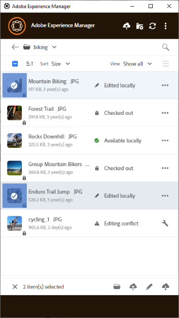
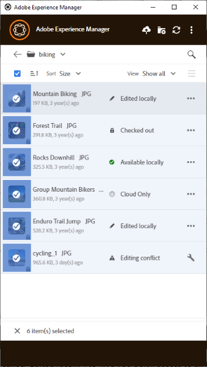

# Work with multiple assets {#work-with-multiple-assets}

Users can easily work with and manage multiple assets using actions like uploading all edits in one go or uploading nested folders in a few clicks.

## Browse large folders {#browse-large-folders}

When working with folders containing many assets, scroll to view more assets. To scroll using the keyboard, press the tab a few times to select the asset at the top. Notice the highlighted asset to know when it is selected. Now, use the Down Arrow key to move through the list of assets.

## Quick actions for selected assets {#quick-actions-for-selected-assets}

Click the thumbnail of a few assets to select the assets. To select all assets, click the check box in the top-bar of the app. The set of actions that are applicable to all the selected assets collectively are displayed in a toolbar at the bottom of the app.

Actions available in the toolbar at the bottom depend on the status of selected files. For example, if you only select **[!UICONTROL Edited Locally]** files, you see **[!UICONTROL Upload Changes]** icon. If you select a mix of **[!UICONTROL Edited locally]** and **[!UICONTROL Cloud only]**, the **[!UICONTROL Upload Changes]** action is not available.

## Next Steps {#next-steps}

* [Watch a video to get started with Adobe Experience Manager Desktop App](https://experienceleague.adobe.com/en/docs/experience-manager-learn/assets/creative-workflows/aem-desktop-app)

* Provide documentation feedback using [!UICONTROL Edit this page]  or [!UICONTROL Log an issue]  available on the right sidebar

* Contact [Customer Care](https://experienceleague.adobe.com/?support-solution=General#support)

>[!MORELIKETHIS]
>
>* [Upload assets](/help/using/upload-assets.md)
>* [Download assets](/help/using/download-assets.md)
>* [Search](/help/using/search.md)
